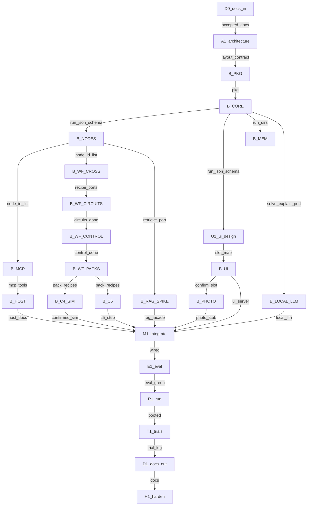

# Execution graph

> **This is the plan you read.** Every node has a markdown link in [Node plans](#node-plans).  
> Scope: [`IMPLEMENTATION_PLAN.md`](IMPLEMENTATION_PLAN.md). Index: [`plans/README.md`](plans/README.md).

---

## Metadata

| Field | Value |
|-------|-------|
| **Scope plan** | [IMPLEMENTATION_PLAN.md](IMPLEMENTATION_PLAN.md) |
| **Objective** | Ship H3 Electrical Engineer end-to-end (P0–P2 in this graph), proven by boot + Cursor trials + docs-out |
| **Topology mix** | chain (docs) + fan-out (surfaces) + diamond (M1) |
| **Depth** | 2 |
| **Graph-engineering** | named — approving starts execution |
| **Cheap model** | `composer-2.5` |
| **Judge model** | `cursor-grok-4.6-high` |
| **Branch** | `cursor/product-execution-plan-eb74` |

---

## Node plans

| ID | Name | Plan |
|----|------|------|
| R0 | Gate 0 (closed) | [docs/planning/GATE_0_RESEARCH.md](docs/planning/GATE_0_RESEARCH.md) |
| D0 | Docs-in | [plans/nodes/D0.md](plans/nodes/D0.md) |
| A1 | Architecture | [plans/nodes/A1.md](plans/nodes/A1.md) |
| B_PKG | Package + CI | [plans/nodes/B_PKG.md](plans/nodes/B_PKG.md) |
| B_CORE | Runner + CLI | [plans/nodes/B_CORE.md](plans/nodes/B_CORE.md) |
| B_NODES | Activity registry | [plans/nodes/B_NODES.md](plans/nodes/B_NODES.md) |
| U1 | UI design | [plans/nodes/U1.md](plans/nodes/U1.md) |
| B_MCP | stdio MCP | [plans/nodes/B_MCP.md](plans/nodes/B_MCP.md) |
| B_MEM | Memory CLI | [plans/nodes/B_MEM.md](plans/nodes/B_MEM.md) |
| B_WF_CROSS | Unmatched + compose | [plans/nodes/B_WF_CROSS.md](plans/nodes/B_WF_CROSS.md) |
| B_UI | FastAPI + React slots | [plans/nodes/B_UI.md](plans/nodes/B_UI.md) |
| B_WF_CIRCUITS | Circuits recipes | [plans/nodes/B_WF_CIRCUITS.md](plans/nodes/B_WF_CIRCUITS.md) |
| B_RAG_SPIKE | RAG spike | [plans/nodes/B_RAG_SPIKE.md](plans/nodes/B_RAG_SPIKE.md) |
| B_WF_CONTROL | Control recipes | [plans/nodes/B_WF_CONTROL.md](plans/nodes/B_WF_CONTROL.md) |
| B_PHOTO | Photo stub | [plans/nodes/B_PHOTO.md](plans/nodes/B_PHOTO.md) |
| B_LOCAL_LLM | Local LLM adapter | [plans/nodes/B_LOCAL_LLM.md](plans/nodes/B_LOCAL_LLM.md) |
| B_WF_PACKS | Remaining packs | [plans/nodes/B_WF_PACKS.md](plans/nodes/B_WF_PACKS.md) |
| B_C4_SIM | Sim after confirm | [plans/nodes/B_C4_SIM.md](plans/nodes/B_C4_SIM.md) |
| B_C5 | Control diagram stub | [plans/nodes/B_C5.md](plans/nodes/B_C5.md) |
| B_HOST | Host adapter docs | [plans/nodes/B_HOST.md](plans/nodes/B_HOST.md) |
| M1 | Integrate | [plans/nodes/M1.md](plans/nodes/M1.md) |
| E1 | Evaluate | [plans/nodes/E1.md](plans/nodes/E1.md) |
| R1 | Run / boot | [plans/nodes/R1.md](plans/nodes/R1.md) |
| T1 | Trials | [plans/nodes/T1.md](plans/nodes/T1.md) |
| D1 | Docs-out | [plans/nodes/D1.md](plans/nodes/D1.md) |
| H1 | Harden | [plans/nodes/H1.md](plans/nodes/H1.md) |

---

## Lifecycle

| Stage | Node id(s) | Plan |
|-------|------------|------|
| Research + questions | R0 | [GATE_0](docs/planning/GATE_0_RESEARCH.md) — done |
| Docs-in | D0 | [D0](plans/nodes/D0.md) |
| Architecture | A1 | [A1](plans/nodes/A1.md) |
| Design / UI UX | U1 | [U1](plans/nodes/U1.md) |
| Build | B_* | all B_* links above |
| Integrate | M1 | [M1](plans/nodes/M1.md) |
| Evaluate | E1 | [E1](plans/nodes/E1.md) |
| Run | R1 | [R1](plans/nodes/R1.md) |
| Trials | T1 | [T1](plans/nodes/T1.md) |
| Docs-out | D1 | [D1](plans/nodes/D1.md) |
| Harden | H1 | [H1](plans/nodes/H1.md) |

---

## Mermaid

---

## Nodes

| ID | Job | Plan | Type | Model | Write paths |
|----|-----|------|------|-------|-------------|
| D0 | Streamline PID/PRD/WORKFLOWS + Spec Kit | [D0](plans/nodes/D0.md) | lead | grok-high | `docs/PID.md`, `docs/PRD.md`, `docs/WORKFLOWS.md`, `.specify/**`, `docs/planning/**` |
| A1 | Freeze arch + ADRs + cannot-do seed | [A1](plans/nodes/A1.md) | lead | grok-high | `docs/ARCHITECTURE.md`, `DECISIONS.md`, `docs/frontend-architecture.md`, `docs/CANNOT_DO.md` |
| B_PKG | uv/hatchling + Ubuntu CI | [B_PKG](plans/nodes/B_PKG.md) | generalPurpose | composer-2.5 | `pyproject.toml`, `src/electrical_engineer/__init__.py`, `.github/workflows/**`, `scripts/validate.sh` |
| B_CORE | YAML runner + CLI | [B_CORE](plans/nodes/B_CORE.md) | generalPurpose | grok-high | `src/electrical_engineer/{cli,runner,gates,router}/**` |
| B_NODES | Register EE activities + cannot-do | [B_NODES](plans/nodes/B_NODES.md) | generalPurpose | grok-high | `src/electrical_engineer/nodes/**`, `docs/CANNOT_DO.md` |
| U1 | UI IA | [U1](plans/nodes/U1.md) | generalPurpose | grok-high | `docs/ui-ia.md`, `docs/frontend-architecture.md` |
| B_MCP | stdio MCP | [B_MCP](plans/nodes/B_MCP.md) | generalPurpose | composer-2.5 | `src/electrical_engineer/mcp/**` |
| B_MEM | Memory CLI | [B_MEM](plans/nodes/B_MEM.md) | generalPurpose | composer-2.5 | `src/electrical_engineer/memory/**` |
| B_WF_CROSS | unmatched + compose | [B_WF_CROSS](plans/nodes/B_WF_CROSS.md) | generalPurpose | grok-high | `workflows/_cross/**`, `skills/_cross/**` |
| B_UI | FastAPI+React slots | [B_UI](plans/nodes/B_UI.md) | generalPurpose | grok-high | `ui/**`, `src/electrical_engineer/ui_server/**` |
| B_WF_CIRCUITS | Circuits YAML+skills | [B_WF_CIRCUITS](plans/nodes/B_WF_CIRCUITS.md) | generalPurpose | grok-high | `workflows/circuits/**`, `skills/circuits/**` |
| B_RAG_SPIKE | Measure RAG engines | [B_RAG_SPIKE](plans/nodes/B_RAG_SPIKE.md) | generalPurpose | grok-high | `src/electrical_engineer/rag/**`, `research/notes/rag-spike-*` |
| B_WF_CONTROL | Control YAML+skills | [B_WF_CONTROL](plans/nodes/B_WF_CONTROL.md) | generalPurpose | grok-high | `workflows/control/**`, `skills/control/**` |
| B_PHOTO | Photo stub | [B_PHOTO](plans/nodes/B_PHOTO.md) | generalPurpose | grok-high | `src/electrical_engineer/vision/**`, `eval/gold/circuits/photo-*` |
| B_LOCAL_LLM | Local OpenAI-compat | [B_LOCAL_LLM](plans/nodes/B_LOCAL_LLM.md) | generalPurpose | grok-high | `src/electrical_engineer/local_llm/**` |
| B_WF_PACKS | Other packs | [B_WF_PACKS](plans/nodes/B_WF_PACKS.md) | generalPurpose | grok-high | `workflows/{signals,machines,power,electronics,measurements,em,power_electronics,maths}/**`, `skills/` same |
| B_C4_SIM | Sim after confirm | [B_C4_SIM](plans/nodes/B_C4_SIM.md) | generalPurpose | grok-high | `workflows/circuits/simulate-after-confirm.yaml` |
| B_C5 | Control-diagram stub | [B_C5](plans/nodes/B_C5.md) | generalPurpose | grok-high | `workflows/control/control-diagram-to-model.yaml` |
| B_HOST | Host docs | [B_HOST](plans/nodes/B_HOST.md) | generalPurpose | composer-2.5 | `docs/hosts/**` |
| M1 | Wire everything | [M1](plans/nodes/M1.md) | lead | grok-high | shared glue only as listed in node plan |
| E1 | Eval + gold | [E1](plans/nodes/E1.md) | generalPurpose | grok-high | `eval/gold/**`, `src/electrical_engineer/eval_runner/**` |
| R1 | Boot it | [R1](plans/nodes/R1.md) | lead | inherit | `docs/planning/R1_BOOT.md` |
| T1 | Cursor trials | [T1](plans/nodes/T1.md) | lead | grok-high | `docs/planning/T1_TRIALS.md` |
| D1 | Docs after it works | [D1](plans/nodes/D1.md) | generalPurpose | composer-2.5 | `README.md`, `docs/EXTENSIVE.md` |
| H1 | Harden | [H1](plans/nodes/H1.md) | lead | grok-high | `scripts/validate.sh`, tests as needed |

---

## Edges

| From | To | Data name | Kind |
|------|----|-----------|------|
| D0 | A1 | `accepted_docs` | agent |
| A1 | B_PKG | `layout_contract` | plumbing |
| B_PKG | B_CORE | `pkg` | plumbing |
| B_CORE | B_NODES | `run_json_schema` | plumbing |
| B_CORE | U1 | `run_json_schema` | plumbing |
| B_NODES | B_MCP | `node_id_list` | plumbing |
| B_NODES | B_WF_CROSS | `node_id_list` | plumbing |
| B_NODES | B_RAG_SPIKE | `retrieve_port` | plumbing |
| U1 | B_UI | `slot_map` | agent |
| B_WF_CROSS | B_WF_CIRCUITS | `recipe_ports` | plumbing |
| B_WF_CIRCUITS | B_WF_CONTROL | `circuits_done` | plumbing |
| B_UI | B_PHOTO | `confirm_slot` | plumbing |
| B_CORE | B_LOCAL_LLM | `solve_explain_port` | plumbing |
| B_WF_CONTROL | B_WF_PACKS | `control_done` | plumbing |
| B_* (listed in M1) | M1 | slice artifacts | plumbing |
| M1 | E1 | `wired` | plumbing |
| E1 | R1 | `eval_green` | plumbing |
| R1 | T1 | `booted` | plumbing |
| T1 | D1 | `trial_log` | agent |
| D1 | H1 | `docs` | plumbing |

**Edges cut:** UI does not wait on RAG to render a run dir; host docs do not wait on photo; gold items do not wait on local LLM.

---

## Waves

| Wave | Nodes | Fan-out? | Barrier? | Status |
|------|-------|----------|----------|--------|
| 0 | [D0](plans/nodes/D0.md) then [A1](plans/nodes/A1.md) | no (shared docs) | yes after A1 | pending |
| 1 | [B_PKG](plans/nodes/B_PKG.md) | no | no | pending |
| 2 | [B_CORE](plans/nodes/B_CORE.md) | no | no | pending |
| 3 | [B_NODES](plans/nodes/B_NODES.md), [U1](plans/nodes/U1.md) | yes | no | pending |
| 4 | [B_MCP](plans/nodes/B_MCP.md), [B_MEM](plans/nodes/B_MEM.md), [B_WF_CROSS](plans/nodes/B_WF_CROSS.md), [B_UI](plans/nodes/B_UI.md) | yes (2–4) | no | pending |
| 5 | [B_WF_CIRCUITS](plans/nodes/B_WF_CIRCUITS.md), [B_RAG_SPIKE](plans/nodes/B_RAG_SPIKE.md) | yes | no | pending |
| 6 | [B_WF_CONTROL](plans/nodes/B_WF_CONTROL.md), [B_PHOTO](plans/nodes/B_PHOTO.md), [B_LOCAL_LLM](plans/nodes/B_LOCAL_LLM.md) | yes | no | pending |
| 7 | [B_WF_PACKS](plans/nodes/B_WF_PACKS.md) | no (one writer) | no | pending |
| 8 | [B_C4_SIM](plans/nodes/B_C4_SIM.md), [B_C5](plans/nodes/B_C5.md), [B_HOST](plans/nodes/B_HOST.md) | yes | no | pending |
| 9 | [M1](plans/nodes/M1.md) | no | **yes — whole set** | pending |
| 10 | [E1](plans/nodes/E1.md) | no | no | pending |
| 11 | [R1](plans/nodes/R1.md) | no | no | pending |
| 12 | [T1](plans/nodes/T1.md) | no | no | pending |
| 13 | [D1](plans/nodes/D1.md) | no | no | pending |
| 14 | [H1](plans/nodes/H1.md) | no | yes | pending |

Resume at the first non-`done` wave.

---

## Failure

- Task throw/empty → null, drop, continue the wave when fan-out.
- Wave 0–2 are serial; a fail **stops** the graph (core missing).
- Fan-in at M1 tolerates a pack marked cannot-do; does **not** tolerate missing B_CORE or B_UI.
- No cycle in this graph.

---

## Commit mapping

See IMPLEMENTATION_PLAN §9. Each node plan lists its own rows. Lead commits. Ponytail on every write.

---

## Approval implication

Approving this graph starts Wave 0. No second wait. No wait per node unless that node plan marks a human checkpoint (copyright / non-localhost bind only).
