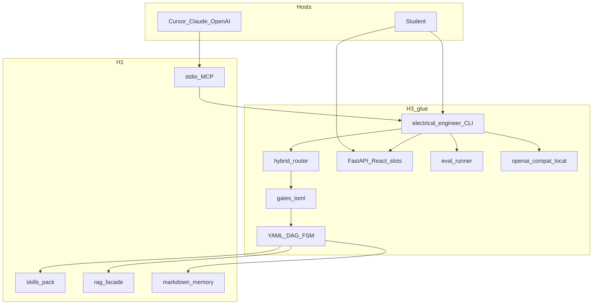

# Electrical Engineer — Master Execution Plan

> Nawab **project** profile + graph-engineering §19.  
> **The graph you run:** [`EXECUTION_GRAPH.md`](EXECUTION_GRAPH.md)  
> **Node plans (all linked):** [`plans/nodes/`](plans/nodes/) · index [`plans/README.md`](plans/README.md)  
> Gate 0 (closed): [`docs/planning/GATE_0_RESEARCH.md`](docs/planning/GATE_0_RESEARCH.md)

Historical research-phase notes are in the appendix at the bottom. They are **not** the current execution contract.

---

## §0 Plan metadata

| Field | Value |
|-------|-------|
| **Profile** | project |
| **Mode** | project |
| **Stack** | Python 3.11+ (`uv` + hatchling) CLI/runner; FastAPI + Vite/React + Zustand slot UI; stdio MCP; local OpenAI-compatible LLM; RAG facade (LightRAG 1.5 spike) |
| **Base branch** | `main` |
| **Feature branch** | `cursor/product-execution-plan-eb74` (single branch) |
| **User commit budget** | 60–80 (owner: 40–50 or more; all-pack solve/explain needs the upper band) |
| **Delivery** | repo `IMPLEMENTATION_PLAN.md` + `EXECUTION_GRAPH.md` + `plans/nodes/*.md` |
| **Supersedes** | Gate 0-only contract (2026-09-10 morning); research-phase plan on `cursor/ee-research-phase-7e0c` |
| **Authority docs** | [`docs/PID.md`](docs/PID.md), [`docs/PRD.md`](docs/PRD.md), [`docs/ARCHITECTURE.md`](docs/ARCHITECTURE.md), [`docs/WORKFLOWS.md`](docs/WORKFLOWS.md), [`docs/curriculum-map.md`](docs/curriculum-map.md), [`DECISIONS.md`](DECISIONS.md), [`research/notes/architecture-qa-gate.md`](research/notes/architecture-qa-gate.md) |
| **Estimated commits** | 60–80 |
| **Lead agent** | Orchestrate, commit, integrate subagents, PR |
| **Cheap model** | `composer-2.5` |
| **Judge / build model** | `cursor-grok-4.6-high` |

---

## §1 North star & scope boundary

### Objective

A student can install `electrical-engineer` locally, run named workflows from CLI or a persistent `127.0.0.1` React workspace, or from Cursor/Claude/OpenAI via MCP, get checked numbers or the exact token `unchecked`, and the same graph has been booted, trialled, and documented.

### Deliverables

- Python package + CLI commands: `run`, `workflows`, `mcp`, `eval`, `ui`, `rag`, `memory`
- Deterministic YAML DAG runner, gates, run dirs
- FastAPI + React slot UI (DSH-inspired, no Cordis)
- stdio MCP: `list_workflows`, `run_workflow`
- Local OpenAI-compatible LLM adapter (BYOK later)
- RAG facade after measured spike (LightRAG 1.5 / Docling / BM25+dense)
- Named recipes: cross-cutting + circuits + control + **solve + explain for every curriculum pack** + compose-from-parts
- Photo stub (multimodal understand, no generate) then C4 sim; C5 stub-to-model
- `eval/gold/` + `electrical-engineer eval --pack`
- `docs/CANNOT_DO.md` — honest failures
- Spec Kit `.specify/` constitution + spec
- README / EXTENSIVE / host adapter docs **after** it runs

### Non-goals

- H4 Electric Pi / Cordis / DSH as runtime
- H5 unique agent harness in CLI or UI
- Faculty LMS, plant/PLC, civil/mechanical, second git repo
- Copyrighted textbooks or third-party exam PDFs in git
- LangGraph, Temporal, crash-resume, HTTP MCP, PyPI, BYOK (this graph)
- Image generation
- Windows/macOS CI in this graph (document only)

### Priority

| Priority | Items |
|----------|-------|
| **P0** | H3 runner + CLI + `unchecked` + gates + circuits recipes + UI bind localhost + MCP fail-closed + eval injection + boot + trials |
| **P1** | RAG winner after spike, control pack, photo stub, local LLM, compose-from-parts, memory CLI |
| **P2** | Remaining pack solve+explain, C4 sim, C5, host docs, cannot-do completeness |
| **P3 (later graph)** | BYOK, HTTP MCP, Win/macOS CI, PyPI, handwritten-page OCR, lcapy, large gold bank |

---

## §2 Prerequisites & blockers

| Item | Status | Blocks | Resolution |
|------|--------|--------|------------|
| Gate 0 questions | **done** | compile | [`docs/planning/GATE_0_RESEARCH.md`](docs/planning/GATE_0_RESEARCH.md) |
| PID P0 locks | **done** | identity | Do not reopen |
| PRD / architecture accept | **this graph D0/A1** | product code | Streamline then treat as accepted for this plan |
| `.specify/` missing | pending | D0 | Scaffold in D0 |
| Local LLM daemon | optional | B_LOCAL_LLM interactive | Skip-if-missing in CI; T1 documents skip |
| MATLAB | optional | none | OSS path required |

---

## §3 Authority & artifact map

| Document | Path | Role |
|----------|------|------|
| PID | `docs/PID.md` | Read-only P0 after D0 streamline |
| PRD | `docs/PRD.md` | Requirements; D0 marks accepted for this scope |
| Architecture | `docs/ARCHITECTURE.md` | Implementer contract after A1 |
| Workflows | `docs/WORKFLOWS.md` | Recipe catalog (ids renamable) |
| Curriculum | `docs/curriculum-map.md` | UG bound |
| ADRs | `DECISIONS.md` | Writable on arch choices |
| This plan | `IMPLEMENTATION_PLAN.md` | Scope contract §0–§18 |
| Graph | `EXECUTION_GRAPH.md` | **What you execute** |
| Node plans | `plans/nodes/<id>.md` | **Only** authority a node agent loads |
| Spec Kit | `.specify/` | Constitution + spec (D0) |
| Cannot-do | `docs/CANNOT_DO.md` | Honest capability holes |
| Progress | `PROGRESS.md` | Wave checkpoint |
| Gate 0 | `docs/planning/GATE_0_RESEARCH.md` | Closed research |

**Read-only for subagents:** PID P0 locks, ARCHITECTURE runner law, this plan’s non-goals.  
**Writable per node:** only that node’s write-path globs.

---

## §4 Architecture & system map



### Target layout

```text
src/electrical_engineer/   # CLI, runner, gates, nodes, mcp, rag, local_llm
ui/                        # Vite React (slots, zustand, tokens)
workflows/<pack>/*.yaml
skills/<pack>/SKILL.md
eval/gold/<pack>/
docs/CANNOT_DO.md
.specify/
plans/nodes/
```

### Trust boundaries

- UI binds `127.0.0.1` only. No product cloud. No silent PDF/key upload.
- BYO PDFs, photos, memory cannot override gates or `unchecked`.
- Secrets via env / host stores. Redact keys from run dirs.
- MCP never waits on humans; fail closed + `ui_url`.

---

## §5 Workstreams

| ID | Name | Owns paths | Depends on | Agent |
|----|------|------------|------------|-------|
| WS-DOC | Authority + Spec Kit | `docs/*`, `.specify/`, `DECISIONS.md` | Gate 0 | lead |
| WS-CORE | Package, runner, CLI | `src/electrical_engineer/` except rag/ui | A1 | lead / high |
| WS-NODES | Activity registry | `src/electrical_engineer/nodes/` | CORE | high |
| WS-UI | Design + SPA | `docs/ui-ia.md`, `docs/frontend-architecture.md`, `ui/`, FastAPI routes | CORE contracts | high |
| WS-MCP | stdio MCP | `src/electrical_engineer/mcp/` | CORE | composer-2.5 |
| WS-WF | Recipes + skills | `workflows/`, `skills/` | NODES ids | high |
| WS-RAG | Spike + facade | `src/electrical_engineer/rag/`, research notes | NODES retrieve port | high |
| WS-EVAL | Gold + runner | `eval/gold/`, eval CLI | first recipes | high |
| WS-HOST | Adapter docs | `docs/hosts/` | MCP + skills | composer-2.5 |

---

## §6 Agent orchestration

| ID | Trigger | Type | readonly | Task | Sync | Gate |
|----|---------|------|----------|------|------|------|
| S-cheap | B_PKG, B_MCP, B_MEM, B_HOST, D1 draft | generalPurpose | false | Assigned node plan only | That node’s commits | node gate |
| S-high | B_CORE, B_UI, B_RAG, recipes, E1 | generalPurpose | false | Assigned node plan only | That node’s commits | node gate |
| S-explore | B_NODES research, B_RAG alternatives | explore | true | EE activities / RAG compare | Before write commits | — |
| S-review | H1 | security-review + ponytail-review | true | Branch diff | Before cutover | fixes by lead |

**Parallel limit:** 2–4 writers, disjoint paths.  
**File ownership:** lead owns `src/electrical_engineer/__init__.py` and shared types unless a node lists them.  
**Models:** `composer-2.5` cheap; `cursor-grok-4.6-high` judge/build.  
**Subagents do not commit.**

Every spawn prompt includes: repo path, node-plan path, write globs, `Do NOT commit`, return JSON contract.

---

## §7 Phase map


| Phase | Objective | Nodes | Exit gate |
|-------|-----------|-------|-----------|
| 0 | Streamline + freeze contracts | [D0](plans/nodes/D0.md), [A1](plans/nodes/A1.md) | PID/PRD/ARCH updated; Spec Kit present |
| 1 | Package + CI | [B_PKG](plans/nodes/B_PKG.md) | `uv run pytest -q` |
| 2 | Runner + CLI | [B_CORE](plans/nodes/B_CORE.md) | FSM + unchecked tests |
| 3 | Nodes + UI IA | [B_NODES](plans/nodes/B_NODES.md), [U1](plans/nodes/U1.md) | registry + `docs/ui-ia.md` |
| 4 | Surfaces | [B_MCP](plans/nodes/B_MCP.md), [B_MEM](plans/nodes/B_MEM.md), [B_WF_CROSS](plans/nodes/B_WF_CROSS.md), [B_UI](plans/nodes/B_UI.md) | MCP test + UI `127.0.0.1` |
| 5 | Circuits + RAG spike | [B_WF_CIRCUITS](plans/nodes/B_WF_CIRCUITS.md), [B_RAG_SPIKE](plans/nodes/B_RAG_SPIKE.md) | named circuit run; spike note |
| 6 | Control, photo, local LLM | [B_WF_CONTROL](plans/nodes/B_WF_CONTROL.md), [B_PHOTO](plans/nodes/B_PHOTO.md), [B_LOCAL_LLM](plans/nodes/B_LOCAL_LLM.md) | control plot; photo confirm-no-sim |
| 7 | All other packs | [B_WF_PACKS](plans/nodes/B_WF_PACKS.md) | each pack recipe or cannot-do row |
| 8 | Later rows + hosts | [B_C4_SIM](plans/nodes/B_C4_SIM.md), [B_C5](plans/nodes/B_C5.md), [B_HOST](plans/nodes/B_HOST.md) | sim-after-confirm path exists |
| N | Integrate → harden | [M1](plans/nodes/M1.md) … [H1](plans/nodes/H1.md) | `scripts/validate.sh` |

---

## §8 Todo registry

```yaml
todos:
  - id: persist-graph
    content: "Graph + node plans on disk (this commit set)"
    status: in_progress
  - id: wave0-docs
    content: "D0 + A1 authority + Spec Kit"
    status: pending
  - id: wave1-2-core
    content: "B_PKG + B_CORE"
    status: pending
  - id: wave3-4-surfaces
    content: "B_NODES U1 MCP MEM WF_CROSS UI"
    status: pending
  - id: wave5-6-quality
    content: "Circuits RAG control photo local-LLM"
    status: pending
  - id: wave7-8-breadth
    content: "Packs C4 C5 host"
    status: pending
  - id: integrate-eval-run
    content: "M1 E1 R1 T1 D1 H1"
    status: pending
```

---

## §9 Commit matrix

**User commit budget:** 60–80. One row = one commit. Tests in the same commit.

| # | WS | Commit | Node | Gate |
|---|-----|--------|------|------|
| 1 | DOC | `docs(plan): persist nawab + execution graph + node plans` | persist | files exist |
| 2 | DOC | `docs(pid): streamline identity` | [D0](plans/nodes/D0.md) | no P0 reopen |
| 3 | DOC | `docs(prd): accept scoped FRs` | D0 | §10/§11 closed |
| 4 | DOC | `docs(workflows): all-pack solve+explain catalog` | D0 | ids listed |
| 5 | DOC | `chore(specify): constitution + spec` | D0 | `.specify/` present |
| 6 | DOC | `docs(arch): UI RAG local-LLM + ADR-0007/0008` | [A1](plans/nodes/A1.md) | ADRs |
| 7 | CORE | `chore: uv hatchling src layout` | [B_PKG](plans/nodes/B_PKG.md) | importable |
| 8 | CORE | `ci: ubuntu lint pytest` | B_PKG | Actions green |
| 9–14 | CORE | runner FSM, gates, run ids, router, CLI surface, unchecked | [B_CORE](plans/nodes/B_CORE.md) | pytest |
| 15–18 | NODES | registry, spice/control/loadflow stubs, cannot-do | [B_NODES](plans/nodes/B_NODES.md) | registry test |
| 19 | UI | `docs(ui): IA + frontend architecture` | [U1](plans/nodes/U1.md) | `docs/ui-ia.md` |
| 20–21 | MCP | stdio tools + fail-closed | [B_MCP](plans/nodes/B_MCP.md) | protocol test |
| 22 | MEM | memory dirs + CLI | [B_MEM](plans/nodes/B_MEM.md) | cap test |
| 23–24 | WF | unmatched + compose-from-parts | [B_WF_CROSS](plans/nodes/B_WF_CROSS.md) | 16/24 reject |
| 25–32 | UI | FastAPI, Vite, slots, zustand, confirm, a11y, auto-open | [B_UI](plans/nodes/B_UI.md) | bind test |
| 33–37 | WF | circuits recipes + skill + tests | [B_WF_CIRCUITS](plans/nodes/B_WF_CIRCUITS.md) | `run solve-circuit-problem` |
| 38–41 | RAG | spike note, facade, retrieve, inventory | [B_RAG_SPIKE](plans/nodes/B_RAG_SPIKE.md) | filters test |
| 42–43 | WF | control solve+explain | [B_WF_CONTROL](plans/nodes/B_WF_CONTROL.md) | plot artifacts |
| 44–45 | LLM | local OpenAI-compat client | [B_LOCAL_LLM](plans/nodes/B_LOCAL_LLM.md) | skip-if-missing |
| 46–48 | VIS | photo stub + fixtures + UI confirm | [B_PHOTO](plans/nodes/B_PHOTO.md) | no sim after confirm |
| 49–56 | WF | one commit per remaining pack | [B_WF_PACKS](plans/nodes/B_WF_PACKS.md) | recipe or cannot-do |
| 57–58 | WF | C4 sim-after-confirm | [B_C4_SIM](plans/nodes/B_C4_SIM.md) | spice on confirmed only |
| 59 | WF | C5 control-diagram stub | [B_C5](plans/nodes/B_C5.md) | confirm no silent sim |
| 60 | HOST | Cursor/Claude/OpenAI docs | [B_HOST](plans/nodes/B_HOST.md) | paths exist |
| 61–62 | EVAL | gold items + injection | [E1](plans/nodes/E1.md) | injection holds |
| 63–64 | ALL | integrate wiring | [M1](plans/nodes/M1.md) | import cycle clean |
| 65–66 | EVAL | `electrical-engineer eval` | E1 | `--pack circuits` |
| 67 | ALL | boot evidence | [R1](plans/nodes/R1.md) | help + ui + mcp |
| 68 | ALL | Cursor student+agent trials | [T1](plans/nodes/T1.md) | trial log |
| 69 | DOC | README + extensive after run | [D1](plans/nodes/D1.md) | readme skill |
| 70 | ALL | validate.sh + reviews | [H1](plans/nodes/H1.md) | orchestrator 0 |

Rows 9–14, 15–18, 25–32, etc. **split** into one logical commit each when implementing (do not squash a range into one commit).

---

## §10 Test & CI strategy

| Tier | Purpose | Trigger | Command |
|------|---------|---------|---------|
| Fast | unit, lint, contract | every PR | `uv run ruff check . && uv run pytest -q` |
| Medium | runner, MCP, gates, injection | PR | `uv run pytest -q tests/integration` |
| Slow | boot + UI + Cursor trials | main / T1 | `EE_NO_BROWSER=1 electrical-engineer ui`; MCP stdio; trial checklist in T1 |

**Test locations:** `tests/unit/`, `tests/integration/`, `eval/gold/`.  
**Contract-first:** unchecked + gate fail-closed tests before photo/RAG.  
**CI:** Ubuntu only this graph.

---

## §11 Research log & decisions

| Topic | Options | Choice | Source | Record |
|-------|---------|--------|--------|--------|
| Harness | H1–H5 | H3 | PID | ADR-0001 |
| UI | HTMX vs React slots | FastAPI+React slots, no Cordis | owner + DSH AGENTS.md (inspire) | ADR-0008 (A1) |
| RAG | RAG-Anything vs LightRAG 1.5 vs Docling vs BM25 | Spike LightRAG 1.5; decide after numbers | HKUDS v1.5 notes; QUALITY>SPEED | ADR-0004 update |
| LLM | BYOK vs local vs host | Host + local OpenAI-compat; BYOK later | owner | A1 |
| Spec Kit | skip vs keep | constitution + specify | owner | D0 |
| Orchestrator | LangGraph vs YAML | YAML in-process | ARCHITECTURE Q17 | ADR-0007 |

---

## §12 Documentation & artifact sync

| Event | Update |
|-------|--------|
| Plan persisted | this file, EXECUTION_GRAPH, plans/nodes, plans/README |
| Wave done | PROGRESS.md, EXECUTION_GRAPH wave status |
| Arch choice | DECISIONS.md |
| Capability hole | docs/CANNOT_DO.md |
| After T1 | README via `readme` skill (D1) |

---

## §13 Quality gates & checkpoints

| Gate | When | Command | Blocks |
|------|------|---------|--------|
| Phase 0 | end A1 | authority docs mention H3 + localhost UI | B_PKG |
| Package | end B_PKG | `uv run pytest -q` | B_CORE |
| Core | end B_CORE | FSM + unchecked tests | surfaces |
| M1 | integrate | import + wiring tests | E1 |
| R1 | boot | help, ui, mcp | T1 |
| H1 | harden | `./scripts/validate.sh` | done |

Human checkpoints: none except copyrighted-PDF attempt or UI bind not localhost.

---

## §14 Validation & hardening

See [H1](plans/nodes/H1.md). Walk: forbidden H4/H5 patterns, secrets, full test matrix, ponytail-review, speckit-converge, expand tests, T1 checklist.

Orchestrator `scripts/validate.sh`: ruff, pytest, eval --pack circuits (OSS), doc path check, no `0.0.0.0` bind.

---

## §15 Rollout & cutover

N/A — no existing consumer to switch. First ship is this repo’s CLI+UI. Rollback = revert git. Do not publish PyPI this graph.

---

## §16 Exit criteria

### P0

- [ ] `electrical-engineer --help` lists required commands
- [ ] Named circuit recipe produces `summary.json` with checked number **or** exact token `unchecked`
- [ ] UI serves on `127.0.0.1` only; photo confirm does not simulate
- [ ] MCP `run_workflow` never waits; fail-closed payload has `ui_url` or CLI hint
- [ ] Injection gold cannot flip gates or `unchecked`
- [ ] R1 boot + T1 multi-trial log exist
- [ ] `scripts/validate.sh` exits 0
- [ ] PROGRESS reflects complete waves

### P1 / P2

- [ ] RAG inventory + book/chapter filter on chosen engine (or cannot-do + thin fallback documented)
- [ ] Control solve+explain with library plots
- [ ] Every remaining pack has solve+explain **or** a cannot-do row
- [ ] compose-from-parts enforces 16/24
- [ ] Local LLM skip-if-missing; works when daemon present
- [ ] C4 sim only after confirm; C5 no silent sim

---

## §17 Risks & contingencies

| Risk | Likelihood | Impact | Mitigation | Contingency |
|------|------------|--------|------------|-------------|
| RAG-Anything unmaintained | high | high | Spike LightRAG 1.5 | Docling or BM25+dense; record in CANNOT_DO |
| React UI grows a second brain | med | high | Slot viewer only; H5 falsifier | Strip to static artifact viewer |
| All-pack breadth is shallow | high | med | cannot-do over fake gold | Defer depth, keep recipes |
| Local LLM absent in CI | high | low | skip-if-missing | Host path for T1 |
| Commit matrix > 80 | med | low | coalesce pack rows | Stay in 80 |
| DSH inspiration → Cordis dep | low | high | ban in A1 + H1 grep | Remove dep |

---

## §18 Execution protocol

If **§19 is filled** (it is), do not run a linear-only loop. On approval: the graph is the plan you read.

```text
1. Node plans already on disk — load EXECUTION_GRAPH.md
2. Ponytail on every code write
3. Per wave: spawn Tasks with ONLY that node-plan path
4. Lead plumbing; barrier at M1
5. One §9 row per commit; lead commits
6. Update EXECUTION_GRAPH status + PROGRESS after each wave
7. Resume at first non-done wave
```

---

## §19 Execution graph

**Full graph:** [`EXECUTION_GRAPH.md`](EXECUTION_GRAPH.md)

### Node plans (every node — click through)

| ID | Name | Plan |
|----|------|------|
| R0 | Gate 0 (closed) | [docs/planning/GATE_0_RESEARCH.md](docs/planning/GATE_0_RESEARCH.md) |
| D0 | Docs-in | [plans/nodes/D0.md](plans/nodes/D0.md) |
| A1 | Architecture | [plans/nodes/A1.md](plans/nodes/A1.md) |
| B_PKG | Package + CI | [plans/nodes/B_PKG.md](plans/nodes/B_PKG.md) |
| B_CORE | Runner + CLI | [plans/nodes/B_CORE.md](plans/nodes/B_CORE.md) |
| B_NODES | Activity registry | [plans/nodes/B_NODES.md](plans/nodes/B_NODES.md) |
| U1 | UI design | [plans/nodes/U1.md](plans/nodes/U1.md) |
| B_MCP | stdio MCP | [plans/nodes/B_MCP.md](plans/nodes/B_MCP.md) |
| B_MEM | Memory CLI | [plans/nodes/B_MEM.md](plans/nodes/B_MEM.md) |
| B_WF_CROSS | Unmatched + compose | [plans/nodes/B_WF_CROSS.md](plans/nodes/B_WF_CROSS.md) |
| B_UI | FastAPI + React slots | [plans/nodes/B_UI.md](plans/nodes/B_UI.md) |
| B_WF_CIRCUITS | Circuits recipes | [plans/nodes/B_WF_CIRCUITS.md](plans/nodes/B_WF_CIRCUITS.md) |
| B_RAG_SPIKE | RAG spike | [plans/nodes/B_RAG_SPIKE.md](plans/nodes/B_RAG_SPIKE.md) |
| B_WF_CONTROL | Control recipes | [plans/nodes/B_WF_CONTROL.md](plans/nodes/B_WF_CONTROL.md) |
| B_PHOTO | Photo stub | [plans/nodes/B_PHOTO.md](plans/nodes/B_PHOTO.md) |
| B_LOCAL_LLM | Local LLM adapter | [plans/nodes/B_LOCAL_LLM.md](plans/nodes/B_LOCAL_LLM.md) |
| B_WF_PACKS | Remaining packs | [plans/nodes/B_WF_PACKS.md](plans/nodes/B_WF_PACKS.md) |
| B_C4_SIM | Sim after confirm | [plans/nodes/B_C4_SIM.md](plans/nodes/B_C4_SIM.md) |
| B_C5 | Control diagram stub | [plans/nodes/B_C5.md](plans/nodes/B_C5.md) |
| B_HOST | Host adapter docs | [plans/nodes/B_HOST.md](plans/nodes/B_HOST.md) |
| M1 | Integrate | [plans/nodes/M1.md](plans/nodes/M1.md) |
| E1 | Evaluate | [plans/nodes/E1.md](plans/nodes/E1.md) |
| R1 | Run / boot | [plans/nodes/R1.md](plans/nodes/R1.md) |
| T1 | Trials | [plans/nodes/T1.md](plans/nodes/T1.md) |
| D1 | Docs-out | [plans/nodes/D1.md](plans/nodes/D1.md) |
| H1 | Harden | [plans/nodes/H1.md](plans/nodes/H1.md) |

Approving this plan (graph filled) **starts wave execution**. Node plans are already written.

---

## Open questions

None blocking compile. Spike-owned: final RAG engine; exact workflow id strings; which pack rows are cannot-do.

---

## Approval

**Mode:** project. Graph compiled. Approve / continue to run **Wave 0** ([D0](plans/nodes/D0.md) → [A1](plans/nodes/A1.md)).

---

## Appendix — historical research contract

The 2026-09-09 research-phase nawab (branch `cursor/ee-research-phase-7e0c`) delivered `research/`, PID, curriculum map, and draft PRD. It is **not** this execution contract. See git history of this file before the product-graph persist commit.
