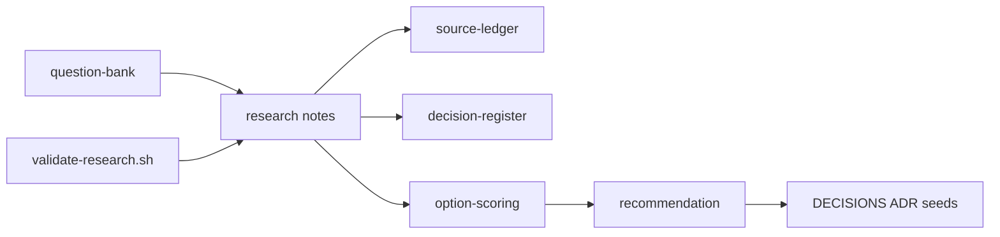

# Electrical-Engineer — research toward an undergrad EE agent

> Full internals (every package, file map, how the repo runs): [Extensive README](docs/EXTENSIVE.md)

**What it is.** A workspace to design an agentic system that helps with undergraduate electrical engineering — circuits, power systems, control, and machines — grounded in textbooks and checked with simulators.

**What it is not (yet).** There is **no shipped agent, no chat product, and no textbook index** in this repository. Right now the valuable output is a finished **research phase**: notes, a recommendation, and decision seeds.

**Primary interface today:** Markdown under [`research/`](research/) plus a small validation script. Agent hosts (Pi, Claude Code, Cursor, Codex) and MATLAB MCP appear in the research as *candidates*, not as installed runtime.

---

## TL;DR

- Research recommends a **local-first, package-first hybrid**: portable EE skills + local textbook RAG + MATLAB/Simulink verification, optionally wrapped as a Pi package — **not** a hard fork of Pi and not a greenfield harness.
- Grounding bet: **curated embedding packs** (from licensed books) published via **GitHub Release** into a **local Chroma** (or sqlite-vec) store — no commercial PDFs in git; BYO remains the fallback until rights are clear. Ingest lean: **RAG-Anything** for parse/table/equation enrichment, not as the student runtime ([`rag-stack-recommendation.md`](research/synthesis/rag-stack-recommendation.md)).
- Numbers should come from **MATLAB/Simulink MCP** when licensed, with an open-source SPICE/Python fallback documented.
- Circuit photos: reconstruct → **editable schematic UI** → simulate (Simulink preferred) only after user confirmation.
- Read the memo: [`research/synthesis/recommendation.md`](research/synthesis/recommendation.md).

## Table of contents

- [1. Vision](#1-vision)
- [2. Ideas worth understanding](#2-ideas-worth-understanding)
- [3. How the research works](#3-how-the-research-works)
- [4. Quickstart (read the research)](#4-quickstart-read-the-research)
- [5. Configuration](#5-configuration)
- [6. Further reading](#6-further-reading)
- [7. Future advancements](#7-future-advancements)

## 1. Vision

### What it is

The long-term idea is an agent that behaves like a strong undergrad electrical engineer: it can reason about circuits and power/control/machines coursework, retrieve concepts from books the user has rights to use, and verify calculations in MATLAB/Simulink or open-source simulators. The first concrete step — completed in this repo — was to research *what to build* rather than invent a product specification up front.

### What it is not

- Not a finished coding agent binary.
- Not a redistributed library of copyrighted textbooks.
- Not a PRD or launch checklist (those wait for a later phase if you accept the recommendation).

## 2. Ideas worth understanding

### 2.1 An agent is a model plus a harness

**The problem.** A raw chat model will invent load-flow numbers and misquote formulae.

**How it works.** A *harness* is the runtime around the model: tool loop, context assembly, safety, extensions. Coding agents differ mainly in that layer. See [`research/notes/harness-landscape.md`](research/notes/harness-landscape.md).

**Like.** The engine (model) versus the chassis and controls (harness).

**Limits.** Owning a harness is expensive; borrowing one via packages/MCP is cheaper if the APIs fit.

**Read next.** [Harness Engineering (arXiv:2609.00006)](https://arxiv.org/abs/2609.00006) · [Pi Coding Agent](https://pi.dev/)

### 2.2 Textbook RAG grounds EE knowledge

**The problem.** Undergrad EE lives in equations, assumptions, and worked examples that general models blur.

**How it works.** Prefer a **local** vector store loaded from a GitHub Release of precomputed embeddings (Chroma default). Until redistribution rights are reviewed per title, fall back to user-provided PDFs and optional open texts. Layout/formula-aware parsing, structure-aware chunks, and citations still apply. Concepts come from books; numbers still need tools. See [`research/notes/local-package-and-embedding-release.md`](research/notes/local-package-and-embedding-release.md), [`research/notes/ee-corpus-and-licensing.md`](research/notes/ee-corpus-and-licensing.md), and the `rag-*.md` notes.

**Like.** An open-book exam where the book is searchable — but you still need a calculator lab.

**Limits.** Bad PDF parsing destroys maths; embedding packs are not automatically copyright-safe; illegal corpora are off-limits.

**Read next.** [Technical-doc RAG (ACL Anthology)](https://aclanthology.org/2026.rag4reports-1.4.pdf) · [GitHub Releases](https://docs.github.com/en/repositories/releasing-projects-on-github/about-releases)

### 2.3 Simulation is the verifier

**The problem.** Fluent wrong answers look like lab results.

**How it works.** Prefer MathWorks’ MATLAB/Simulink MCP and agentic toolkits when a licence exists; keep SPICE/Python options as a fallback tier. Policy direction: do not present fabricated “simulation” numbers. See [`research/notes/matlab-simulink-surface.md`](research/notes/matlab-simulink-surface.md).

**Like.** Showing your work on a calculator printout, not scribbling an answer from memory.

**Limits.** Licence and toolbox gaps; long simulations need timeouts and approvals.

**Read next.** [MATLAB MCP Server](https://github.com/matlab/matlab-mcp-server)

### 2.4 “Undergrad-capable” is a task taxonomy, not a vibe

**The problem.** “Can do anything an EE undergrad can” is too vague to test.

**How it works.** Map genres (solve, derive, design, simulate, review, explain, report) across GATE EE sections and curricula, then score checkable vs judgement work differently. See [`research/notes/ee-task-taxonomy-draft.md`](research/notes/ee-task-taxonomy-draft.md).

**Like.** A lab rubric instead of a single exam percentage.

**Limits.** Rubrics are designed; pass bars are intentionally undecided.

**Read next.** [GATE EE syllabus (mirror PDF)](https://static.collegedekho.com/media/uploads/2024/07/01/gate-_ee_2025_syllabus.pdf)

## 3. How the research works



Workstreams studied harnesses (especially Pi), EE textbook RAG, MATLAB/OSS verification, and a capability taxonomy, then scored build options O1–O4. The failable script [`scripts/research/validate-research.sh`](scripts/research/validate-research.sh) checks note shape, citation hygiene heuristics, and anti-spec language in the memo.

## 4. Quickstart (read the research)

```bash
git clone https://github.com/Vinayak-RZ/Electrical-Engineer.git
cd Electrical-Engineer
./scripts/research/validate-research.sh --full
```

Then read, in order:

1. [`research/README.md`](research/README.md)
2. [`research/synthesis/recommendation.md`](research/synthesis/recommendation.md)
3. [`DECISIONS.md`](DECISIONS.md)
4. Deep dives under [`research/notes/`](research/notes/)

## 5. Configuration

Nothing to configure for reading. Future runtime work will need (not wired here):

- GitHub Release URL + checksum for an embedding pack, or paths to **user-owned** textbook PDFs for BYO RAG
- Local vector store (Chroma / sqlite-vec) and the **same embedding model** used to build the pack
- MATLAB/Simulink install + MCP registration when using MathWorks tools (local licence)
- Optional local LLM runtime; otherwise model API credentials for the host agent

## 6. Further reading

- [`research/synthesis/option-scoring.md`](research/synthesis/option-scoring.md)
- [`AGENTS.md`](AGENTS.md) — how agents should work in this repo
- [Pi](https://pi.dev/) · [MATLAB Agentic Toolkit](https://www.mathworks.com/products/matlab-agentic-toolkit.html)

## 7. Future advancements

### 7.1 Implement the O1 hybrid (skills + local RAG MCP + MATLAB wiring)

**Why.** Research ranked this path highest for speed, portability, and local-first use.  
**What would land.** Skill packs, Release→Chroma setup, RAG MCP server, host setup docs.  
**Done when.** A host agent can cite a local-pack (or BYO) passage and verify a trivial numeric check with tools.

### 7.2 Circuit photo → editable schematic → Simulink/ngspice

**Why.** Engineers often start from a photo or textbook figure, not a netlist.  
**What would land.** Vision→draft netlist, local schematic UI edit gate, Simulink or ngspice export.  
**Done when.** One clean schematic survives photo→edit→sim without trusting raw vision output.

### 7.3 Formula-preserving ingest spike on one owned chapter

**Why.** Parser ranking is still medium confidence.  
**What would land.** Metrics only (no corpus in git).  
**Done when.** Equation and example boundaries survive a measured parse.

### 7.4 Eval harness from the twenty RAG case titles

**Why.** Without gold tasks, RAG quality is anecdotal.  
**What would land.** Fixtures + retrieval/citation checks.  
**Done when.** Nightly or PR-optional jobs can fail on citation fabrications.

### 7.5 Optional standalone app later

**Why.** Multi-agent MCP/skills come first; a UI can wrap the same SDK later.  
**What would land.** Thin client over threads, artifacts, approvals.  
**Done when.** The app calls the same tools as CLI hosts without a second brain.

## Status

Branch of record for this work: `cursor/ee-research-phase-7e0c`. See [`PROGRESS.md`](PROGRESS.md).
