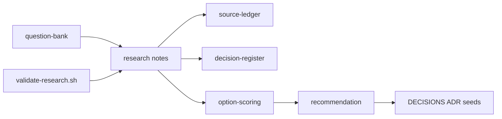

# Electrical-Engineer — UG electrical engineering co-solver (not shipped)

> Full internals (every package, file map, how the repo runs): [Extensive README](docs/EXTENSIVE.md)

**Thesis.** Electrical Engineer is an Apache-2.0, forever-open-source **co-solver** for undergraduate electrical engineering: a branded **local CLI** that also plugs into Cursor, Claude Code, or OpenAI (or a local model / BYO key), checks numbers with simulators when it can and **labels** numbers it did not check, and is shaped by **real UG coursework** at Indian and global institutes. GATE is an eval instrument, not the product bound. PG, civil, and mechanical are out of the public promise.

**What it is not (yet).** There is **no shipped agent, no CLI binary, no MCP server, no localhost UI, and no textbook index** in this repository. Identity is locked; architecture is **Proposed**. Read [`docs/PID.md`](docs/PID.md) (Accepted), [`docs/PRD.md`](docs/PRD.md) (draft), [`docs/ARCHITECTURE.md`](docs/ARCHITECTURE.md) (Proposed), [`docs/WORKFLOWS.md`](docs/WORKFLOWS.md) (Proposed).

**Harness (locked):** **H3** — branded CLI `electrical-engineer` wrapping portable skills + MCP + local RAG. Not a Pi fork (H4). Not a greenfield harness (H5). The CLI must stay a thin wrapper.

**Primary interface today:** Markdown under [`docs/`](docs/) and [`research/`](research/) plus `./scripts/research/validate-research.sh`. Hosts and simulators in the research notes are *candidates*, not installed runtime.

---

## Target capabilities (what success looks like)

This is the north star. If we reach it, the project succeeded. Nothing in this list is shipped today.

**North star.** A UG electrical engineering student can hand this co-solver the same work their coursework asks — written problems, assignments, later circuit and control diagrams — and get an answer that is **correct**, **explained**, and **checkable** (tool evidence, or an explicit **unchecked** label). The same repo is also an instrument: it exists to find the **limits** of current AI on core engineering, not only to wrap a chatbot in EE vocabulary.

**Who it is for first.** UG EE / EEE students, **India first**, including colleges without a MATLAB-fluent teaching assistant. Global UG EE must not be a thin afterthought. Self-learners on the same cores are welcome. GATE/IES aspirants may use exam-style items; that does not make this a GATE-only product. PG is **not** a public promise. Faculty/TA features are **not** v1.

**One repo.** Public line = UG coursework. Later unpublished profiles may exist in **this** repository. There is no UG-freeze fork vs lab fork.

### Capability list

| ID | Capability | Done when | Why it qualifies the project |
|----|------------|-----------|------------------------------|
| C1 | **Solve EE questions correctly** | On a published UG eval (curriculum-map packs; GATE tags are overlay only), numeric/symbolic answers match gold within tolerance **or the output is labelled unchecked**. Silent invention presented as checked is a fail. | Coverage + honesty, not vibes. Bound: [`docs/curriculum-map.md`](docs/curriculum-map.md). |
| C2 | **Explain, not only answer** | Every solved item states assumptions, applicable laws, and steps a viva can probe. Conceptual claims cite a retrieved passage the user has rights to use, or a standard identity. | A helper that dumps an answer without teaching is homework automation, not an engineer. |
| C3 | **All assignment genres** | The co-solver can **solve, derive, design-to-spec, simulate, review** (find seeded mistakes), **explain**, and structure a **lab-style report** across UG programme packs. | Real coursework is not only MCQs. Taxonomy: [`research/notes/ee-task-taxonomy-draft.md`](research/notes/ee-task-taxonomy-draft.md). |
| C4 | **Circuit diagrams** | Photo, screenshot, or textbook figure → draft netlist → **editable schematic** the student corrects → simulation (Simulink preferred, ngspice fallback). Vision output is never treated as truth until the student confirms. | Most EE work starts as a drawing. Pipeline research: [`research/notes/photo-to-schematic-to-simulink.md`](research/notes/photo-to-schematic-to-simulink.md). |
| C5 | **Control-system diagrams** | Block diagrams, signal-flow graphs, and typical UG Bode/Nyquist *figures* become a structured model the agent analyzes (poles, margins, step response) with the same edit-then-simulate gate. | Control homework is pictures plus math; a text-only agent is not an EE. |
| C6 | **Reliability contract** | No fabricated “simulation” or load-flow numbers. Tool evidence travels with checked answers. Unverified numbers are labelled **unchecked**. Low-confidence OCR/vision is flagged. | Core engineering is unsafe when fluency is mistaken for a lab. Landscape: [`research/notes/ai-core-engineering-landscape.md`](research/notes/ai-core-engineering-landscape.md). |
| C7 | **Student-first and open** | Apache-2.0, forever OSS in this repo. Local-first CLI so textbooks and student work need not leave the machine. OSS solvers first-class; MATLAB if present. | The people this is for often cannot buy Siemens/Ansys/Cadence stacks. |
| C8 | **Limit-finding** | Not a student UX promise. A public eval may report evidence rate vs unvalidated-claim rate. PG/operational tasks stay unpublished in this repo. | Failures have to be measurable; they are not a second product. |

### Domain coverage (UG coursework bound)

Packs follow [`docs/curriculum-map.md`](docs/curriculum-map.md). P1 default depth (not locked): circuits first, then control. GATE section labels are an **eval overlay**, not the ceiling.

1. Electric circuits
2. Control systems (diagram ingest is P1 after C4)
3. Power systems (classroom / study-level, not control-room operations)
4. Electrical machines
5. Signals and systems
6. Analog and digital electronics
7. Power electronics
8. Electromagnetic fields, measurements, engineering mathematics — solve/explain first; heavy numerics when a tool exists

PG stretch is **not advertised**. Civil, mechanical, and manufacturing are never this product.

### Reliability rules (non-negotiable)

- The model **plans and teaches**. MATLAB/Simulink (if present), SPICE, or the documented Python stack **owns checked numbers**.
- Unverified numbers are allowed only if labelled **unchecked**. Never present them as simulation.
- A reconstructed diagram is a **draft**. The student owns the topology after edits.
- Academic integrity is the institution’s policy. Default mode is **co-solver** (full working + answer). No faculty mode in v1.

### How we will know

Measurement design lives in [`research/notes/capability-eval-design.md`](research/notes/capability-eval-design.md): verified numeric, derivation checklist, citation-grounded explain, design-constraints, review catch-rate. Launch percentages are **not** invented here. The project is successful when those rubrics exist, run, and the default path is **tool-checked or labelled unchecked**.

---

## TL;DR

- **Success bar** is the capability list above: correct + explained + diagram-capable + label-unchecked, for **UG** EE, Apache-2.0.
- **Product choice is H3:** branded local CLI wrapping portable skills + MCP. Research memo still recommends O1/H2 as *advice*; do not treat that memo as the harness lock.
- Grounding bet (P1 proposed): local RAG, BYO PDFs, no commercial books in git.
- Numbers: MATLAB if present, OSS first-class otherwise; unverified values labelled **unchecked**.
- Circuit photos (later slice): reconstruct → **editable schematic** → simulate only after user confirmation.
- Core-engineering AI in the wider world already uses that same verify-loop. This repo’s gap is an **open student co-solver**, not a plant-floor copilot. Read [`research/notes/ai-core-engineering-landscape.md`](research/notes/ai-core-engineering-landscape.md).
- **Identity is locked.** [`docs/PID.md`](docs/PID.md). **PRD is draft for owner review.** [`docs/PRD.md`](docs/PRD.md). **Architecture is Proposed.** [`docs/ARCHITECTURE.md`](docs/ARCHITECTURE.md) · [`docs/WORKFLOWS.md`](docs/WORKFLOWS.md). Research advice (historical): [`research/synthesis/recommendation.md`](research/synthesis/recommendation.md).

## Table of contents

- [Target capabilities (what success looks like)](#target-capabilities-what-success-looks-like)
- [Accepted PID](docs/PID.md) · [PRD (draft)](docs/PRD.md) · [Architecture (Proposed)](docs/ARCHITECTURE.md) · [Workflows (Proposed)](docs/WORKFLOWS.md)
- [1. Vision](#1-vision)
- [2. Ideas worth understanding](#2-ideas-worth-understanding)
- [3. How the research works](#3-how-the-research-works)
- [4. Quickstart (read the research)](#4-quickstart-read-the-research)
- [5. Configuration](#5-configuration)
- [6. Further reading](#6-further-reading)
- [7. Future advancements](#7-future-advancements)

## 1. Vision

### What it is

The long-term idea is an **open-source** co-solver that behaves like a strong undergraduate electrical engineer: it can take the questions and diagrams that person is given, get them **right**, **teach** the solution, and leave an evidence trail a human can audit — or label numbers it did not check. Near-term, that person is a **UG** student, **India first**, without making global UG EE a thin afterthought. The first concrete step — completed in this repo — was research; the second is an Accepted PID and a PRD; the third is a **Proposed** technical architecture. There is still **no shipped CLI**.

PG is not a public promise. Later unpublished profiles may live in this same repository. Civil, mechanical, and manufacturing are never this product.

### What it is not

- Not a finished coding agent binary or an installable CLI **yet**.
- Not a redistributed library of copyrighted textbooks or third-party exam PDFs.
- Not a Siemens/Ansys/Cadence replacement, and not a plant-floor controller.
- Not a silent homework vending machine (explanations and tool evidence are part of the bar).
- Not a Pi fork (H4) and not a from-scratch harness (H5).

## 2. Ideas worth understanding

### 2.1 An agent is a model plus a harness

**The problem.** A raw chat model will invent load-flow numbers and misquote formulae.

**How it works.** A *harness* is the runtime around the model: tool loop, context assembly, safety, extensions. Coding agents differ mainly in that layer. See [`research/notes/harness-landscape.md`](research/notes/harness-landscape.md).

**Like.** The engine (model) versus the chassis and controls (harness).

**Limits.** Owning a harness is expensive; borrowing one via packages/MCP is cheaper if the APIs fit.

**Read next.** [Harness Engineering (arXiv:2609.00006)](https://arxiv.org/abs/2609.00006) · [Pi Coding Agent](https://pi.dev/)

### 2.2 Textbook RAG grounds EE knowledge

**The problem.** Undergrad EE lives in equations, assumptions, and worked examples that general models blur.

**How it works.** Prefer a **local** vector store loaded from a GitHub Release of precomputed embeddings (Chroma default). Until redistribution rights are reviewed per title, fall back to user-provided PDFs and optional open texts. Layout/formula-aware parsing, structure-aware chunks, and citations still apply. Concepts come from books; numbers still need tools. See [`research/notes/local-package-and-embedding-release.md`](research/notes/local-package-and-embedding-release.md), [`research/notes/ee-corpus-and-licensing.md`](research/notes/ee-corpus-and-licensing.md), and the `rag-*.md` notes.

**Like.** An open-book exam where the book is searchable — but you still need a calculator lab.

**Limits.** Bad PDF parsing destroys maths; embedding packs are not automatically copyright-safe; illegal corpora are off-limits.

**Read next.** [Technical-doc RAG (ACL Anthology)](https://aclanthology.org/2026.rag4reports-1.4.pdf) · [GitHub Releases](https://docs.github.com/en/repositories/releasing-projects-on-github/about-releases)

### 2.3 Simulation is the verifier

**The problem.** Fluent wrong answers look like lab results.

**How it works.** Prefer MathWorks’ MATLAB/Simulink MCP and agentic toolkits when a licence exists; keep SPICE/Python options as a first-class tier. Policy: do not present fabricated “simulation” numbers; label unverified values **unchecked**. See [`research/notes/matlab-simulink-surface.md`](research/notes/matlab-simulink-surface.md).

**Like.** Showing your work on a calculator printout, not scribbling an answer from memory.

**Limits.** Licence and toolbox gaps; long simulations need timeouts and approvals.

**Read next.** [MATLAB MCP Server](https://github.com/matlab/matlab-mcp-server)

### 2.4 “Undergrad-capable” is a task taxonomy, not a vibe

**The problem.** “Can do anything an EE undergrad can” is too vague to test.

**How it works.** Map genres (solve, derive, design, simulate, review, explain, report) across **UG programme packs**. GATE EE sections may **tag eval items**; they are not the product bound. See [`docs/curriculum-map.md`](docs/curriculum-map.md) and [`research/notes/ee-task-taxonomy-draft.md`](research/notes/ee-task-taxonomy-draft.md).

**Like.** A lab rubric instead of a single exam percentage.

**Limits.** Rubrics are designed; pass bars are intentionally undecided.

**Read next.** [GATE EE syllabus (mirror PDF)](https://static.collegedekho.com/media/uploads/2024/07/01/gate-_ee_2025_syllabus.pdf)

### 2.5 Core engineering AI is a verify loop

**The problem.** Most public AI progress is software agents. Core EE, civil, and manufacturing look empty until you look inside vendor toolchains and 2025–2026 papers — and even there, a fluent model will invent a “safe” load-flow or a wrong netlist.

**How it works.** The field’s actual progress is: LLM plans and explains; SPICE, MATLAB, BIM checkers, or PLC compilers own the numbers; a human or a deterministic gate catches the rest. See [`research/notes/ai-core-engineering-landscape.md`](research/notes/ai-core-engineering-landscape.md).

**Like.** A design intern who is brilliant at talking, sitting next to a lab that will not lie.

**Limits.** Vendor copilots are licence-locked. Open student harnesses are still rare. Diagram ingest stays assistive.

**Read next.** [PowerAgentBench](https://github.com/Power-Agent/PowerAgentBench) · [AnalogCoder](https://github.com/laiyao1/analogcoder) · [MATLAB Copilot](https://www.mathworks.com/products/matlab-copilot.html)

## 3. How the research works



Workstreams studied harnesses (especially Pi), EE textbook RAG, MATLAB/OSS verification, a capability taxonomy, and the wider **AI-in-core-engineering** landscape, then scored build options. The failable script [`scripts/research/validate-research.sh`](scripts/research/validate-research.sh) checks note shape, citation hygiene heuristics, and anti-spec language in the **historical** research memo. **Product choice is H3**, recorded in [`DECISIONS.md`](DECISIONS.md) ADR-0001.

## 4. Quickstart (read the research)

```bash
git clone https://github.com/Vinayak-RZ/Electrical-Engineer.git
cd Electrical-Engineer
./scripts/research/validate-research.sh --full
```

Then read, in order:

1. [`research/README.md`](research/README.md)
2. [`research/synthesis/recommendation.md`](research/synthesis/recommendation.md)
3. [`DECISIONS.md`](DECISIONS.md)
4. [`research/notes/ai-core-engineering-landscape.md`](research/notes/ai-core-engineering-landscape.md) — what the ecosystem can and cannot do
5. Deep dives under [`research/notes/`](research/notes/)

## 5. Configuration

Nothing to configure for reading. Future runtime work will need (not wired here):

- GitHub Release URL + checksum for an embedding pack, or paths to **user-owned** textbook PDFs for BYO RAG
- Local vector store (Chroma / sqlite-vec) and the **same embedding model** used to build the pack
- MATLAB/Simulink install + MCP registration when using MathWorks tools (local licence)
- Optional local LLM runtime; otherwise model API credentials for the host agent

## 6. Further reading

- [`docs/PID.md`](docs/PID.md) — accepted product identity
- [`docs/PRD.md`](docs/PRD.md) — product requirements (draft until owner accepts)
- [`docs/curriculum-map.md`](docs/curriculum-map.md) — UG bound; GATE as eval overlay
- [`docs/PID_DECISION_SHEET.md`](docs/PID_DECISION_SHEET.md) — P0 answers; P1 proposed
- [`LICENSE`](LICENSE) — Apache License 2.0
- [`research/notes/ai-core-engineering-landscape.md`](research/notes/ai-core-engineering-landscape.md)
- [`research/synthesis/option-scoring.md`](research/synthesis/option-scoring.md)
- [`AGENTS.md`](AGENTS.md) — how agents should work in this repo
- [Pi](https://pi.dev/) · [MATLAB Agentic Toolkit](https://www.mathworks.com/products/matlab-agentic-toolkit.html) · [MATLAB Copilot](https://www.mathworks.com/products/matlab-copilot.html)

## 7. Future advancements

### 7.1 Implement the H3 CLI wrapping the portable H1 core

**Why.** Owner locked H3. Research O1/H2 remains useful as the *portable layer* under the CLI, not as the product identity.  
**What would land.** Thin `electrical-engineer` CLI, skill packs, MCP (RAG/SPICE/MATLAB-if-present), host adapter docs, eval runner.  
**Done when.** A student can run the CLI locally (BYO key or local model) and also load the same skills in Cursor / Claude Code / OpenAI — without a unique agent loop.

### 7.2 Circuit photo → editable schematic → Simulink/ngspice

**Why.** Engineers often start from a photo or textbook figure, not a netlist.  
**What would land.** Vision→draft netlist, local schematic UI edit gate, Simulink or ngspice export.  
**Done when.** One clean schematic survives photo→edit→sim without trusting raw vision output.

### 7.3 Formula-preserving ingest spike on one owned chapter

**Why.** Parser ranking is still medium confidence.  
**What would land.** Metrics only (no corpus in git).  
**Done when.** Equation and example boundaries survive a measured parse.

### 7.4 Eval harness from the twenty RAG case titles

**Why.** Without gold tasks, RAG quality is anecdotal.  
**What would land.** Fixtures + retrieval/citation checks.  
**Done when.** Nightly or PR-optional jobs can fail on citation fabrications.

### 7.5 Persistent localhost UI (specified, not shipped)

**Why.** The UI is a critical shared workspace so student and agent can see runs, library-rendered diagrams, plots, citations, and RAG inventory — not a one-shot pretty picture.  
**What would land.** `electrical-engineer ui` on `127.0.0.1`, auto-opened on visual gates.  
**Done when.** Photo-stub confirm and artifact browse work without a second agent loop. Spec: [`docs/ARCHITECTURE.md`](docs/ARCHITECTURE.md).

### 7.6 UG-bounded eval against the success bar

**Why.** C1–C8 are a promise, not a measurement, until gold tasks exist.  
**What would land.** Licence-clean questions per curriculum pack (GATE tags optional), diagram fixtures, **unchecked**-label checks.  
**Done when.** A run can fail the agent for a fluent wrong number or a missing explanation.

## Status

Identity locked (H3, Apache-2.0, UG coursework bound). PRD awaiting owner accept. Architecture **Proposed**. **No shipped agent.** See [`PROGRESS.md`](PROGRESS.md).
