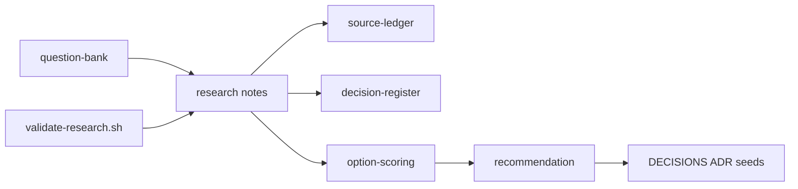

# Electrical-Engineer — UG electrical engineering co-solver (not shipped)

> Full internals (every package, file map, how the repo runs): [Extensive README](docs/EXTENSIVE.md)

**Thesis.** Electrical Engineer is an Apache-2.0, forever-open-source **co-solver** for undergraduate electrical engineering: a branded **local CLI** and a **persistent localhost UI** that also plug into Cursor, Claude Code, or OpenAI (or a local model / BYO key). Students run **named workflows** so retrieval, citations, and numbers get better. The product checks numbers with simulators when it can and labels unverified numbers with the exact token **unchecked**. It is shaped by **real UG coursework** at Indian and global institutes. GATE is an eval instrument, not the product bound. PG, civil, and mechanical are out of the public promise.

**What it is not (yet).** There is **no shipped agent, no CLI binary, no MCP server, no localhost UI, and no textbook index** in this repository. Identity is locked; architecture is **Proposed**. Read [`docs/PID.md`](docs/PID.md) (Accepted), [`docs/PRD.md`](docs/PRD.md) (draft), [`docs/ARCHITECTURE.md`](docs/ARCHITECTURE.md) (Proposed), [`docs/WORKFLOWS.md`](docs/WORKFLOWS.md) (Proposed).

**Harness (locked):** **H3** — branded CLI `electrical-engineer` wrapping portable skills + MCP + local RAG. The CLI runs **named YAML recipes** (a small DAG). Hosts own the main LLM loop. Not a Pi fork (H4). Not a greenfield harness (H5).

**Primary interface today:** Markdown under [`docs/`](docs/) and [`research/`](research/) plus `./scripts/research/validate-research.sh`. Hosts and simulators in the research notes are *candidates*, not installed runtime.

---

## Target capabilities (what success looks like)

This is the north star. If we reach it, the project succeeded. Nothing in this list is shipped today.

**North star.** A UG electrical engineering student can hand this co-solver the same work their coursework asks — written problems, assignments, later circuit and control diagrams — and get an answer that is **correct**, **explained**, and **checkable** (tool evidence, or an explicit **unchecked** label). The same repo is also an instrument: it exists to find the **limits** of current AI on core engineering, not only to wrap a chatbot in EE vocabulary.

**Who it is for first.** UG EE / EEE students, **India first**, including colleges without a MATLAB-fluent teaching assistant. Global UG EE must not be a thin afterthought. Self-learners on the same cores are welcome. GATE/IES aspirants may use exam-style items; that does not make this a GATE-only product. PG is **not** a public promise. Faculty/TA features are **not** v1.

**One repo.** Public line = UG coursework. Later unpublished profiles may exist in **this** repository. There is no UG-freeze fork vs lab fork.

### Capability list

| ID | Capability | Done when | Why it qualifies the project |
|----|------------|-----------|------------------------------|
| C1 | **Solve EE questions correctly** | On a published UG eval (curriculum-map packs; GATE tags are overlay only), numeric/symbolic answers match gold within tolerance **or the output contains the exact token unchecked**. Silent invention presented as checked is a fail. | Coverage + honesty, not vibes. Bound: [`docs/curriculum-map.md`](docs/curriculum-map.md). |
| C2 | **Explain, not only answer** | Every solved item states assumptions, applicable laws, and steps a viva can probe. Conceptual claims cite a retrieved passage (book + chapter + page) the user has rights to use, or a standard identity. | A helper that dumps an answer without teaching is homework automation, not an engineer. |
| C3 | **All assignment genres** | The co-solver can **solve, derive, design-to-spec, simulate, review** (find seeded mistakes), **explain**, and structure a **lab-style report** across UG programme packs, via **named workflows**. | Real coursework is not only MCQs. Catalog: [`docs/WORKFLOWS.md`](docs/WORKFLOWS.md). Taxonomy: [`research/notes/ee-task-taxonomy-draft.md`](research/notes/ee-task-taxonomy-draft.md). |
| C4 | **Circuit diagrams** | Photo or textbook screenshot → draft netlist + JSON graph → student **confirms in the persistent localhost UI**. Vision is never truth until that confirm. **Simulation after confirm is later** (the first slice is a stub). | Most EE work starts as a drawing. Spec: [`docs/ARCHITECTURE.md`](docs/ARCHITECTURE.md). |
| C5 | **Control-system diagrams** | Catalog stub `control-diagram-to-model` (do not drop): figure → structured model → **UI confirm**, same honesty as C4. Analyze-and-simulate after confirm is later. | Control homework is pictures plus math; a text-only agent is not an EE. |
| C6 | **Reliability contract** | No fabricated “simulation” or load-flow numbers. Tool evidence travels with checked answers. Unverified numbers use the exact token **unchecked**. Low-confidence OCR/vision is flagged. | Core engineering is unsafe when fluency is mistaken for a lab. Landscape: [`research/notes/ai-core-engineering-landscape.md`](research/notes/ai-core-engineering-landscape.md). |
| C7 | **Student-first and open** | Apache-2.0, forever OSS in this repo. Local-first CLI **and persistent UI** so textbooks and student work need not leave the machine. OSS solvers first-class; MATLAB if present (never required). | The people this is for often cannot buy Siemens/Ansys/Cadence stacks. |
| C8 | **Limit-finding** | Not a student UX promise. A public eval may report evidence rate vs unvalidated-claim rate. PG/operational tasks stay unpublished in this repo. | Failures have to be measurable; they are not a second product. |

### Domain coverage (UG coursework bound)

Packs follow [`docs/curriculum-map.md`](docs/curriculum-map.md). P1 default depth (not locked): circuits first, then control. GATE section labels are an **eval overlay**, not the ceiling.

1. Electric circuits
2. Control systems (diagram ingest is a catalog stub after C4)
3. Power systems (classroom / study-level, not control-room operations)
4. Electrical machines
5. Signals and systems
6. Analog and digital electronics
7. Power electronics
8. Electromagnetic fields, measurements, engineering mathematics — solve/explain first; heavy numerics when a tool exists

PG stretch is **not advertised**. Civil, mechanical, and manufacturing are never this product.

### Reliability rules (non-negotiable)

- The model **plans and teaches**. MATLAB/Simulink (if present), SPICE, or the documented Python stack **owns checked numbers**.
- Unverified numbers are allowed only if the exact token **unchecked** appears in the answer. Never present them as simulation.
- A reconstructed diagram is a **draft**. The student confirms topology in the persistent localhost UI.
- Figures come from **libraries + code** (schemdraw, matplotlib, python-control), not from a model inventing a PNG.
- Academic integrity is the institution’s policy. Default mode is **co-solver** (full working + answer). No faculty mode in v1.

### How we will know

Measurement design lives in [`research/notes/capability-eval-design.md`](research/notes/capability-eval-design.md). Gold tasks will live in [`eval/gold/`](eval/gold/README.md) and name a workflow id. Launch percentages are **not** invented here. The project is successful when those rubrics exist, run, and the default path is **tool-checked or labelled unchecked**.

---

## TL;DR

- **Success bar** is the capability list above: correct + explained + diagram-honest + exact token **unchecked**, for **UG** EE, Apache-2.0.
- **Product choice is H3:** local CLI + persistent UI wrapping portable skills + MCP. Named **workflows** improve RAG, citations, and verified numbers. The runner is not an LLM loop. Research memo O1/H2 is *advice*; do not treat it as the harness lock.
- Grounding: local RAG, BYO PDFs/scans, **inventory and book/chapter/folder tags**, no commercial books in git.
- Numbers: MATLAB if present, OSS first-class otherwise (product works **without** MATLAB).
- Circuit photos: reconstruct → **UI confirm** → stop. Simulate-after-confirm is later.
- Core-engineering AI elsewhere is the same verify-loop. This repo’s gap is an **open student co-solver**. Read [`research/notes/ai-core-engineering-landscape.md`](research/notes/ai-core-engineering-landscape.md).
- **Identity is locked.** [`docs/PID.md`](docs/PID.md). **PRD is draft.** [`docs/PRD.md`](docs/PRD.md). **Architecture is Proposed.** [`docs/ARCHITECTURE.md`](docs/ARCHITECTURE.md) · [`docs/WORKFLOWS.md`](docs/WORKFLOWS.md).

## Table of contents

- [Target capabilities (what success looks like)](#target-capabilities-what-success-looks-like)
- [Accepted PID](docs/PID.md) · [PRD (draft)](docs/PRD.md) · [Architecture (Proposed)](docs/ARCHITECTURE.md) · [Workflows (Proposed)](docs/WORKFLOWS.md)
- [1. Vision](#1-vision)
- [2. Ideas worth understanding](#2-ideas-worth-understanding)
- [3. How the research works](#3-how-the-research-works)
- [4. Quickstart (read the research)](#4-quickstart-read-the-research)
- [5. Configuration](#5-configuration)
- [6. Further reading](#6-further-reading)
- [7. Future advancements](#7-future-advancements)

## 1. Vision

### What it is

The long-term idea is an **open-source** co-solver that behaves like a strong undergraduate electrical engineer: it can take the questions and diagrams that person is given, get them **right**, **teach** the solution, and leave an evidence trail a human can **see** — or label numbers it did not check with `unchecked`. Near-term, that person is a **UG** student, **India first**, without making global UG EE a thin afterthought.

**How it is meant to work** (specified, not shipped). The student — or Cursor/Claude — calls a **named workflow** such as “solve a circuit homework problem.” A tiny runner executes a checked-in recipe (retrieve, explain, simulate if that recipe says so). A **persistent localhost UI** stays up so both the student and the agent can look at runs, library-drawn schematics, plots, and citations. The router never invents a new graph; unmatched questions get a short co-solver that will not pretend to have simulated. Detail: [`docs/ARCHITECTURE.md`](docs/ARCHITECTURE.md).

The first concrete step — completed in this repo — was research; then an Accepted PID and a PRD; then a **Proposed** technical architecture. There is still **no shipped CLI**.

PG is not a public promise. Later unpublished profiles may live in this same repository. Civil, mechanical, and manufacturing are never this product.

### What it is not

- Not a finished coding agent binary or an installable CLI **yet**.
- Not a unique agent loop pretending to be “just glue.”
- Not a redistributed library of copyrighted textbooks or third-party exam PDFs.
- Not a Siemens/Ansys/Cadence replacement, and not a plant-floor controller.
- Not a silent homework vending machine (explanations and tool evidence are part of the bar).
- Not a Pi fork (H4) and not a from-scratch harness (H5).

## 2. Ideas worth understanding

### 2.1 An agent is a model plus a harness

**The problem.** A raw chat model will invent load-flow numbers and misquote formulae.

**How it works.** A *harness* is the runtime around the model: tool loop, context assembly, safety. Coding agents differ mainly in that layer. Electrical Engineer’s H3 choice is a **thin branded CLI**: named YAML recipes, gates, eval, and a local UI — not a from-scratch agent. Hosts (Cursor, Claude Code, Codex) keep their loops. See [`docs/ARCHITECTURE.md`](docs/ARCHITECTURE.md) and [`research/notes/harness-landscape.md`](research/notes/harness-landscape.md).

**Like.** The engine (model) versus the chassis and controls (harness).

**Limits.** Owning a harness is expensive; borrowing one via packages/MCP is cheaper if the APIs fit.

**Read next.** [Harness Engineering (arXiv:2609.00006)](https://arxiv.org/abs/2609.00006) · [Pi Coding Agent](https://pi.dev/)

### 2.2 Textbook RAG grounds EE knowledge

**The problem.** Undergrad EE lives in equations, assumptions, and worked examples that general models blur.

**How it works.** Prefer a **local** index (RAG-Anything proposed as ingest) loaded from BYO PDFs and scans, with an **inventory** and tags so retrieval can mean “this book, chapter 3.” Until redistribution rights are reviewed per title, do not ship commercial books in git. Layout/formula-aware parsing, hybrid search, and citations (book + chapter + page) still apply. Concepts come from books; numbers still need tools. See [`docs/ARCHITECTURE.md`](docs/ARCHITECTURE.md) §10, [`research/notes/local-package-and-embedding-release.md`](research/notes/local-package-and-embedding-release.md), and the `rag-*.md` notes.

**Like.** An open-book exam where the book is searchable — but you still need a calculator lab.

**Limits.** Bad PDF parsing destroys maths; embedding packs are not automatically copyright-safe; illegal corpora are off-limits.

**Read next.** [Technical-doc RAG (ACL Anthology)](https://aclanthology.org/2026.rag4reports-1.4.pdf) · [GitHub Releases](https://docs.github.com/en/repositories/releasing-projects-on-github/about-releases)

### 2.3 Simulation is the verifier

**The problem.** Fluent wrong answers look like lab results.

**How it works.** Prefer MathWorks’ MATLAB/Simulink MCP when a licence exists; keep SPICE/Python as a **first-class** tier. The whole product must work **without MATLAB**. Policy: do not present fabricated “simulation” numbers; use the exact token **unchecked**. See [`research/notes/matlab-simulink-surface.md`](research/notes/matlab-simulink-surface.md).

**Like.** Showing your work on a calculator printout, not scribbling an answer from memory.

**Limits.** Licence and toolbox gaps; long simulations need timeouts and approvals.

**Read next.** [MATLAB MCP Server](https://github.com/matlab/matlab-mcp-server)

### 2.4 “Undergrad-capable” is a task taxonomy, not a vibe

**The problem.** “Can do anything an EE undergrad can” is too vague to test.

**How it works.** Map genres (solve, derive, design, simulate, review, explain, report) across **UG programme packs**, then give each a **student-readable workflow name**. GATE EE sections may **tag eval items**; they are not the product bound. See [`docs/curriculum-map.md`](docs/curriculum-map.md), [`docs/WORKFLOWS.md`](docs/WORKFLOWS.md), and [`research/notes/ee-task-taxonomy-draft.md`](research/notes/ee-task-taxonomy-draft.md).

**Like.** A lab rubric instead of a single exam percentage.

**Limits.** Rubrics are designed; pass bars are intentionally undecided.

**Read next.** [GATE EE syllabus (mirror PDF)](https://static.collegedekho.com/media/uploads/2024/07/01/gate-_ee_2025_syllabus.pdf)

### 2.5 Core engineering AI is a verify loop

**The problem.** Most public AI progress is software agents. Core EE, civil, and manufacturing look empty until you look inside vendor toolchains and 2025–2026 papers — and even there, a fluent model will invent a “safe” load-flow or a wrong netlist.

**How it works.** The field’s actual progress is: LLM plans and explains; SPICE, MATLAB, BIM checkers, or PLC compilers own the numbers; a human or a deterministic gate catches the rest. See [`research/notes/ai-core-engineering-landscape.md`](research/notes/ai-core-engineering-landscape.md).

**Like.** A design intern who is brilliant at talking, sitting next to a lab that will not lie.

**Limits.** Vendor copilots are licence-locked. Open student harnesses are still rare. Diagram ingest stays assistive.

**Read next.** [PowerAgentBench](https://github.com/Power-Agent/PowerAgentBench) · [AnalogCoder](https://github.com/laiyao1/analogcoder) · [MATLAB Copilot](https://www.mathworks.com/products/matlab-copilot.html)

## 3. How the research works



Workstreams studied harnesses (especially Pi), EE textbook RAG, MATLAB/OSS verification, a capability taxonomy, and the wider **AI-in-core-engineering** landscape, then scored build options. The failable script [`scripts/research/validate-research.sh`](scripts/research/validate-research.sh) checks note shape, citation hygiene heuristics, and anti-spec language in the **historical** research memo. **Product choice is H3**, recorded in [`DECISIONS.md`](DECISIONS.md) ADR-0001.

## 4. Quickstart (read the research)

```bash
git clone https://github.com/Vinayak-RZ/Electrical-Engineer.git
cd Electrical-Engineer
./scripts/research/validate-research.sh --full
```

Then read, in order:

1. [`docs/PID.md`](docs/PID.md) — who this is
2. [`docs/PRD.md`](docs/PRD.md) — what it must do (draft)
3. [`docs/ARCHITECTURE.md`](docs/ARCHITECTURE.md) — how it is meant to be built (Proposed)
4. [`docs/WORKFLOWS.md`](docs/WORKFLOWS.md) — named recipes
5. [`research/notes/ai-core-engineering-landscape.md`](research/notes/ai-core-engineering-landscape.md) — what the ecosystem can and cannot do
6. [`research/README.md`](research/README.md) — research map (historical O1 advice is not the harness lock)

## 5. Configuration

Nothing to configure for reading. Future runtime work will need (not wired here):

- Python 3.11+ and `pip` (Linux, macOS, Windows)
- Paths to **user-owned** textbook PDFs/scans for BYO RAG (plus optional embedding pack later)
- Gate files: `~/.config/electrical-engineer/gates.toml` and `.electrical-engineer/gates.toml`
- MATLAB/Simulink install + MCP registration **only if** using MathWorks tools (optional)
- Optional local LLM runtime; otherwise model API credentials for the host agent
- Browser on localhost for `electrical-engineer ui`

## 6. Further reading

- [`docs/PID.md`](docs/PID.md) — accepted product identity
- [`docs/PRD.md`](docs/PRD.md) — product requirements (draft until owner accepts)
- [`docs/ARCHITECTURE.md`](docs/ARCHITECTURE.md) — technical architecture (Proposed)
- [`docs/WORKFLOWS.md`](docs/WORKFLOWS.md) — named workflow catalog (Proposed)
- [`docs/curriculum-map.md`](docs/curriculum-map.md) — UG bound; GATE as eval overlay
- [`eval/gold/README.md`](eval/gold/README.md) — gold-task layout (empty packs)
- [`LICENSE`](LICENSE) — Apache License 2.0
- [`research/notes/ai-core-engineering-landscape.md`](research/notes/ai-core-engineering-landscape.md)
- [`research/synthesis/option-scoring.md`](research/synthesis/option-scoring.md)
- [`AGENTS.md`](AGENTS.md) — how agents should work in this repo
- [Pi](https://pi.dev/) · [MATLAB Agentic Toolkit](https://www.mathworks.com/products/matlab-agentic-toolkit.html) · [MATLAB Copilot](https://www.mathworks.com/products/matlab-copilot.html)

## 7. Future advancements

### 7.1 Implement the specified H3 CLI, recipes, UI, and eval

**Why.** Identity and architecture now say what to build: named YAML workflows, a deterministic runner, persistent localhost UI, tagged RAG, markdown memory, `eval/gold/`.  
**What would land.** `pip`-installable `electrical-engineer` (run / workflows / mcp / eval / ui / rag), skill packs, stdio MCP, UI on `127.0.0.1`.  
**Done when.** A student can run a named circuits workflow locally (BYO key or local model) and load the same skills in Cursor — without a unique agent loop. Blocked on **PRD accept** plus an implementation plan.

### 7.2 Photo stub in the UI, then simulate later

**Why.** Engineers often start from a photo or textbook figure, not a netlist.  
**What would land.** Vision → draft netlist + JSON → UI confirm (no sim in the stub); later, simulate the confirmed netlist.  
**Done when.** One clean schematic survives photo → confirm without treating raw vision as truth.

### 7.3 Formula-preserving ingest spike on one owned chapter

**Why.** Parser ranking is still medium confidence; RAG quality is a first-class requirement.  
**What would land.** Metrics only (no corpus in git); tagged book/chapter retrieval under the architecture budget.  
**Done when.** Equation and example boundaries survive a measured parse; empty retrieval is visible.

### 7.4 Gold tasks in `eval/gold/`

**Why.** C1–C8 are a promise until gold items name a recipe and score `unchecked`.  
**What would land.** Licence-clean circuits (then unmatched/injection) fixtures; `electrical-engineer eval --pack circuits`.  
**Done when.** A run can fail the agent for a fluent wrong number, a missing `unchecked`, or a BYO PDF that tries to flip gates.

## Status

Identity locked (H3, Apache-2.0, UG coursework bound). PRD and architecture awaiting owner accept. **No shipped agent.** See [`PROGRESS.md`](PROGRESS.md).
