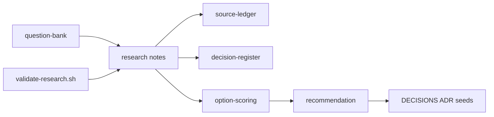

# Electrical-Engineer — research toward an undergrad EE agent

> Full internals (every package, file map, how the repo runs): [Extensive README](docs/EXTENSIVE.md)

**What it is.** An open-source project to build — and to *measure* — an agent that can do the work of a strong undergraduate (and later postgraduate) electrical engineer: solve the questions, explain them, ingest the diagrams, and refuse to invent numbers.

**What it is not (yet).** There is **no shipped agent, no chat product, and no textbook index** in this repository. Right now the valuable output is a finished **research phase**: notes, a recommendation, a landscape of AI in core engineering, and the success bar below.

**Primary interface today:** Markdown under [`research/`](research/) plus a small validation script. Agent hosts (Pi, Claude Code, Cursor, Codex) and MATLAB MCP appear in the research as *candidates*, not as installed runtime.

---

## Target capabilities (what success looks like)

This is the north star. If we reach it, the project succeeded. Nothing in this list is shipped today.

**North star.** A student can hand this agent the same work a UG or PG electrical engineer is asked to do — written problems, assignments, circuit diagrams, control-system diagrams — and get an answer that is **correct**, **explained**, and **checkable**. The same repo is also an instrument: it exists to find the **limits** of current AI on core engineering, not only to wrap a chatbot in EE vocabulary.

**Who it is for first.** UG and PG students in India and elsewhere who are actually taking circuits, machines, power, control, signals, and electronics — including people whose colleges do not have a MATLAB-fluent teaching assistant. Vendor copilots already sit inside expensive EDA, PLC, and CAD suites. This project is the open, student-facing counterpart.

**Two copies later.** The public line stays **UG-bounded**: curriculum, assignments, teaching, integrity. A fork (or a separately released track) can keep pushing PG/research-intern tasks and publishing where models still break. Same reliability contract; different promise.

### Capability list

| ID | Capability | Done when | Why it qualifies the project |
|----|------------|-----------|------------------------------|
| C1 | **Solve EE questions correctly** | On a published eval drawn from GATE EE sections and typical UG/PG assignments, numeric/symbolic answers match gold within tolerance **or the agent refuses**. Silent invention is a fail. | “Pretty much any assignment question” is the aim; the honest claim is coverage + refuse-unverified, not vibes. |
| C2 | **Explain, not only answer** | Every solved item states assumptions, applicable laws, and steps a viva can probe. Conceptual claims cite a retrieved passage the user has rights to use, or a standard identity. | A helper that dumps an answer without teaching is homework automation, not an engineer. |
| C3 | **All assignment genres** | The agent can **solve, derive, design-to-spec, simulate, review** (find seeded mistakes), **explain**, and structure a **lab-style report** across the GATE EE technical sections. | Real coursework is not only MCQs. Taxonomy: [`research/notes/ee-task-taxonomy-draft.md`](research/notes/ee-task-taxonomy-draft.md). |
| C4 | **Circuit diagrams** | Photo, screenshot, or textbook figure → draft netlist → **editable schematic** the student corrects → simulation (Simulink preferred, ngspice fallback). Vision output is never treated as truth until the student confirms. | Most EE work starts as a drawing. Pipeline research: [`research/notes/photo-to-schematic-to-simulink.md`](research/notes/photo-to-schematic-to-simulink.md). |
| C5 | **Control-system diagrams** | Block diagrams, signal-flow graphs, and typical UG Bode/Nyquist *figures* become a structured model the agent analyzes (poles, margins, step response) with the same edit-then-simulate gate. | Control homework is pictures plus math; a text-only agent is not an EE. |
| C6 | **Reliability contract** | No fabricated “simulation” or load-flow numbers. Tool evidence travels with the answer. Low-confidence OCR/vision is flagged. The agent says what it did not check. | Core engineering is unsafe when fluency is mistaken for a lab. Landscape: [`research/notes/ai-core-engineering-landscape.md`](research/notes/ai-core-engineering-landscape.md). |
| C7 | **Student-first and open** | The project stays open source. Local-first path exists so textbooks and student work need not leave the machine. OSS solvers work when MATLAB is unavailable. | The people this is for often cannot buy Siemens/Ansys/Cadence stacks. |
| C8 | **Limit-finding (research track)** | A public eval reports evidence rate and unvalidated-claim rate, and a fork can take PG/power-operation/analog-search tasks the UG product will not promise. | The scientific question — *how capable is AI for core engineering?* — is only answerable if failures are published. |

### Domain coverage (UG-bounded product)

Priority depth first, then the rest of a standard EE degree:

1. Electric circuits
2. Control systems (including diagram ingest)
3. Power systems (classroom / GATE level, not control-room operations)
4. Electrical machines
5. Signals and systems
6. Analog and digital electronics
7. Power electronics
8. Electromagnetic fields, measurements, engineering mathematics — solve/explain first; heavy numerics when a tool exists

PG stretch (research fork, not the student promise): literature triage, parametric Simulink studies, analog topology search, PowerAgentBench-style operational studies.

### Reliability rules (non-negotiable)

- The model **plans and teaches**. MATLAB/Simulink, SPICE, or the documented Python stack **owns the numbers**.
- A reconstructed diagram is a **draft**. The student (or a later human reviewer) owns the topology after edits.
- “I don’t know / I did not simulate this” is a successful behaviour. A confident wrong plot is not.
- Academic integrity is the institution’s policy. Product stance: show work so a viva still means something.

### How we will know

Measurement design lives in [`research/notes/capability-eval-design.md`](research/notes/capability-eval-design.md): verified numeric, derivation checklist, citation-grounded explain, design-constraints, review catch-rate. Launch percentages are **not** invented here. The project is successful when those rubrics exist, run, and the agent’s default path is **tool-checked or explicit refusal**.

---

## TL;DR

- **Success bar** is the capability list above: correct + explained + diagram-capable + refuse-unverified, for UG/PG students, open source.
- Research recommends a **local-first, package-first hybrid**: portable EE skills + local textbook RAG + MATLAB/Simulink verification, optionally wrapped as a Pi package — **not** a hard fork of Pi and not a greenfield harness.
- Grounding bet: **curated embedding packs** (from licensed books) published via **GitHub Release** into a **local Chroma** (or sqlite-vec) store — no commercial PDFs in git; BYO remains the fallback until rights are clear.
- Numbers should come from **MATLAB/Simulink MCP** when licensed, with an open-source SPICE/Python fallback documented.
- Circuit photos: reconstruct → **editable schematic UI** → simulate (Simulink preferred) only after user confirmation.
- Core-engineering AI in the wider world already uses that same verify-loop (vendor copilots + academic SPICE/BIM/PLC agents). This repo’s gap is an **open student harness**, not another plant-floor copilot. Read [`research/notes/ai-core-engineering-landscape.md`](research/notes/ai-core-engineering-landscape.md).
- Read the build memo: [`research/synthesis/recommendation.md`](research/synthesis/recommendation.md).

## Table of contents

- [Target capabilities (what success looks like)](#target-capabilities-what-success-looks-like)
- [1. Vision](#1-vision)
- [2. Ideas worth understanding](#2-ideas-worth-understanding)
- [3. How the research works](#3-how-the-research-works)
- [4. Quickstart (read the research)](#4-quickstart-read-the-research)
- [5. Configuration](#5-configuration)
- [6. Further reading](#6-further-reading)
- [7. Future advancements](#7-future-advancements)

## 1. Vision

### What it is

The long-term idea is an **open-source** agent that behaves like a strong electrical engineering student and, later, like a capable PG researcher: it can take the questions and diagrams that person is given, get them **right**, **teach** the solution, and leave an evidence trail a human can audit. Near-term, that person is a UG or PG student — especially in India, where EE cohorts are large and AI tooling has mostly followed software. The first concrete step — completed in this repo — was to research *what to build* and *what success means*, rather than invent a product specification up front.

A later **fork** can keep exploring the capability ceiling (harder PG tasks, operational power studies, analog search) while a copy of this line stays **bounded to UG/PG coursework**. Same reliability rules; different promise.

### What it is not

- Not a finished coding agent binary.
- Not a redistributed library of copyrighted textbooks.
- Not a Siemens/Ansys/Cadence replacement, and not a plant-floor controller.
- Not a silent homework vending machine (explanations and tool evidence are part of the bar).
- Not a PRD or launch checklist (those wait for a later phase if you accept the recommendation).

## 2. Ideas worth understanding

### 2.1 An agent is a model plus a harness

**The problem.** A raw chat model will invent load-flow numbers and misquote formulae.

**How it works.** A *harness* is the runtime around the model: tool loop, context assembly, safety, extensions. Coding agents differ mainly in that layer. See [`research/notes/harness-landscape.md`](research/notes/harness-landscape.md).

**Like.** The engine (model) versus the chassis and controls (harness).

**Limits.** Owning a harness is expensive; borrowing one via packages/MCP is cheaper if the APIs fit.

**Read next.** [Harness Engineering (arXiv:2609.00006)](https://arxiv.org/abs/2609.00006) · [Pi Coding Agent](https://pi.dev/)

### 2.2 Textbook RAG grounds EE knowledge

**The problem.** Undergrad EE lives in equations, assumptions, and worked examples that general models blur.

**How it works.** Prefer a **local** vector store loaded from a GitHub Release of precomputed embeddings (Chroma default). Until redistribution rights are reviewed per title, fall back to user-provided PDFs and optional open texts. Layout/formula-aware parsing, structure-aware chunks, and citations still apply. Concepts come from books; numbers still need tools. See [`research/notes/local-package-and-embedding-release.md`](research/notes/local-package-and-embedding-release.md), [`research/notes/ee-corpus-and-licensing.md`](research/notes/ee-corpus-and-licensing.md), and the `rag-*.md` notes.

**Like.** An open-book exam where the book is searchable — but you still need a calculator lab.

**Limits.** Bad PDF parsing destroys maths; embedding packs are not automatically copyright-safe; illegal corpora are off-limits.

**Read next.** [Technical-doc RAG (ACL Anthology)](https://aclanthology.org/2026.rag4reports-1.4.pdf) · [GitHub Releases](https://docs.github.com/en/repositories/releasing-projects-on-github/about-releases)

### 2.3 Simulation is the verifier

**The problem.** Fluent wrong answers look like lab results.

**How it works.** Prefer MathWorks’ MATLAB/Simulink MCP and agentic toolkits when a licence exists; keep SPICE/Python options as a fallback tier. Policy direction: do not present fabricated “simulation” numbers. See [`research/notes/matlab-simulink-surface.md`](research/notes/matlab-simulink-surface.md).

**Like.** Showing your work on a calculator printout, not scribbling an answer from memory.

**Limits.** Licence and toolbox gaps; long simulations need timeouts and approvals.

**Read next.** [MATLAB MCP Server](https://github.com/matlab/matlab-mcp-server)

### 2.4 “Undergrad-capable” is a task taxonomy, not a vibe

**The problem.** “Can do anything an EE undergrad can” is too vague to test.

**How it works.** Map genres (solve, derive, design, simulate, review, explain, report) across GATE EE sections and curricula, then score checkable vs judgement work differently. See [`research/notes/ee-task-taxonomy-draft.md`](research/notes/ee-task-taxonomy-draft.md).

**Like.** A lab rubric instead of a single exam percentage.

**Limits.** Rubrics are designed; pass bars are intentionally undecided.

**Read next.** [GATE EE syllabus (mirror PDF)](https://static.collegedekho.com/media/uploads/2024/07/01/gate-_ee_2025_syllabus.pdf)

### 2.5 Core engineering AI is a verify loop

**The problem.** Most public AI progress is software agents. Core EE, civil, and manufacturing look empty until you look inside vendor toolchains and 2025–2026 papers — and even there, a fluent model will invent a “safe” load-flow or a wrong netlist.

**How it works.** The field’s actual progress is: LLM plans and explains; SPICE, MATLAB, BIM checkers, or PLC compilers own the numbers; a human or a deterministic gate catches the rest. See [`research/notes/ai-core-engineering-landscape.md`](research/notes/ai-core-engineering-landscape.md).

**Like.** A design intern who is brilliant at talking, sitting next to a lab that will not lie.

**Limits.** Vendor copilots are licence-locked. Open student harnesses are still rare. Diagram ingest stays assistive.

**Read next.** [PowerAgentBench](https://github.com/Power-Agent/PowerAgentBench) · [AnalogCoder](https://github.com/laiyao1/analogcoder) · [MATLAB Copilot](https://www.mathworks.com/products/matlab-copilot.html)

## 3. How the research works



Workstreams studied harnesses (especially Pi), EE textbook RAG, MATLAB/OSS verification, a capability taxonomy, and the wider **AI-in-core-engineering** landscape, then scored build options O1–O4. The failable script [`scripts/research/validate-research.sh`](scripts/research/validate-research.sh) checks note shape, citation hygiene heuristics, and anti-spec language in the memo.

## 4. Quickstart (read the research)

```bash
git clone https://github.com/Vinayak-RZ/Electrical-Engineer.git
cd Electrical-Engineer
./scripts/research/validate-research.sh --full
```

Then read, in order:

1. [`research/README.md`](research/README.md)
2. [`research/synthesis/recommendation.md`](research/synthesis/recommendation.md)
3. [`DECISIONS.md`](DECISIONS.md)
4. [`research/notes/ai-core-engineering-landscape.md`](research/notes/ai-core-engineering-landscape.md) — what the ecosystem can and cannot do
5. Deep dives under [`research/notes/`](research/notes/)

## 5. Configuration

Nothing to configure for reading. Future runtime work will need (not wired here):

- GitHub Release URL + checksum for an embedding pack, or paths to **user-owned** textbook PDFs for BYO RAG
- Local vector store (Chroma / sqlite-vec) and the **same embedding model** used to build the pack
- MATLAB/Simulink install + MCP registration when using MathWorks tools (local licence)
- Optional local LLM runtime; otherwise model API credentials for the host agent

## 6. Further reading

- [`research/notes/ai-core-engineering-landscape.md`](research/notes/ai-core-engineering-landscape.md)
- [`research/synthesis/option-scoring.md`](research/synthesis/option-scoring.md)
- [`AGENTS.md`](AGENTS.md) — how agents should work in this repo
- [Pi](https://pi.dev/) · [MATLAB Agentic Toolkit](https://www.mathworks.com/products/matlab-agentic-toolkit.html) · [MATLAB Copilot](https://www.mathworks.com/products/matlab-copilot.html)

## 7. Future advancements

### 7.1 Implement the O1 hybrid (skills + local RAG MCP + MATLAB wiring)

**Why.** Research ranked this path highest for speed, portability, and local-first use.  
**What would land.** Skill packs, Release→Chroma setup, RAG MCP server, host setup docs.  
**Done when.** A host agent can cite a local-pack (or BYO) passage and verify a trivial numeric check with tools.

### 7.2 Circuit photo → editable schematic → Simulink/ngspice

**Why.** Engineers often start from a photo or textbook figure, not a netlist.  
**What would land.** Vision→draft netlist, local schematic UI edit gate, Simulink or ngspice export.  
**Done when.** One clean schematic survives photo→edit→sim without trusting raw vision output.

### 7.3 Formula-preserving ingest spike on one owned chapter

**Why.** Parser ranking is still medium confidence.  
**What would land.** Metrics only (no corpus in git).  
**Done when.** Equation and example boundaries survive a measured parse.

### 7.4 Eval harness from the twenty RAG case titles

**Why.** Without gold tasks, RAG quality is anecdotal.  
**What would land.** Fixtures + retrieval/citation checks.  
**Done when.** Nightly or PR-optional jobs can fail on citation fabrications.

### 7.5 Optional standalone app later

**Why.** Multi-agent MCP/skills come first; a UI can wrap the same SDK later.  
**What would land.** Thin client over threads, artifacts, approvals.  
**Done when.** The app calls the same tools as CLI hosts without a second brain.

### 7.6 UG-bounded eval against the success bar

**Why.** C1–C8 are a promise, not a measurement, until gold tasks exist.  
**What would land.** Licence-clean questions per GATE section, diagram fixtures, refuse-unverified checks.  
**Done when.** A run can fail the agent for a fluent wrong number or a missing explanation.

## Status

Branch of record for this work: `cursor/ee-research-phase-7e0c`. See [`PROGRESS.md`](PROGRESS.md).
