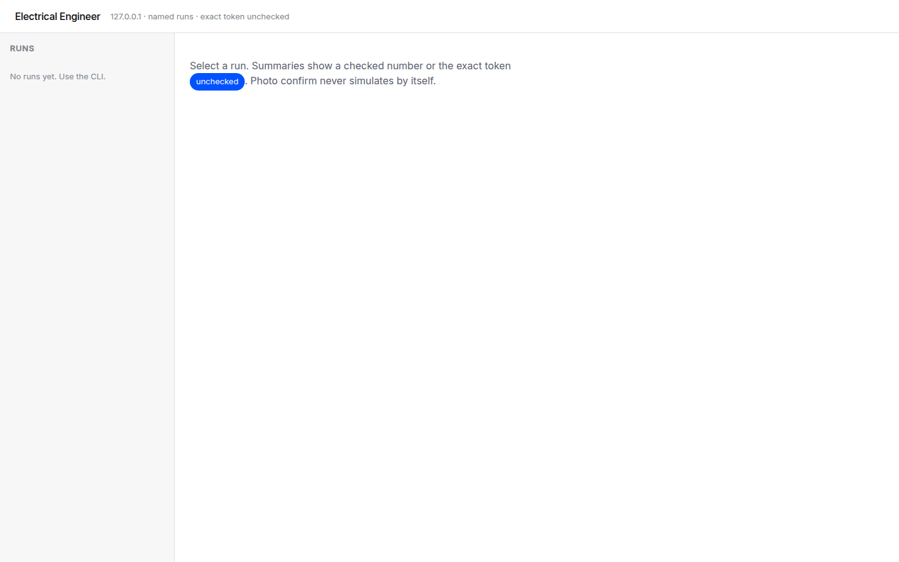
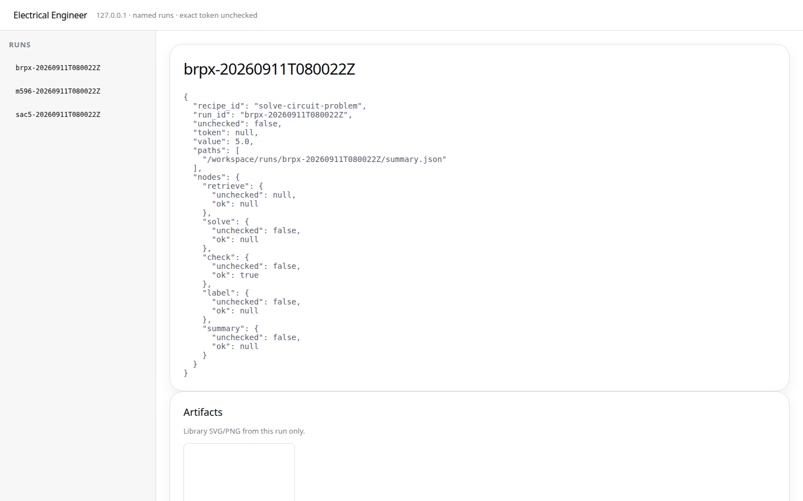
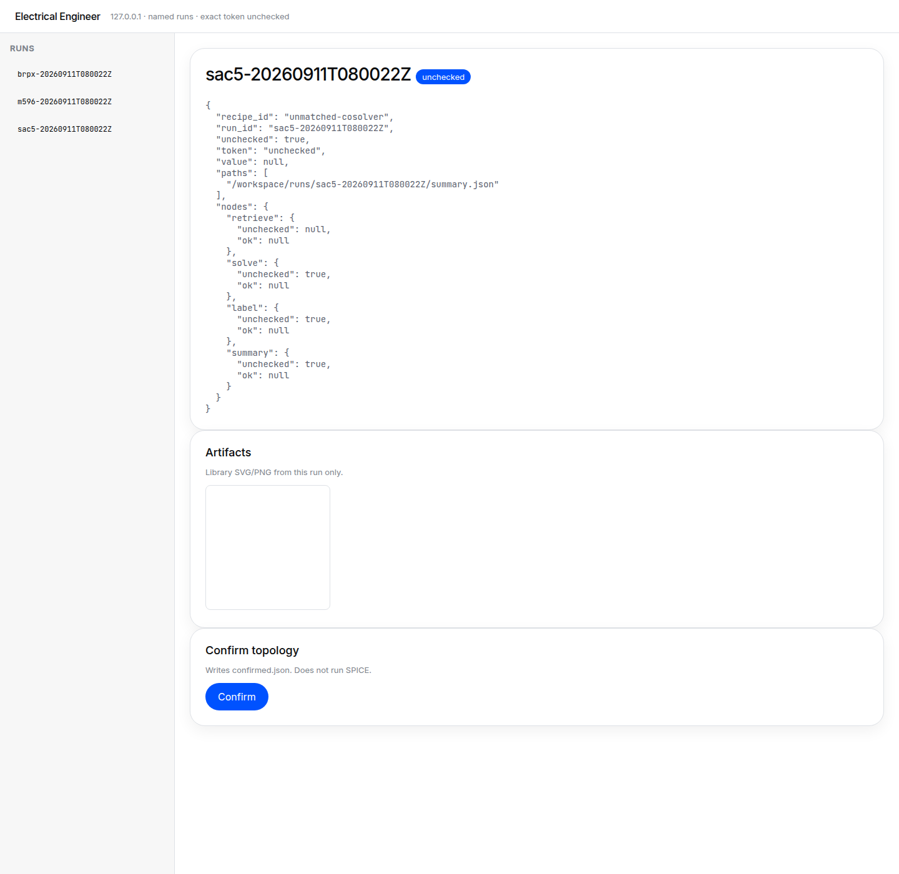
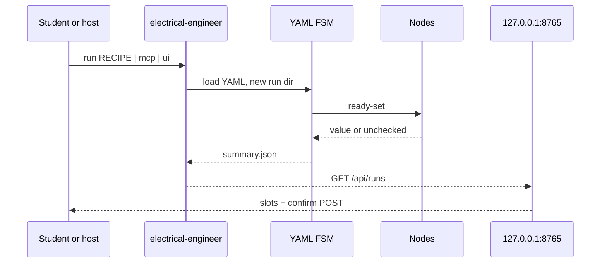

<p align="center">
  
</p>

<p align="center">
  <a href="docs/EXTENSIVE.md"></a>
  <a href="LICENSE"></a>
  <a href=".github/workflows/ci.yml"></a>
</p>

<p align="center">
  <a href="docs/EXTENSIVE.md"><b>Internals</b></a> ·
  <a href="docs/PID.md"><b>PID</b></a> ·
  <a href="docs/CANNOT_DO.md"><b>Cannot-do</b></a> ·
  <a href="LICENSE"><b>License</b></a>
</p>

> Full internals (every package, file map, how the repo runs): [Extensive README](docs/EXTENSIVE.md)

**Electrical Engineer** is an Apache-2.0 **undergraduate electrical-engineering co-solver**. It runs named YAML workflows so a student (or a host agent) can retrieve, check, and explain coursework with simulators when they exist, and with the exact token **unchecked** when they do not.

> **Electrical Engineer is a local CLI + persistent localhost UI you can run today.** It is not Electric Pi, not a Cordis/DSH agent loop, and not a PyPI release or BYOK cloud.
> Primary interface: `electrical-engineer`.
> Invariant: **unverified numbers use the exact token `unchecked`** — never a silent fake SPICE pass.

```text
$ uv run electrical-engineer --help
usage: electrical-engineer [-h] [--version]
                           {run,workflows,mcp,eval,ui,rag,memory} ...
```

```text
$ uv run electrical-engineer eval --pack circuits
PASS divider-dc-01 recipe=solve-circuit-problem
1/1 passed
```

That eval is the product check: gold `eval/gold/circuits/divider-dc-01` expects divider `Vout = 5.0` from `Vin=10`, `R1=R2=1k`. A fluent wrong number presented as checked fails the product.

## The workspace you actually open

`electrical-engineer ui` binds **127.0.0.1:8765** only. Pass `--run <id>` to open `/?run=<id>`. White canvas, scarce `#0052ff` pills, Inter + JetBrains Mono — **not** Coinbase fonts or wordmark. Tokens: [`ui/src/tokens.css`](ui/src/tokens.css) from [`docs/design/DESIGN-coinbase.md`](docs/design/DESIGN-coinbase.md).



Empty chrome: pick a run from the CLI. The `unchecked` badge is a pill in the copy, not a red/green verdict.



A **checked** divider: `"value": 5.0` and `"unchecked": false`. The title has no badge — the word `unchecked` inside JSON keys must not light the pill.



An **unmatched** run stays `unchecked`. Confirm writes `confirmed.json` and **does not run SPICE**.

Trials: [`docs/planning/T1_TRIALS.md`](docs/planning/T1_TRIALS.md). Boot log: [`docs/planning/R1_BOOT.md`](docs/planning/R1_BOOT.md). Honest holes: [`docs/CANNOT_DO.md`](docs/CANNOT_DO.md).

## Why it exists

Undergraduate electrical engineering is mostly circuits, signals, machines, power, and control — not chatbot fluency. This repo is the H3 harness from [`docs/PID.md`](docs/PID.md): a branded CLI wrapping portable skills and stdio MCP, with a FastAPI + React workspace on loopback. Hosts (Cursor, Claude Code, OpenAI) own the LLM loop; the CLI can also talk to a local OpenAI-compatible daemon when `EE_LOCAL_LLM_URL` is set.

Nearby-wrong products (MATLAB Copilot, a general coding agent that “also does circuits”, Electric Pi) are not the runtime. If the UI grew its own agent loop, that would be the H5 falsifier.

## Core techniques

- **Named YAML DAGs.** Recipes under `workflows/` run in-process (`repair_max`, 16-node cap). Limit: the router never invents a graph; unmatched work uses `unmatched-cosolver` and stays unchecked. [`docs/WORKFLOWS.md`](docs/WORKFLOWS.md)
- **Label-unchecked.** If ngspice, python-control, or pandapower is missing, the run fails closed with token `unchecked`. `EE_ALLOW_ALL` skips *asks*, not this token. Limit: a checked number requires a tool or a numeric check, not a fluent paragraph. [`docs/ARCHITECTURE.md`](docs/ARCHITECTURE.md)
- **Localhost slot UI.** FastAPI on `127.0.0.1:8765`, Vite React slots, DESIGN-coinbase tokens. Limit: no WAN bind, no agent loop in the browser, library SVG/PNG only.
- **stdio MCP.** `list_workflows` / `run_workflow`. Photo, compose, and control-diagram ids fail closed with a `ui_url` (`/?run=` when an id exists). Limit: MCP never waits on a human. [`docs/hosts/README.md`](docs/hosts/README.md)
- **Thin RAG facade.** Book/chapter/folder/domain filters; empty retrieval is visible (`empty: true`). Spike picked **bm25** until LightRAG 1.5 has numbers on a licensed chapter. Limit: no commercial PDFs in git. [`research/notes/rag-spike-results-2026-09.md`](research/notes/rag-spike-results-2026-09.md)

## Field guide

**Checked vs unchecked.** A number is checked only when a verifier or numeric gold comparison said so. Everything else is the exact token `unchecked`. Fluency is not evidence.

**Named recipe vs unmatched.** The catalog is the product. If the router cannot name a YAML id, it runs `unmatched-cosolver` — it does not grow a new DAG at runtime.

**Confirm ≠ simulate.** Photo and topology gates stop after the student confirms in the UI. Confirming a picture never starts SPICE by itself.

**Loopback only.** The workspace is a shared viewer on `127.0.0.1`. Binding `0.0.0.0` is a product bug (`./scripts/validate.sh` greps for it).

## How it works



Entry: `electrical-engineer` → `electrical_engineer.cli:main`. Internals: [`docs/EXTENSIVE.md`](docs/EXTENSIVE.md).

## What it achieves (honest)

Reproduced on this tree ([T1](docs/planning/T1_TRIALS.md)): divider `Vout=5.0` checked; unmatched and injection stay `unchecked`; MCP photo does not hang; UI binds loopback; control artifacts exist but say `python-control missing` when the library is absent. MATLAB is optional and not in CI. PyPI, HTTP MCP, and BYOK cloud are later-graph — named so they are not silently claimed.

## Get started

You need **Python 3.11+**, **[uv](https://docs.astral.sh/uv/)**, and (for the UI) **Node** to build `ui/dist`.

```text
uv sync --extra dev
uv run electrical-engineer workflows
uv run electrical-engineer run solve-circuit-problem
EE_NO_BROWSER=1 uv run electrical-engineer ui
uv run electrical-engineer mcp
uv run electrical-engineer eval --pack circuits
./scripts/validate.sh
```

Put a `problem.json` in the working directory for numeric tasks (see `eval/gold/circuits/divider-dc-01/fixtures/problem.json`). Host adapters: [`docs/hosts/README.md`](docs/hosts/README.md).

## Go deeper

| Doc | What it is |
|-----|------------|
| [`docs/EXTENSIVE.md`](docs/EXTENSIVE.md) | Concepts, runtime path, every package |
| [`docs/PID.md`](docs/PID.md) | Locked identity (H3, UG, Apache-2.0) |
| [`docs/PRD.md`](docs/PRD.md) | Product requirements |
| [`docs/ARCHITECTURE.md`](docs/ARCHITECTURE.md) | Harness and seams |
| [`docs/WORKFLOWS.md`](docs/WORKFLOWS.md) | Named recipe catalog |
| [`docs/CANNOT_DO.md`](docs/CANNOT_DO.md) | Honest holes |
| [`docs/design/DESIGN-coinbase.md`](docs/design/DESIGN-coinbase.md) | Visual lock |
| [`docs/planning/T1_TRIALS.md`](docs/planning/T1_TRIALS.md) | Live trial ledger |

## License

Apache-2.0. See [`LICENSE`](LICENSE).
