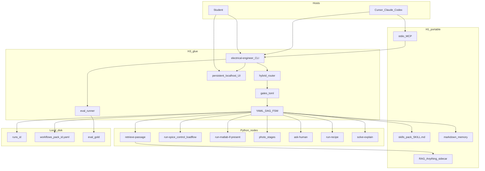

# Technical architecture — Electrical Engineer

**Status:** Accepted for this graph (A1, 2026-09-10).  
**Date:** 2026-09-10  
**Authority:** [`PID.md`](PID.md) (Accepted), [`PRD.md`](PRD.md) (Accepted for this graph)

There is **no shipped product yet**; this file is the implementer contract. Do not invent LangGraph, Temporal, Cordis, or a second agent loop.

Recipes exist so the agent gives **better answers** (RAG, citations, verified numbers, explanations), not so a graph merely runs. Named workflows are the default. The runner is **not** an LLM loop.

---

## 1. System map



**Patterns (agent-patterns MCP unreachable — ids MCP-PENDING):** Pipeline; DAG fan-out; Human-in-the-loop; hard step cap.

---

## 2. Layers

| Layer | Owns | Must not own |
|-------|------|----------------|
| CLI | Defaults (co-solver, ug, `unchecked`), router, DAG runner, eval, `ui`, `rag` inventory, gates | A unique multi-turn agent loop (H5) |
| Skills | Pedagogy, named workflow intent | Secrets, commercial books |
| MCP | `list_workflows`, `run_workflow` (stdio) | Sessions, waiting on humans |
| Persistent UI | Shared understanding: runs, artifacts, diagrams, plots, citations, RAG inventory, memory excerpts | A second brain; WAN bind; KiCad clone |
| RAG sidecar | Ingest/index (RAG-Anything, proposed), tagged retrieval | Harness / agent loop |
| Nodes | One activity each | Inventing workflows |
| Hosts | Their LLM loops | Our textbook corpus |

**H3 falsifier:** if the CLI grows a custom harness hosts cannot share, stop and return to the owner.

**Runner law:** no model calls except through **registered nodes**, plus one **pre-runner** classifier when the workflow id is omitted. The DAG runner itself is deterministic.

---

## 3. Language, OS, install

| Topic | Freeze |
|-------|--------|
| Runtime this pass | **Python 3.11+** CLI, runner, and in-process node functions |
| Install | `pip` (and equivalent) on **Linux, macOS, and Windows** |
| Offline | Required: with a configured local model, CLI-only is a complete path. Spice/control/load-flow work with **no** model |
| MATLAB | **Optional.** Product and CI must work with OSS only (ngspice, python-control, pandapower, sympy) |
| Later CLI skin | Owner also allowed a Go or Rust CLI wrapping this Python runner. Not the Proposed freeze. Revisit after PRD accept if a static binary is needed |

Main LLM work lives in **Cursor / Claude Code / Codex** (or another configured model). The CLI is deterministic glue: YAML recipes, Python nodes, files, UI, eval.

---

## 4. Hybrid router

1. If the user passes an explicit workflow id (`electrical-engineer run solve-circuit-problem`), **skip** classify.
2. If the id is omitted, one **small classifier LLM** call ranks named recipes.
3. If top-1 and top-2 scores differ by **less than 0.15**, **ask the student** (counts as an interrupt).
4. Otherwise run that named YAML recipe.
5. If nothing matches: **`unmatched-cosolver` only**. No auto-simulate. Numerics that lack a verifier artifact use the exact token `unchecked`.

The router **never invents a DAG**. New graphs only from `compose-from-parts --advanced`.

Inside a named recipe the agent **may** branch on conditional DAG edges, pick a child via `run-recipe` when the parent declares that choice, and multi-hop RAG inside `retrieve-passage` (book → chapter → passages) with a hop cap.

**Forbidden:** unmatched path attaching `run-spice` because text “looks like a netlist”; memory or a BYO PDF instructing a new workflow into existence.

---

## 5. DAG runner and FSM

Custom **in-process** runner. No LangGraph, Temporal, Treadle, Ordius, or Tasked.

- Recipes: YAML at `workflows/<pack>/<id>.yaml`.
- Nodes: registered Python functions.
- A node is **ready** when every incoming typed port is satisfied.
- All ready nodes **may run concurrently** (threads or asyncio in **one** process for **one** run).
- **Start order** among simultaneously ready nodes: sorted `node id` (evals replay the same start sequence even if wall clocks overlap).
- Isolation: `runs/<id>/nodes/<node-id>/`. Shared mutable files at the run root are forbidden except `summary.json` written at the end.
- FSM states: `running`, `waiting-human` (live TTY or UI, not crash-resume), `failed`, `done`.
- Timeouts: **2 min** default, recipe override allowed, **10 min** hard ceiling.
- Sim-repair: `repair_max: 2` on named simulate nodes. Automatic. **Does not** count toward human interrupts. After exhaustion: `label-unchecked` or `ask-human`, never a fake pass.

**No crash-resume.** The run directory is **audit**. If the process dies, start a new run. Do not skip nodes by reading old `out.json`.

### Run ids

Format: `{short-suffix}-{utc-timestamp}`, suffix **first**.

- Suffix: 4 chars, lowercase Crockford base32 (or similar), from a few random bytes. Speakable: “run k7m2”.
- Timestamp: `YYYYMMDDTHHMMSSZ`.
- Example: `k7m2-20260910T162148Z`.
- Directory name is always the full id. Display may use the suffix alone only if unique under `./runs/`.

Location: `./runs/<id>/` under the **project root** (cwd, or nearest ancestor with `.electrical-engineer/` or `workflows/`). Gitignore `runs/`.

### Concurrency across runs

No project lock. No cap. Each `electrical-engineer run` is one process, one `runs/<id>/`, one context bundle. Two Cursor chats, or CLI + MCP, may run together. Do not share `summary.json` or spice working directories across runs.

If one process ever hosts several in-flight recipes, use a single deterministic FIFO of ready nodes keyed by `(run_id, node_id)`. No work-stealing, priorities, or remote workers in this pass.

MATLAB: if a single-seat licence errors on a second engine, fail that node clearly. Do not globally serialize all recipes.

---

## 6. Composition and `run-recipe`

**Space (plugins):** swap backends behind seams (`run-spice` vs `run-matlab-if-present`) without a second CLI.

**Time (recipes):** a workflow is a small DAG of nodes, including nested recipes.

Activity **`run-recipe`**: input `recipe_id` plus a small map matching the child’s declared ports. Allowed in checked-in YAML **and** in DAGs emitted by `compose-from-parts`.

Child run dir: `runs/<parent-id>/children/<child-suffix>-<timestamp>/` (same id rules). Child `summary.json` is the parent node’s output (short JSON + **paths**, not bodies).

Hard rules:

- Cycle detection on the recipe-id graph. `A → A` or `A → B → A` rejected **before** run.
- Max nesting depth **3** (root = 0).
- A `run-recipe` node counts as **one** node on the parent’s 16-node cap. The child has its **own** 16/24 budget.
- Child interrupts count toward the parent’s **2-interrupt** budget.
- Child gates use the same policy. MCP still does not wait.

### `compose-from-parts`

Listed, **`--advanced`**. Only this path may **emit** a new DAG. Typed ports. Cap **16 nodes / 24 edges** on the composed graph. Invalid graphs fail closed before spice. May include `run-recipe` nodes. Asking to compose counts as an interrupt (see gates).

---

## 7. Gates (Cursor-like)

Files:

- Global: `~/.config/electrical-engineer/gates.toml`
- Project: `.electrical-engineer/gates.toml`
- Format: TOML
- Merge: **most-restrictive wins**
- Allow-all: file flag **and** env `EE_ALLOW_ALL` **and** CLI `--allow-all`
- Default: **on**
- Budget: **at most 2** `ask-human` / visual confirms per **root** run (children included). A would-be **3rd** interrupt **aborts**. Do not auto-allow the rest.

| Action | Policy |
|--------|--------|
| Local sim writing only inside that run’s dir (`run-spice`, `run-python-control`, `run-load-flow`) | auto-run |
| MATLAB | ask |
| RAG retrieve (read-only) | auto-run |
| Writes outside the run dir | deny-by-default |
| Photo / vision | ask (UI confirm) |
| Extra network / API from a node (not the student’s configured LLM) | ask |
| Installing packages | deny-by-default |
| `compose-from-parts` | ask |
| `run-recipe` | inherits child gates; no extra ask just for nesting |
| Memory file write | auto-run inside the two memory dirs; deny anywhere else |
| RAG ingest (BYO add) | ask (persistent index) |

Configured host / BYO / local **LLM** is allowed without a gate. “Network” ≠ that model.

**MCP:** `run_workflow` **never waits**. If a gate would fire: fail closed with a structured error, a `ui_url` when the UI is up, or the exact command `electrical-engineer ui --run <id>`, plus a CLI hint. Host UI is **not** allow-all.

Eval may set `EE_ALLOW_ALL=1` so gates do not block CI. That does **not** disable the `unchecked` contract.

---

## 8. CLI and MCP

Specified, not shipped.

| Command | Now / later |
|---------|-------------|
| `electrical-engineer run <id>` | now |
| `electrical-engineer workflows` | now (discovery) |
| `electrical-engineer mcp` | now (stdio) |
| `electrical-engineer eval` / `eval --pack circuits` | now |
| `electrical-engineer ui` / `ui --run <id>` | now |
| `electrical-engineer rag add \| list \| tag` | now |
| `electrical-engineer memory` | now |
| `electrical-engineer resume` | **later** |
| Faculty / LMS | **never** |

MCP **now** (stateless stdio): `list_workflows`, `run_workflow`. HTTP/SSE **later**. `resume_workflow` / `list_runs` / `get_run` **later**.

`run_workflow` returns short JSON + artifact **paths**. The **host** assembles the next model context. The CLI assembles context for the **local-model** path. Do not build a second hidden prompt loop inside MCP.

---

## 9. Persistent localhost UI (critical)

The UI is a **first-class product surface**, not a fine-diagram gadget.

**Why.** Cursor/Claude users (and CLI users) need a place that **stays up** so both the **student and the agent** can see and understand: current and past runs, library-rendered schematics, plots, photo-stub topology, citations, RAG inventory, and memory excerpts. Understanding is the point of the co-solver.

**Stack (freeze).** FastAPI serves a Vite/React CSR SPA. Zustand holds layout + current run id. A **thin in-repo slot registry** (inspire DSH named holes; **no Cordis / DSH runtime**). Visual tokens: [`design/DESIGN-coinbase.md`](design/DESIGN-coinbase.md) (Inter + JetBrains/Geist Mono; never Coinbase fonts or wordmark). Slot map: `root`, `sidebar`, `workspace`, `run.detail`, `run.artifacts`, `photo.confirm`, `rag.inventory`, `memory.excerpt`, `gates.prompt`. Layout: `src/electrical_engineer` + `ui/`.

**Shape**

- Command: `electrical-engineer ui` (optionally `--run <id>`). CLI **auto-opens** it when a recipe hits a **visual** gate.
- Long-lived local HTTP server. Bind **`127.0.0.1` only**. No product cloud. No LAN bind by default.
- Persistent for the working session (and may stay up across runs). Text-only recipes never **require** it; it still helps browse artifacts.
- Thin viewer + confirm: render **library** SVG/PNG plus the JSON graph. If the student edits topology, the UI updates the JSON graph / netlist, then a **library re-renders**. Not a KiCad clone. Not an image-model PNG.
- Photo stub confirm happens **here**, not as ASCII-only.
- After photo confirm: **still no sim** in the stub (C4 sim remains later).
- MCP does not wait; fail payload points at this UI.

This remains **H3 glue** (a viewer/workspace). If the UI grows its own agent loop, that is the H5 falsifier.

---

## 10. RAG (quality is mandatory)

Do **not** lock an engine before numbers. This graph **spikes LightRAG 1.5** against Docling and BM25+dense (ADR-0004). QUALITY then SPEED. A facade exposes `retrieve` + inventory regardless of winner. Thin BM25 fallback is allowed if the spike fails; record that in [`CANNOT_DO.md`](CANNOT_DO.md).

Keep an explicit source tree: **library → book → chapter → chunk**.

EE metadata on top of the chunk note: `doc_id`, title, chapter, section, pages, `licence_tag`, `folder_tag`, student tags, `domain_tag`, `chunk_type`. Optional concept-graph prerequisites remain the P1 overlay in [`../research/notes/rag-chunking-and-retrieval.md`](../research/notes/rag-chunking-and-retrieval.md).

| Rule | Freeze |
|------|--------|
| BYO ingest | PDFs **and** images (scans). Circuit-homework photos for **simulation** still go through `photo-to-netlist`, not quiet RAG-as-netlist |
| Inventory | `electrical-engineer rag list` — every ingested source and its tags. CLI is enough this pass (no third MCP tool) |
| Filters (v1 retrieval) | `book_id`, `chapter_id`, `folder_tag`, `domain_tag`. “Search only this book, chapter 3” is required, not optional |
| Hybrid | dense + BM25. Empty retrieval is **visible**, never silent |
| Citations | book + chapter + page (+ tag if filtered) |
| Legal | no commercial PDFs in git; BYO stays on the student’s machine |
| Untrusted | ingest cannot override gates, `--allow-all`, or `unchecked` |

**Very good RAG** means **precision under a small context budget**, not dumping chapters.

---

## 11. Memory

Not the RAG index. Not a chat dump.

| Scope | Path |
|-------|------|
| Project | `.electrical-engineer/memory/` (student may commit as a course notebook) |
| User | `~/.local/share/electrical-engineer/memory/` (never in the project repo) |

One concern per file (examples: `preferences.md`, `course.md`, `errors.md`, `facts.md`). Agent reads/writes through **explicit** nodes or CLI helpers — no silent append every turn. Untrusted (Q57). Context: **paths + short excerpt** (800-char class), never the whole folder. Cap **32 KiB per file**; over cap ⇒ summarise, do not grow forever.

---

## 12. Context policy

| Always | Skill **index** (id + one line) |
|--------|--------------------------------|
| On EE tasks | matching `skills/<pack>/SKILL.md` |
| After each node | ≤ **800** chars JSON + **paths**, not bodies |
| RAG in context | cited passages, max **1500 chars × 3**, plus book + chapter + page (and tag if filtered). Paths-only is **not** enough for C2 |
| Filtered RAG | honour book/chapter/folder tags **before** filling the 3-passage budget |
| Never | full SPICE traces, RAG index dump, conversation logs, full memory folder, full chapter text |

Skills live at `skills/<pack>/SKILL.md`. CLI and hosts read the **same** files.

---

## 13. Trust, math, figures

**Unchecked.** The exact token `unchecked` appears in the student-facing answer **and** `summary.json` has a field plus a sentence. Synonyms (`unverified`, `not simulated`) are **not** the contract token.

**LaTeX.** Answers with mathematics use `$...$` / `$$...$$` (or `\[ \]`). `summary.json` may include `math: latex | plain`. CLI prints plaintext/unicode fallback. Hosts get LaTeX. Unmatched delimiters are a **defect**.

**Figures.** Forbidden default: vision model invents a pretty circuit PNG with no netlist. Required: node/agent writes **Python against a library** → artifacts in the run dir → UI displays them.

First-class libraries:

- Circuits drawing: **schemdraw** (and/or lcapy diagrams)
- Numeric plots: **matplotlib**
- Control plots: **python-control** (Bode, step, root locus)
- Netlist/sim: `run-spice` / `run-python-control` / `run-load-flow` / `run-matlab-if-present`

Export **png** (share/report) and **svg** (crisp in UI).

**Run dir contents:** node JSON, artifact paths, spice **log path** (not body). No API keys. Redact `*_KEY`, `*_TOKEN`, `*_SECRET`, `sk-`, `Bearer`, MATLAB licence strings.

**Injection:** BYO PDFs, photos, folder tags, and memory files **cannot** override gates, `--allow-all`, or `unchecked`.

---

## 14. Eval (specified this pass)

Gold home: [`../eval/gold/`](../eval/gold/README.md).

```text
eval/gold/
  circuits/
  control/
  unmatched/
  injection/          # BYO-PDF must not flip gates
```

Suggested item shape (prose, not a JSON Schema): `task.md` (student-facing prompt), `expect.json` (numeric tolerances, required token `unchecked` or checked, `recipe_id`), optional `fixtures/`.

`electrical-engineer eval` and `eval --pack circuits`. A gold item **names a recipe**. Scoring reads `summary.json` (numeric fields, `unchecked` token, recipe id). MATLAB optional. `EE_ALLOW_ALL=1` may skip gates in CI; **unchecked** still scores.

Do not design a hosted leaderboard, LLM-as-judge platform, or a 200-task bank here.

---

## 15. Activity nodes

Student-facing names live in [`WORKFLOWS.md`](WORKFLOWS.md). Activities (not a classifier):

`retrieve-passage`, `check-numeric`, `run-spice`, `run-python-control`, `run-matlab-if-present`, `run-load-flow`, `ask-human`, `label-unchecked`, `write-run-summary`, `solve-explain`, photo stages `detect-components`, `connect-wires`, `ocr-labels`, `draft-netlist`, `confirm-topology`, `run-recipe`.

Simulate seam: **separate** spice / matlab / load-flow nodes. MATLAB if present else OSS (PRD P1). Do not invent a third rule.

---

## 16. Local OpenAI-compatible LLM

CLI path for `solve-explain` uses a local OpenAI-compatible HTTP client (LM Studio / Ollama / vLLM). Skip-if-missing in CI. Hosts keep their own loops. BYOK is **later** (not this graph).

---

## 17. Non-goals (this architecture)

- LangGraph, Temporal cluster, DSH/Cordis runtime, Treadle/Ordius/Tasked
- Crash-resume, HTTP MCP, `resume` CLI, BYOK
- Hosted eval, full schematic editor, locking a RAG engine before the spike
- Per-field JSON Schema
- Faculty/LMS, H4/H5, second git repo, civil/mechanical packs

---

## Owner review checkpoint

Closed A1 2026-09-10 (owner: start / execute this graph):

- [x] Hybrid router, named recipes, compose `--advanced` only
- [x] Python 3.11+ pip CLI; deterministic runner; hosts own the main LLM
- [x] Persistent localhost UI as a **critical** shared workspace (FastAPI + React slots, DESIGN-coinbase)
- [x] Typed DAG + `run-recipe` depth 3; no crash-resume
- [x] Gates, MCP fail-closed, `unchecked` exact token
- [x] RAG facade after LightRAG 1.5 spike; markdown memory
- [x] `eval/gold/` + `electrical-engineer eval`
- [x] **Architecture accepted** for this graph
