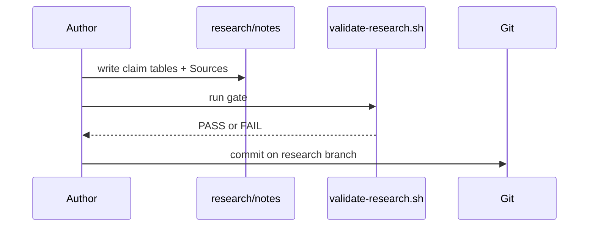

# Extensive README — Electrical-Engineer internals

Companion to the human overview in [`README.md`](../README.md). This file maps **what exists in the tree today**, how the research phase runs, and why each important file is there.

**Repo kind:** greenfield product idea + **completed research-phase documentation**. No application packages (`packages/`) yet. Vendored Cursor coding config lives under `.cursor/`.

---

## How the repository runs (today)

There is no server to start. The “runtime” is:

1. Humans/agents edit Markdown under `research/`.
2. `./scripts/research/validate-research.sh` (optionally `--full`) fails the change if notes lack required sections, look unfinished, smell like a requirements doc in the memo, or (after Phase F) break README path rules.
3. Git commits on `cursor/ee-research-phase-7e0c` record one research artifact per commit by convention.



When a future implementation phase starts, expect MCP servers and skill packs to appear; they are **not** in the tree yet. The recommendation describing them is [`research/synthesis/recommendation.md`](../research/synthesis/recommendation.md).

---

## Top-level layout

| Path | Role |
|------|------|
| `README.md` | Readable research compilation |
| `AGENTS.md` | Instructions for coding agents in this repo |
| `PROGRESS.md` | Phase status log |
| `DECISIONS.md` | ADR seeds (`proposed`) |
| `skills-manifest.json` | Inventory of vendored skills |
| `research/` | Research-phase artifacts (authority for “what to build”) |
| `scripts/` | Helper scripts (research validator; Cursor config installers) |
| `docs/` | Docs including this file and `cursor-config/` guides |
| `.cursor/` | Vendored rules, skills, MCP config |

---

## Package: `research/`

**What it is for.** Hold the research-only phase: questions, decisions, sourced notes, synthesis.

**How it is invoked.** Read by humans; validated by `scripts/research/validate-research.sh`.

### File map — registers

| Path | What it does | Why it exists |
|------|--------------|---------------|
| `research/README.md` | Map of the research phase | Onboarding without opening every note |
| `research/NOTE.template.md` | Required note headings | Keeps validator and authors aligned |
| `research/question-bank.md` | Q1–Q17 with status | Prevents silent unresolved questions |
| `research/DECISION_REGISTER.md` | D1–D10 stances | Compact decision index |
| `research/source-ledger.md` | S1–S42 sources + tiers | Citation cross-check backbone |

### File map — `research/notes/`

| Path | What it does | Why it exists |
|------|--------------|---------------|
| `harness-landscape.md` | Compare Pi/Codex/Claude/OpenHands/Aider | WS-A evidence |
| `pi-feasibility.md` | Package vs fork vs hybrid stance | WS-A decision input |
| `ee-corpus-and-licensing.md` | Corpus rights; BYO default | WS-B licence spine |
| `rag-parsing-formulae-figures.md` | PDF/math/figure extraction | WS-B parsing |
| `rag-chunking-and-retrieval.md` | Chunk/metadata/hybrid search | WS-B retrieval |
| `rag-agent-integration.md` | MCP vs middleware vs multi-hop | WS-B agent wiring |
| `rag-eval-methodology.md` | Eval design + 20 case titles | WS-B quality |
| `matlab-simulink-surface.md` | MathWorks MCP/toolkits | WS-C primary verifier |
| `open-source-verification.md` | SPICE/Python fallback | WS-C licence-free tier |
| `local-package-and-embedding-release.md` | Local package + GitHub embedding packs + Chroma | WS-B/E local-first RAG |
| `photo-to-schematic-to-simulink.md` | Photo → editable schematic → Simulink/ngspice | WS-C circuit vision |
| `ee-task-taxonomy-draft.md` | Genres × GATE sections | WS-D capability map |
| `capability-eval-design.md` | Rubrics without SLAs | WS-D measurement design |

### File map — `research/synthesis/`

| Path | What it does | Why it exists |
|------|--------------|---------------|
| `option-scoring.md` | O1–O4 scored on 8 criteria | Force comparable trade-offs |
| `recommendation.md` | Chosen path + spikes + non-decisions | Handoff out of research |

### File map — `research/spikes/`

| Path | What it does | Why it exists |
|------|--------------|---------------|
| `.gitkeep` | Placeholder | Reserved for optional throwaway spikes (none approved yet) |

---

## Package: `scripts/`

| Path | What it does | Why it exists |
|------|--------------|---------------|
| `scripts/research/validate-research.sh` | Failable research gate | Enforce note quality without a test framework |
| `scripts/cursor-config/*.ps1` | Install/link Cursor config pieces | From vendored coding-config setup |

---

## Package: `docs/`

| Path | What it does | Why it exists |
|------|--------------|---------------|
| `docs/EXTENSIVE.md` | This internals map | extensive-readme companion |
| `docs/cursor-config/*` | Guides for MCP, Spec Kit, skills, learning | Document the vendored `.cursor/` workflow |

---

## Package: `.cursor/` (vendored coding config)

**What it is for.** Rules and skills that constrain how agents plan and code in this repo (`nawab-plans`, `ponytail`, `agentic-system-design`, `readme` router, Spec Kit skills, etc.).

**How it is invoked.** Cursor loads rules; agents are told via `AGENTS.md` to read skills before planning/coding.

**Important files (not exhaustive):**

| Path | Why it exists |
|------|---------------|
| `.cursor/rules/planning.mdc` | Mandates nawab-plans in Plan mode |
| `.cursor/rules/ponytail.mdc` | Minimal-diff discipline before code |
| `.cursor/rules/agentic-systems.mdc` | Agent/RAG/MCP architecture expectations |
| `.cursor/skills/nawab-plans/` | 18-section execution plans |
| `.cursor/skills/agentic-system-design/` | Agent design checklist |
| `.cursor/skills/readme/` + `readable-readme/` + `extensive-readme/` | README routing and authorship |
| `.cursor/mcp.json` | Points at agent-patterns MCP (may be unreachable in some environments) |

Vendor pin notes: `.cursor/VENDOR.md`.

---

## Cross-artifact edges

```text
question-bank ──answered-by──► notes/*
notes/* ──cite──► source-ledger
notes/* ──stance──► DECISION_REGISTER ──ADR──► DECISIONS.md
notes/* ──feed──► option-scoring ──feed──► recommendation
recommendation ──summarised-by──► README.md
all research files ──mapped-by──► docs/EXTENSIVE.md
validate-research.sh ──gates──► notes + recommendation + READMEs
```

---

## Config, tests, CI

| Concern | Today |
|---------|-------|
| Tests | `scripts/research/validate-research.sh` only |
| CI | No GitHub Actions workflows in-tree yet |
| Secrets | None required for research reading |

---

## Future advancements

1. **Implementation phase** following ADR-0001..0003 once accepted.
2. **Real CI job** running `validate-research.sh --full` on PRs.
3. **Spike folder population** only after explicit approval (Pi MCP bridge, parse metrics, MATLAB smoke).
4. **Application packages** (`skills/`, MCP servers) when research exits.

---

## Further reading

- [Pi Coding Agent](https://pi.dev/)
- [Harness Engineering arXiv:2609.00006](https://arxiv.org/abs/2609.00006)
- [MATLAB MCP Server](https://github.com/matlab/matlab-mcp-server)
- [GATE EE syllabus mirror](https://static.collegedekho.com/media/uploads/2024/07/01/gate-_ee_2025_syllabus.pdf)
