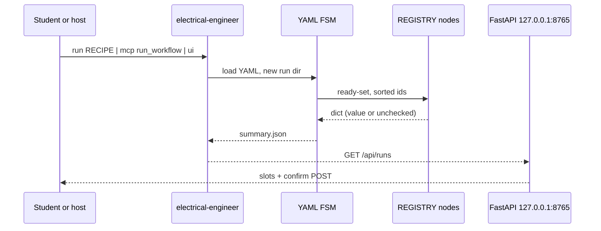

# Electrical Engineer — extensive internals

Companion to the main [README](../README.md). Concepts first, then how the repo
runs, then every first-party package. Do not invent paths.

## Table of contents

- [1. Domain concepts](#1-domain-concepts)
- [2. How this repository runs](#2-how-this-repository-runs)
- [3. Package map](#3-package-map)
- [4. Packages](#4-packages)
- [5. Configuration](#5-configuration)
- [6. Tests and CI](#6-tests-and-ci)
- [7. Further reading](#7-further-reading)
- [8. Future advancements](#8-future-advancements)

## 1. Domain concepts

- **Named recipe.** A checked-in YAML DAG (`workflows/**/*.yaml`) with `id` and `nodes.{id}.{activity,needs}`. The router picks a row; it does not invent edges.
- **unchecked.** Exact token from `electrical_engineer.unchecked.UNCHECKED`. Used when a verifier is missing or a numeric check fails. `EE_ALLOW_ALL` skips *asks*, not this token.
- **Run dir.** `runs/<4char>-<UTC>/` holds `summary.json`, `nodes/<id>/out.json`, optional `confirmed.json`. Audit only — no crash-resume.
- **Gate.** TOML most-restrictive merge; third interrupt aborts. MCP never waits: fail-closed with `ui_url`.
- **Confirm ≠ simulate.** Photo and C5 stop after `confirm-topology`. C4 `simulate-after-confirm` requires `confirmed.json` before `run-spice`.
- **Slot UI.** React `register(name, Component)`; shell renders `root` only. No LLM client in the browser. `?run=` selects a run; CLI `ui --run` opens that URL. The `unchecked` pill is `summary.unchecked === true`, not a substring match on JSON.
- **RAG facade.** EE owns `book_id` / `chapter_id` / `folder_tag` / `domain_tag`. Empty retrieval is a first-class `empty: true`. Engine after spike: thin bm25.

## 2. How this repository runs

Install with `uv sync --extra dev`. Entry: `electrical-engineer` → `electrical_engineer.cli:main`. UI auto-opens unless `EE_NO_BROWSER=1`. MCP is line-delimited JSON-RPC on stdio.

## 3. Package map

| Package | Path | Role | Entry |
|---------|------|------|-------|
| `electrical_engineer` | `src/electrical_engineer/` | CLI, runner, nodes, MCP, RAG, eval | `electrical-engineer` |
| `electrical-engineer-ui` | `ui/` | Vite React slot shell | `npm run dev` / FastAPI `ui/dist` |
| recipes | `workflows/` | Named YAML | `electrical-engineer workflows` |
| skills | `skills/` | Pedagogy markdown | host copy/symlink |
| gold | `eval/gold/` | Licence-clean tasks | `electrical-engineer eval` |

Vendored Cursor config (`.cursor/`) is not a product package; see `.cursor/VENDOR.md`.

## 4. Packages

### 4.1 `electrical_engineer`

**What it is for.** The installable H3 co-solver: parse YAML, run nodes, score gold, serve localhost HTTP, speak MCP.

**How it is used.** `uv run electrical-engineer <cmd>` or `python -m electrical_engineer`.

**How it works.** `cli.py` dispatches. `runner.execute.execute` loads a recipe, wraps `REGISTRY` with `run_dir`, writes `summary.json`.

#### File map

| File | Why it is here | What it does |
|------|----------------|--------------|
| `src/electrical_engineer/cli.py` | Console script | argparse surface |
| `src/electrical_engineer/__main__.py` | `python -m` | calls `main` |
| `src/electrical_engineer/catalog.py` | Discovery | YAML ids |
| `src/electrical_engineer/unchecked.py` | Invariant | exact token |
| `src/electrical_engineer/runner/fsm.py` | DAG | ready-set, cycle reject, 16 cap |
| `src/electrical_engineer/runner/runs.py` | Isolation | run ids |
| `src/electrical_engineer/runner/execute.py` | Glue | one run → summary |
| `src/electrical_engineer/gates/policy.py` | Safety | most-restrictive TOML |
| `src/electrical_engineer/router/hybrid.py` | Routing | explicit / Δ0.15 ask / unmatched |
| `src/electrical_engineer/nodes/registry.py` | Activities | register + summary |
| `src/electrical_engineer/nodes/sim.py` | Verifiers | spice/control/load-flow/check-numeric |
| `src/electrical_engineer/nodes/photo.py` | Vision + explain | photo stages, retrieve, solve-explain |
| `src/electrical_engineer/mcp/server.py` | Hosts | stdio JSON-RPC |
| `src/electrical_engineer/ui_server/app.py` | UI API | bind 127.0.0.1, `ui_page_url`, runs, first `*.svg` artifact, confirm |
| `src/electrical_engineer/rag/` | Retrieval | inventory + filters |
| `src/electrical_engineer/local_llm/` | Optional daemon | skip-if-missing |
| `src/electrical_engineer/memory/store.py` | Notes | 32KiB cap |
| `src/electrical_engineer/compose/graph.py` | Advanced DAG | 16/24 |
| `src/electrical_engineer/vision/fixtures.py` | CI photo | no VLM |
| `src/electrical_engineer/eval_runner/score.py` | Gold | compare expect.json |

### 4.2 `electrical-engineer-ui`

**What it is for.** Persistent workspace chrome.

**How it is used.** `electrical-engineer ui` serves `ui/dist` when built; Vite `server.host` is 127.0.0.1.

**How it works.** `App.jsx` renders slot `root`. Zustand holds `currentRunId`.

#### File map

| File | Why it is here | What it does |
|------|----------------|--------------|
| `ui/src/tokens.css` | DESIGN-coinbase | `--ee-*` variables |
| `ui/src/slots/registry.js` | Slot map | `register` / `renderSlot` |
| `ui/src/slots/root.jsx` | Shell | runs, `?run=`, JSON unchecked badge, photo.confirm, skip-link |
| `ui/src/store.js` | Layout | zustand |
| `ui/vite.config.js` | Dev server | loopback |
| `ui/package-lock.json` | Reproducible npm | lockfile for `npm run build` |
| `assets/electrical-engineer-logo.svg` | Product mark | flat README logo (no Coinbase wordmark) |

### 4.3 recipes (`workflows/`)

**What it is for.** The catalog students actually run.

**How it is used.** `electrical-engineer run <id>`.

**How it works.** One YAML per id. Packs: `_cross`, `circuits`, `control`, `signals`, `machines`, `power`, `electronics`, `measurements`, `em`, `power_electronics`, `maths`.

### 4.4 skills (`skills/`)

**What it is for.** Pedagogy for hosts. No secrets.

**How it is used.** Copy/symlink per [`docs/hosts/README.md`](hosts/README.md).

### 4.5 gold (`eval/gold/`)

**What it is for.** OSS eval. Circuits divider, unmatched, injection.

**How it is used.** `electrical-engineer eval --pack circuits`.

## 5. Configuration

| Name | Role |
|------|------|
| `EE_NO_BROWSER` | `1` skips auto-open |
| `EE_ALLOW_ALL` | skip asks; **not** unchecked |
| `EE_LOCAL_LLM_URL` | OpenAI-compat base; unset = skip |
| `EE_LOCAL_LLM_MODEL` | optional model name |
| `problem.json` | cwd payload for `run` |

Python 3.11+, `uv`, hatchling. Optional tools (PySpice, python-control, pandapower, sympy) are imported if present.

## 6. Tests and CI

- `uv run ruff check . && uv run pytest -q`
- `./scripts/validate.sh` — lint, pytest, eval circuits, refuse `0.0.0.0`
- `.github/workflows/ci.yml` — Ubuntu only; tests use the checkout cwd (not a Cloud Agent `/workspace` path)
- Layout: `tests/unit/`, `tests/integration/`, `eval/gold/`
- README screenshots: `docs/media/ui-empty.png`, `docs/media/ui-checked-run.png`, `docs/media/ui-unchecked-confirm.png` from live `127.0.0.1:8765`

## 7. Further reading

- [`docs/PID.md`](PID.md), [`docs/PRD.md`](PRD.md), [`docs/ARCHITECTURE.md`](ARCHITECTURE.md)
- [`docs/WORKFLOWS.md`](WORKFLOWS.md), [`docs/CANNOT_DO.md`](CANNOT_DO.md)
- [`docs/design/DESIGN-coinbase.md`](design/DESIGN-coinbase.md)
- [`docs/planning/R1_BOOT.md`](planning/R1_BOOT.md), [`docs/planning/T1_TRIALS.md`](planning/T1_TRIALS.md)
- Spike: [`research/notes/rag-spike-results-2026-09.md`](../research/notes/rag-spike-results-2026-09.md)

## 8. Future advancements

1. Re-run the RAG spike on a licensed chapter with LightRAG 1.5 numbers before swapping engines.
2. Optional MATLAB and ngspice in non-Ubuntu CI; keep skip-if-missing.
3. BYOK / HTTP MCP / PyPI — explicitly later-graph in PID; do not pretend they shipped.
