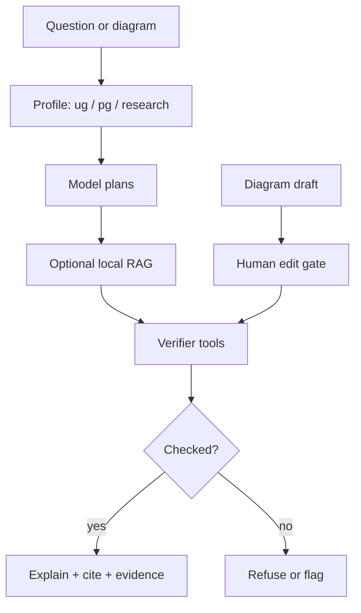

# Product Identity Document (PID) — Electrical-Engineer

**Status:** DRAFT FOR OWNER DECISIONS. Nothing here is the product until you accept it.  
**Date:** 2026-09-09  
**Audience:** project owner (you). Agents must not silently fill OPEN rows.  
**After this:** you answer [`PID_DECISION_SHEET.md`](PID_DECISION_SHEET.md) → we lock an Accepted PID → then Spec Kit + nawab implementation plan.

This document is **extensive on identity, bounds, architecture, and trade-offs**. It is **limited on what v1 is allowed to promise** (UG-bounded coursework). The architecture is shaped so a later PG / research / industrial-adjacent track can grow **without rewriting the core**.

---

## 0. How to read this

| Layer | Meaning |
|-------|---------|
| **Locked-enough (from you + research)** | Open source; student-first; reliability via tools; UG-bounded *public promise*; later expandable copy/fork; explore AI limits on core EE |
| **Proposed (not accepted)** | Capability list C1–C8 in `README.md`; research path O1 (Pi package hybrid); MATLAB primary / OSS fallback; local RAG |
| **OPEN** | You decide. Listed as trade-offs + numbered questions. Research defaults are **advice**, not the product. |

This PID is **not** a coding plan, not a sprint, and not a claim that an agent exists.

**Authority stack after you accept:** Accepted PID → constitution/spec (Spec Kit, if you want that workflow) → nawab `IMPLEMENTATION_PLAN.md` → code.

---

## 1. Working thesis (editable)

One sentence, pending your wording:

> An open-source, tool-verified electrical-engineering agent that can take a UG (then PG) student’s questions and diagrams, get them **right**, **teach** the solution, and **refuse** when it did not check — and that is also a public instrument for measuring how far AI can go on core engineering.

What that implies, if you keep it:

- The product is an **engineer-shaped harness + tools + evals**, not a chatbot with an EE system prompt.
- **UG-bounded** is a *promise and a policy profile*, not a hard-coded ceiling in the solvers.
- Expansion is **packs + profiles + eval suites**, not a second brain.

---

## 2. Product identity (OPEN fields)

| Field | Working value | OPEN? |
|-------|----------------|-------|
| Public name | Electrical-Engineer (repo) | Yes — Q1. Could be Electric Pi, a CLI name, or a student-facing brand |
| What people install | Unchosen (MCP pack vs CLI vs Pi package vs fork) | Yes — Q-H* |
| Category | Student EE co-solver / tutor with simulators | Yes — tutor vs solver vs “research intern” vs all |
| Primary geography | India UG/PG first, usable elsewhere | Yes — Q2 |
| Licence | Unchosen (MIT is common for this repo’s vendored config; not decided for product code) | Yes — Q3 |
| Locality | Research leaning local-first | Yes — Q4 |
| Paid tier | None assumed (you said fully OSS) | Confirm Q5 |

**Positioning (proposed, not locked)**

- **Is:** a student-facing, open, checkable EE agent for assignments, explanations, and diagrams.
- **Is not:** Siemens Eigen, MATLAB Copilot, Cadence Cerebrus, a plant-floor controller, a homework cheater that hides its work, or a general coding agent with “also do circuits.”
- **Invariant:** numbers come from tools; diagrams are drafts until a human confirms; unexplained answers fail the product bar.

---

## 3. Who it is for

### 3.1 Primary (proposed)

UG and PG electrical engineering students who actually sit circuits, machines, power, control, signals, electronics — especially in India, including colleges without a MATLAB-fluent TA.

### 3.2 Secondary (OPEN)

| Actor | Include in v1? | Why it changes the product |
|-------|----------------|----------------------------|
| GATE / IES aspirant (exam drill) | OPEN | Different UX: timed MCQ vs long assignment |
| Faculty / TA (review student work, generate variants) | OPEN | Needs instructor mode, integrity controls, possibly LMS |
| Self-learner outside a degree | OPEN | Weaker “assignment” framing, stronger textbook RAG |
| Working junior EE (intern) | OPEN | Leaks toward industrial diagrams and plant safety |
| International UG (MIT/ETH-style) | OPEN | Curriculum pack, not a different agent |

### 3.3 Explicit non-users (proposed until you override)

Control-room operators, professional protection engineers signing off settings, tape-out analog designers, PLC commissioning of live plant. Those may appear on a **research fork** as experiments; they are not the student promise.

---

## 4. UG-bounded now, expandable later

### 4.1 What “UG-bounded” should mean (proposed)

A **policy + pack + eval** bound, not a smaller model and not a deleted codebase.

| Bound | UG-bounded public product | Expansion track (later) |
|-------|---------------------------|-------------------------|
| Promise | GATE EE technical sections + typical UG assignments | PG coursework, research-intern tasks, operational benches |
| Tools | Same verifiers (MATLAB/SPICE/Python) | Same tools + more licences, bigger cases |
| Diagrams | Textbook/assignment figures, student photos of *homework* schematics | Plant P&IDs, multi-sheet industrial CAD |
| Autonomy | Co-solve with explanation; human confirms topology and irreversible exports | Longer loops, budgeted search (PowerAgentBench-style) |
| Integrity | Show work; optional struggle/hints mode | Different audience, different policy |
| Eval | Licence-clean UG gold tasks | Separate suites; do not dilute UG scores |

### 4.2 How expansion stays cheap (architecture invariant)

Regardless of harness choice (package vs fork vs custom), **do not put the UG limit inside the SPICE solver or the RAG index**. Put it in four swappable layers:

```text
┌─────────────────────────────────────────────────────────┐
│  Host adapter     CLI / MCP / Pi package / Cursor skills │
├─────────────────────────────────────────────────────────┤
│  Policy profile   ug-coursework | pg | research | forbid │
├─────────────────────────────────────────────────────────┤
│  Domain packs     circuits | control | power | machines… │
├─────────────────────────────────────────────────────────┤
│  Tool adapters    MATLAB MCP | ngspice | pandapower | …  │
├─────────────────────────────────────────────────────────┤
│  Eval suites      one suite per pack × profile           │
└─────────────────────────────────────────────────────────┘
```

Adding “PG machines” later = a new **pack + profile + eval**, not a new agent. Adding civil later (if you ever want a sibling product) = a different pack family, same host/policy/tool pattern.

**Distribution (OPEN):** you previously wanted a **UG-bounded public copy** and a **fork you keep improving**. That can be:

- **D1** Two git repos / GitHub forks (policy baked at release time)
- **D2** One repo, two release channels (`ee-ug` vs `ee-lab`)
- **D3** One install, `--profile ug` default, `--profile research` opt-in
- **D4** Same code, different skill packs enabled

You pick this in Q-E*. Architecture should support D3 even if you also do D1.

---

## 5. Success bar (proposed C1–C8)

Copied from `README.md` as the **candidate** definition of success. Confirm, cut, or add in Q-C*.

| ID | Capability | v1? |
|----|------------|-----|
| C1 | Solve EE questions correctly or refuse | Proposed P0 |
| C2 | Explain with assumptions / viva-ready steps | Proposed P0 |
| C3 | Genres: solve, derive, design, simulate, review, explain, report | OPEN how many genres in v1 |
| C4 | Circuit diagram ingest + edit gate + sim | OPEN whether v1 or v1.5 |
| C5 | Control-system diagram ingest | OPEN (likely after C4) |
| C6 | Reliability contract | Proposed P0 (non-negotiable if you keep the thesis) |
| C7 | Open + student-first + OSS fallback | Proposed P0 |
| C8 | Limit-finding eval / research track | Proposed as parallel, not v1 student UX |

**North-star honesty:** “any and all questions correctly” is the aim. The **claimable** bar is: on a published taxonomy, tool-on, match gold or refuse. Fluent wrong numbers fail the product even if the prose is excellent.

---

## 6. Main product trade-off: what people actually run

This is the decision you called out. Research scored paths; **you own the product**.

### 6.1 The five shapes

| ID | Name | What the user runs | Who owns the loop |
|----|------|--------------------|-------------------|
| **H1** | Portable core only | Skills + MCP servers (RAG, SPICE, MATLAB) inside Cursor / Claude Code / Codex | Those hosts |
| **H2** | H1 + Pi package | Same core, plus `pi install electrical-engineer` wiring | Pi + our package |
| **H3** | Branded CLI over H1 | `ee` or `electrical-engineer` CLI that uses Pi SDK / subprocess / our thin loop, still speaking MCP | We own a small CLI; not a full unique harness |
| **H4** | Electric Pi (hard fork) | A Pi fork branded as an EE agent: default constitution, EE modes, verification policy in the harness | We own a fork of Pi forever |
| **H5** | Greenfield harness | Our own agent loop, tools, context, safety, UI | We own everything |

Research totals (from `research/synthesis/option-scoring.md`): H1-like (O3) 37 · H2-like (O1) 34 · H4-like (O2) 27 · H5-like (O4) 23. H3 was not scored; it is the “identity without fork” middle.

---

## Trade-off: harness ownership

**Decision:** Who owns the agent loop (the chassis), vs who only ships EE brain (skills, RAG, verifiers).

**Option H1 — MCP + skills + local RAG, no owned harness**  
Pros: fastest spike; works in Cursor/Claude/Codex the student may already use; MATLAB official MCP already targets those hosts; lowest maintenance; if Pi dies, core survives.  
Cons: weak “this is Electrical Engineer” product; cannot enforce refuse-unverified if the host ignores our skills; three install stories; no single `ee` binary.

**Option H2 — H1 + optional Pi package (research default if PRIORITY = SPEED + PORTABILITY)**  
Pros: Pi-native install for people who want it; still portable; matches Pi’s “don’t fork, package” thesis; RAG via documented extensions.  
Cons: Pi has **no built-in MCP** (need adapter/extension); identity still split across hosts; package APIs can churn.

**Option H3 — Branded CLI wrapping the portable core**  
Pros: `electrical-engineer solve …` as a product; can default `--profile ug`; can refuse unverified in *our* CLI even if Cursor would not; still reuse MCP/skills; easier story than a fork.  
Cons: now we maintain a CLI; students who only live in Cursor may ignore it; risk of secretly growing into H5.

**Option H4 — Electric Pi, hard fork of Pi**  
Pros: one branded EE harness; default constitution (always cite, always verify, always explain); EE modes (tutor / co-solver / reviewer) as first-class UX; full control of context, safety, step limits; strongest product identity; Pi is MIT and designed to be modified.  
Cons: merge tax against Earendil upstream forever; MCP still not native (you inherit Pi’s gap unless you add it in the fork); **hurts** “works inside Cursor” unless you *also* ship H1; students must install *your* CLI; slowest time-to-insight; C8/limit-finding still needs the same tools, so fork does not magically raise EE accuracy.

**Option H5 — Own harness from zero**  
Pros: no upstream politics; EE-shaped loop, evals, schematic UI as native citizens; can look like a real product.  
Cons: you rebuild loop, tools, context, safety, compaction, streaming — the expensive part that does not differentiate an EE tutor; highest exit cost; research scored this worst for a reason.

**Default (research, not your decision):** H2, with H1 as the portable backbone, H3 if you need a name on the command line, H4 only if you set **PRIORITY = IDENTITY** and accept merge cost, H5 only if H4’s Pi constraints are unacceptable.

**Override:** Set `PRIORITY` = SPEED | PORTABILITY | IDENTITY | CONTROL | SIMPLICITY

**What would make H4 the right product:** you want a single binary a student runs called Electric Pi / Electrical Engineer; you want verification policy **enforced in the harness** (not hoped for in a SKILL.md); you are willing to maintain a fork and *still* publish MCP/skills so Cursor users are not abandoned.

**What would make H1 the right product:** you care more about “works in Cursor tomorrow” than a brand; you treat this repo as an EE **library** of skills+MCP, not an app.

---

## Trade-off: CLI vs MCP vs “inside Cursor only”

**Decision:** Primary daily interface for a UG student.

**Option A — MCP/skills consumed by Cursor (and siblings)**  
Pros: zero new UX; matches how *you* already work; MATLAB MCP is built for this.  
Cons: students who are not in Cursor are out; hard to enforce product policy; looks like a config repo.

**Option B — First-class CLI**  
Pros: scriptable, eval-friendly, works in college labs; clear product.  
Cons: teaching a student to use a CLI; Windows/Linux/macOS install tax.

**Option C — Chat / web UI (including schematic canvas)**  
Pros: matches “upload the circuit photo”; lowest intimidation.  
Cons: you are now a web app (auth, hosting, or local Electron); slowest; C4 almost forces *some* UI anyway.

**Option D — All three, shared core**  
Pros: matches expandable architecture.  
Cons: three surfaces to keep honest; v1 must still pick a **primary**.

**Default:** if C4 (schematic edit) is in v1, you need **at least a local UI or TUI**; MCP-only cannot show an editable schematic. If C4 slips to v1.5, MCP+CLI can ship first.

**Override:** PRIORITY = SIMPLICITY (one surface) vs CONSISTENCY (one core, many adapters)

---

## Trade-off: local RAG vs no RAG vs cloud RAG

**Decision:** Where textbook knowledge lives.

**Option A — Local vector store + BYO PDFs / licensed embedding packs (research leaning)**  
Pros: student PDFs never leave the machine; matches Indian college reality (pirated-PDF culture we will **not** abet — BYO rights only); works offline-ish.  
Cons: ingest quality is the hard engineering; licence review for any Redistributed pack; laptop RAM/disk.

**Option B — Skills-only (no RAG v1)**  
Pros: ships faster; pedagogy in SKILL.md; no corpus legal surface.  
Cons: models blur formulae; weaker “open book exam” story; C2 citations become generic.

**Option C — Cloud RAG**  
Pros: easier ops.  
Cons: fights local-first; sending textbooks to a vendor is a non-starter for many students and for this repo’s licence stance.

**Default:** A, with B as a v0 spike if ingest is the blocker. Never C for commercial books.

**Override:** PRIORITY = SPEED (skip RAG) vs QUALITY (RAG from day one)

---

## Trade-off: MATLAB-primary vs OSS-primary

**Decision:** Default numeric backend.

**Option A — MATLAB/Simulink when licensed, OSS documented fallback (research leaning)**  
Pros: matches UG labs in many Indian colleges that *do* have campus MATLAB; Simulink is the control/machines gold path; official MCP exists.  
Cons: licence blocker (CP-2); students without MATLAB feel second-class unless OSS path is first-class UX, not a footnote.

**Option B — OSS-primary (ngspice, python-control, pandapower, sympy), MATLAB optional extra**  
Pros: truly open default; aligns with “cannot buy Ansys”; evals run in CI without MathWorks.  
Cons: machines / multi-domain labs weaker; some assignments are Simulink-shaped.

**Option C — MATLAB required**  
Pros: simpler matrix.  
Cons: excludes a large fraction of the stated audience.

**Default:** A only if you confirm campus/personal MATLAB; otherwise B for the public product and A as “if present, prefer.”

**Override:** PRIORITY = AVAILABILITY (OSS-first) vs QUALITY (MATLAB-first)

---

## Trade-off: two-copy vision (UG freeze vs living lab)

**Decision:** How the UG-bounded product and the expanding product relate.

**Option A — Git fork: `Electrical-Engineer` (UG) and `Electrical-Engineer-Lab` (you keep pushing)**  
Pros: UG promise cannot silently inflate; clear GitHub story.  
Cons: bugfixes must cherry-pick; packs drift.

**Option B — One repo, profile flags, two release tags**  
Pros: one core; expansion is config.  
Cons: UG users can flip a flag and leave the promise; need discipline in README.

**Option C — Monorepo packages (`packs/ug`, `packs/pg`) with UG the default install**  
Pros: clean expansion unit; matches §4.2.  
Cons: more repo layout work up front.

**Default:** C internally, A or B as *distribution* — you choose in Q-E*.

**Override:** PRIORITY = CONSISTENCY (one repo) vs SAFETY (hard UG freeze)

---

## 7. Capability architecture (so UG does not trap you)

### 7.1 Domain packs (expandable unit)

Each pack is: skills + tool bindings + gold tasks + diagram fixtures.

| Pack | UG v1 candidate | Later |
|------|-----------------|-------|
| `circuits` | Mesh/nodal, Thevenin, transients, phasors | RF, distributed, analog IC sizing |
| `control` | LTI, Bode, PID, Routh, block diagrams | Optimal/robust, MPC, nonlinear |
| `power` | Per-unit, load flow homework, faults (study-level) | PowerAgentBench-style operations |
| `machines` | Equivalent circuit, OC/SC, torque-speed | Drives, FOC, hardware-in-loop |
| `signals` | Convolution, Fourier, sampling | DSP projects |
| `electronics` | Diode/BJT/FET, op-amp, combinational logic | Mixed-signal |
| `power-electronics` | Average models, basic converters | Modulation search (PHIA-class) |
| `emag` / `measurements` / `math` | Explain + solve | Numeric EM |

v1 should **not** enable all packs at full depth. You pick the first one or two in Q-S*.

### 7.2 Agent modes (OPEN which exist in v1)

| Mode | Behaviour |
|------|-----------|
| **Tutor** | Hints, Socratic, may withhold final numeric until the student tries |
| **Co-solver** | Full solution + explanation + tool evidence |
| **Reviewer** | Student pastes their solution; agent finds errors |
| **Lab** | Procedure, plots, report skeleton |
| **Exam-drill** | Timed MCQ, no RAG leak of live paper (integrity) |

Tutor vs co-solver is an academic-integrity product decision (Q-I*), not a model decision.

### 7.3 Reliability pipeline (invariant across H1–H5)



Harness choice changes **where** Policy and Gate live (SKILL.md vs CLI vs forked Pi constitution). It should not change **whether** they exist.

### 7.4 What we will not bake into v1 (expansion valves)

Keep sockets, skip implementations:

- Multi-agent “designer / critic / evaluator” analog-IC flow
- Plant actuation
- Cloud textbook index
- Fine-tuned EE model (unless you later insist)
- Civil/mechanical packs (sibling products, not this identity)

---

## 8. Surfaces and artefacts

| Surface | Needed if… |
|---------|------------|
| MCP servers | Any host-agnostic tools (RAG, spice, maybe policy) |
| Skill packs | Pedagogy + workflows on Cursor/Claude/Pi |
| CLI | Evals, scripting, branded entry, H3/H4 |
| Local schematic UI | C4/C5 in scope |
| Eval runner | C1/C6 are real, not slogans |
| Embedding-pack installer | RAG without committing books |

v0 (spike) can be MCP + one skill + one eval fixture. v1 is whatever you lock in the decision sheet.

---

## 9. Trust, integrity, safety

| Topic | Proposed stance | OPEN |
|-------|-----------------|------|
| Unverified numbers | Refuse / label; never present as sim | Confirm |
| Diagrams | Draft until user confirms | Confirm |
| Academic integrity | Show work; institution owns cheating policy | Tutor vs dump — you pick |
| PII / student data | Local by default; no silent upload | Confirm |
| Live plant / PLC write | Out of UG product | Confirm |
| Copyright | No commercial PDFs in git; BYO or licensed packs only | Confirm |
| Exam leakage | Do not ship live GATE papers as RAG | Confirm |

---

## 10. Non-goals for the UG-bounded product

- Replacing MATLAB, KiCad, or a professional protection package
- Autonomous grid operation
- Shipping copyrighted textbooks
- Being the best general coding agent
- Matching Siemens/Ansys copilot inside TIA/ANSYS
- A social network, LMS, or paid tutoring marketplace (unless you add that later)

---

## 11. Risks (product-level)

| Risk | If ignored | Mitigation shape |
|------------------|------------------|
| Fluent wrong answers | Students learn errors; project fails C6 | Verifier gate in the *enforced* layer |
| Host ignores skills (H1) | Policy is theatre | H3/H4 or host hooks |
| MATLAB licence missing | v1 evaporates for many users | OSS-first UX |
| Diagram v1 too hard | Whole product waits on vision | Split C1–C3 from C4–C5 |
| Fork tax (H4) | No time for EE packs | Package-first |
| Integrity backlash | Colleges ban the tool | Tutor mode, faculty story |
| Scope: “any question” | Never ships | Pack-by-pack evals |
| Two-copy drift | UG and lab become different products accidentally | Packs + cherry-pick policy |

---

## 12. Research defaults vs owner defaults

If you say “just pick research defaults,” an agent would take: **H2**, local RAG, MATLAB-if-present else OSS, C1–C3+C6+C7 in first slice, C4 after, UG profile, portable skills+MCP as the expansion spine.

This PID **does not apply that**. You answer the sheet.

---

## 13. What “Accepted PID” will contain that this draft does not

- Chosen name, one-liner, licence
- Chosen H* and primary surface
- v1 pack list and deferred packs
- Integrity mode default
- MATLAB vs OSS default
- Two-copy mechanism
- First implementation slice (then nawab plan)

Until then, treat C1–C8 and O1 as **proposals**.

---

## 14. Related artifacts

| Doc | Role |
|-----|------|
| [`PID_DECISION_SHEET.md`](PID_DECISION_SHEET.md) | Your answers |
| [`../README.md`](../README.md) | Public success bar (proposed) |
| [`../research/synthesis/recommendation.md`](../research/synthesis/recommendation.md) | O1 research advice |
| [`../research/synthesis/option-scoring.md`](../research/synthesis/option-scoring.md) | H1–H5 scores |
| [`../research/notes/ai-core-engineering-landscape.md`](../research/notes/ai-core-engineering-landscape.md) | Ecosystem |
| [`../DECISIONS.md`](../DECISIONS.md) | ADR seeds still `proposed` |

---

## Sources

- Owner conversation (UG-bounded, expandable, OSS, reliability, student-first, Pi-fork as an option) — 2026-09-09 — primary
- Research notes and ADRs cited above — 2026-09-08 — primary

## Confidence

Overall confidence that **these are the right decisions to make**: high.  
Overall confidence that **any H* is already chosen**: none — owner has not answered.
