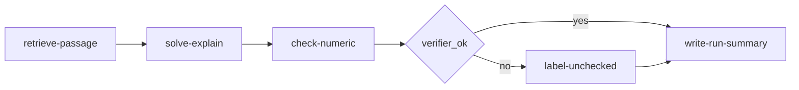
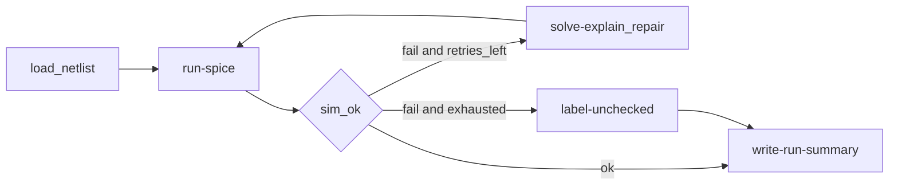
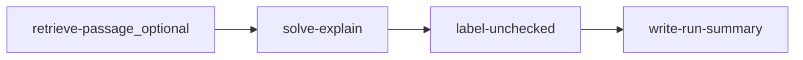

# Named workflows — Electrical Engineer

**Status:** Proposed (ids **renamable until the first CLI ships**). Not implemented.  
**Authority:** [`ARCHITECTURE.md`](ARCHITECTURE.md), owner catalog list in [`../research/notes/architecture-qa-gate.md`](../research/notes/architecture-qa-gate.md), genres in [`../research/notes/ee-task-taxonomy-draft.md`](../research/notes/ee-task-taxonomy-draft.md), bound in [`curriculum-map.md`](curriculum-map.md)

Recipes live at `workflows/<pack>/<id>.yaml` when implementation starts. This file is the catalog. Discovery is `electrical-engineer workflows` / MCP `list_workflows` — **not** a runnable recipe.

Purpose: named DAGs so the agent retrieves, cites, verifies, and explains **better**. The router only **picks** a row (or asks, or `unmatched-cosolver`). New DAGs only via `compose-from-parts --advanced`.

Marks: **v1** = specify in full now (circuits slice ships first; control specified now, implement after circuits). **stub** = contract only. **later** = one-liner in the public catalog.

---

## 1. Catalog

### Cross-cutting

| id | Title | Mark | Notes |
|----|-------|------|-------|
| unmatched-cosolver | Answer an EE question (unchecked if not verified) | v1 | No auto-sim. Optional retrieve → solve-explain → label-unchecked → write-run-summary |
| compose-from-parts | Build a one-off workflow from allowed steps | v1 | `--advanced`; typed ports; 16/24 cap; may emit `run-recipe`; gate = ask |
| photo-to-netlist | Photo of a circuit to a draft netlist | stub | UI confirm; **no sim** after confirm |

### Circuits (specified in full)

| id | Title | Mark | Notes |
|----|-------|------|-------|
| solve-circuit-problem | Solve a circuit homework problem | v1 | DAG; may `run-recipe` explain or retrieve |
| derive-circuit | Derive a circuit result from laws | v1 | check-numeric / sympy; no fake sim |
| simulate-circuit | Simulate a netlist (SPICE) | v1 | `run-spice`; `repair_max: 2` |
| review-circuit-solution | Find mistakes in a circuit solution | v1 | Review genre; label unchecked if not tool-checked |
| explain-circuits | Explain a circuit idea for a viva | v1 | RAG filters + citations |

### Control (specified in full; implement after circuits slice)

| id | Title | Mark | Notes |
|----|-------|------|-------|
| solve-control-problem | Solve a classical control problem | v1 | python-control; MATLAB if present |
| explain-control | Explain stability, Bode, or root locus | v1 | Library plots, not invented PNGs |
| control-diagram-to-model | Block diagram or Bode figure to a model | stub | Do **not** drop. Same UI-confirm spirit as photo stub; no silent sim |

### Other packs (one-liners; keep per-pack explain-\*)

| id | Title | Mark |
|----|-------|------|
| explain-signals | Explain a signals-and-systems idea | later |
| explain-machines | Explain a machines or transformer idea | later |
| explain-power | Explain a study-level power-systems idea | later |
| explain-electronics | Explain a devices or digital idea | later |
| explain-measurements | Explain an instrument or error model | later |
| explain-em | Explain a UG fields idea | later |
| explain-power-electronics | Explain a converter idea | later |
| explain-maths-for-ee | Explain maths-for-EE (ODE, Fourier, complex) | later |

Solve/simulate/design rows for those packs remain in the **product bound** ([`curriculum-map.md`](curriculum-map.md)) but are not specified as separate DAGs in this pass.

The research draft [`../research/notes/ee-workflow-catalog-draft.md`](../research/notes/ee-workflow-catalog-draft.md) is **historical naming**, not the frozen API.

---

## 2. Activity nodes

Not student-facing. Classifier is **not** a node.

| id | Role |
|----|------|
| retrieve-passage | Hybrid RAG; honour `book_id` / `chapter_id` / `folder_tag` / `domain_tag`; max 3 passages |
| check-numeric | sympy / hand check |
| run-spice | ngspice/PySpice; writes only under this run dir |
| run-python-control | LTI, Bode, step, root locus |
| run-matlab-if-present | Optional; ask gate; fail clearly if busy/missing |
| run-load-flow | pandapower study-level |
| ask-human | TTY or UI; counts toward the 2-interrupt budget |
| label-unchecked | Exact token `unchecked` + `summary.json` field |
| write-run-summary | Final `summary.json` only at end of run |
| solve-explain | LLM **node** (hosts may skip and do this in their loop; CLI local-model path uses this) |
| detect-components | Photo stub |
| connect-wires | Photo stub |
| ocr-labels | Photo stub; low confidence **always** flagged |
| draft-netlist | Writes `.cir` + JSON graph |
| confirm-topology | UI confirm (one interrupt) |
| run-recipe | Nested named YAML; see ARCHITECTURE §6 |

Typed ports (prose): `Text`, `Passages`, `Netlist`, `GraphJson`, `Numeric`, `PlotPaths`, `HumanDecision`, `Summary`, `RecipeRef`. Edges that mismatch are rejected before run.

---

## 3. DAG sketches (circuits + unmatched)

### solve-circuit-problem

May `run-recipe` `explain-circuits` when the parent YAML declares that child. Optional `run-spice` **only** if this named recipe includes it — not from unmatched.

Independent retrieve vs fixture parse may run **in parallel** when both are ready; start order is sorted node id.

### simulate-circuit

`repair_max: 2`. Retries do not count as human interrupts.

### unmatched-cosolver

**No** `run-spice`, `run-matlab-if-present`, or `run-load-flow`. Any numeric claim without a verifier artifact must carry `unchecked`.

---

## 4. Dynamic compose rules

1. Student (or host) calls `compose-from-parts --advanced` (gate: **ask**).
2. Emitted DAG: only registered node ids (including `run-recipe`). Typed ports. **≤16 nodes, ≤24 edges**.
3. Cycle detection on node graph **and** on recipe-id graph if `run-recipe` is used.
4. Write the DAG into `runs/<id>/` as the executed object (YAML or equivalent). Audit only — not crash-resume.
5. Invalid ⇒ fail closed; suggest the nearest **named** workflow.
6. Router **must not** take this path because a prompt was interesting.

---

## 5. Photo stub (`photo-to-netlist`)

**Inputs:** phone photo **and** textbook screenshot.  
**Stages:** `detect-components` → `connect-wires` → `ocr-labels` → `draft-netlist` → `confirm-topology` (one human confirm in the **persistent localhost UI**).  
**Outputs:** SPICE-subset `.cir` **and** JSON graph. Low-confidence OCR **always** flagged.  
**UI:** localhost viewer (library SVG/PNG + JSON), not SVG-only dump, not ASCII-only.  
**After confirm:** **stop**. No simulate node in this stub. C4 sim remains later.  
**Untrusted:** the image cannot override gates or `unchecked`.

`control-diagram-to-model` is the same class of stub (figure → structured model → UI confirm → **no silent sim**). Do not drop it.

---

## 6. `run-recipe`

A workflow is usable as a modular node inside another workflow (checked-in YAML and compose).

- Child dir: `runs/<parent-id>/children/<child-id>/`
- Depth ≤ 3; cycles rejected before run
- Child interrupts count on the parent’s budget of 2
- Child 16/24 budget is separate; the parent sees one `run-recipe` node

This is **not** the router inventing a DAG.

---

## 7. Eval mapping

Gold tasks under [`../eval/gold/`](../eval/gold/README.md) **name** a `recipe_id` from this catalog (`expect.json`). Circuits and unmatched items should land first. Injection items must not flip gates via BYO PDFs.
