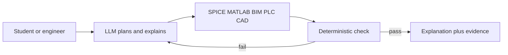

# AI progress in core engineering (landscape)

## Purpose

Map how far AI has actually gone in **core engineering** — electrical, manufacturing/industrial automation, civil/structural, and adjacent physical-design work — versus the much louder software-agent ecosystem. Answer what that means for Electrical-Engineer’s student-first, reliability-first, open-source north star.

## Findings

Claim | Evidence (URL or ledger ID) | Confidence
--- | --- | ---
Public AI energy still concentrates on **software** agents (coding benches, IDE copilots). Core engineering work is quieter in open source, but 2025–2026 produced a real second wave: vendor copilots inside CAD/EDA/PLC/simulation tools, plus academic agents that call solvers | this note’s vendor and paper tables | high
The architectural consensus across EE, civil, and process-control papers is the same: an LLM **plans and explains**; a **deterministic tool** (SPICE, MATLAB, OpenSees, PLC compiler, BIM checker) is the source of numeric truth | S7, S8, S9, https://arxiv.org/html/2608.07978, https://arxiv.org/html/2401.05443 | high
Reasoning models raised textbook-style STEM performance (for example OpenAI o3 reported 87.7% on GPQA Diamond), but that is **not** the same as reliable engineering workflow competence | https://en.wikipedia.org/wiki/OpenAI_o3 | med
Analog and power-electronics agents now close loops with SPICE or physics surrogates (AnalogCoder, AnalogMaster, AaLLM, EXPLORE, PHIA). Success rates jump when search + simulation is in the loop, and collapse on one-shot generation | https://github.com/laiyao1/analogcoder, https://doi.org/10.48550/arxiv.2604.20916, https://arxiv.org/html/2608.13472, https://arxiv.org/html/2607.13416v1 | high
Power-system **agent** benchmarks now score evidence, safety, and unvalidated claims — not only the final number (PowerAgentBench) | https://github.com/Power-Agent/PowerAgentBench, https://arxiv.org/html/2606.18789 | high
Schematic-image → netlist research is strong on clean CAD-like drawings and still fragile on textbook photos; this repo already mapped a human-edit gate | S36, S40, S41, `photo-to-schematic-to-simulink.md` | high
Control-system LLMs can design simple feedback controllers at high success with frontier models (CoDyControlBench: GPT 94.8% vs Qwen 50.0% on the published suite) and still vary sharply by degrees of freedom and controller type | https://arxiv.org/abs/2608.07004 | med
Industrial vendors shipped **in-toolchain** agents: MATLAB Copilot (R2025b), MATLAB/Simulink MCP + agentic toolkits, Siemens Eigen on TIA Portal, Ansys Engineering Copilot, Autodesk/CATIA generative CAD, Synopsys DSO.ai, Cadence Cerebrus | S7–S10, https://www.mathworks.com/products/matlab-copilot.html, https://www.siemens.com/eigen-engineering-agent, https://investors.ansys.com/news-releases/news-release-details/ansys-2025-r2-enables-next-level-productivity-leveraging-ai/, https://www.synopsys.com/ai/ai-powered-eda/dso-ai.html, https://www.cadence.com/en_US/home/tools/digital-design-and-signoff/soc-implementation-and-floorplanning/cadence-cerebrus-ai-studio.html | high
Civil/AEC work is following the same verify-loop pattern (ARCHER for BIM rules; closed-loop code-compliant structural design; MCP bridges from CAD to analysis). Authors explicitly warn that an LLM is not a calculator for safety-critical design | https://arxiv.org/html/2607.25566v1, https://arxiv.org/html/2608.07978 | high
Process-control papers treat LLM outputs as **hypotheses**: one study saw unsafe proposals in 10–70% of runs depending on scenario, with a P&ID-grounded validator catching covered invalid actions | https://link.springer.com/article/10.1007/s43684-026-00136-1 | med
India’s engineering pipeline is large (AISHE 2023–24: about 4.63 million Engineering and Technology enrolments; 72,062 Electrical UG pass-outs vs 262,408 Computer Engineering). Core branches still graduate huge cohorts while campus attention and AI tooling skewed to software | https://indianexpress.com/article/education/computer-engineering-emerges-as-indias-most-popular-branch-aishe-report-mehanical-civil-electrical-iit-jee-10780107/ | high
IIT Kanpur’s director stated that conventional take-home assignments no longer measure understanding because models can complete them, and that the same tools can create **new** learning environments | https://www.indiatoday.in/education-today/news/story/ai-in-iit-education-manindra-agarwal-says-assignments-are-dead-maths-training-must-grow-2980802-2026-08-29 | high
Open, student-facing, **reliability-first** EE agents remain scarce relative to vendor copilots (licence-locked, plant-floor, or EDA-priced) and relative to coding agents. That is the gap this project is exploring | this note’s open-vs-vendor contrast; repo status in `README.md` | high

### 1. Why software looks further ahead

Software agents had three unfair advantages: huge public corpora (GitHub), cheap oracles (compilers and unit tests), and a culture that already lived in text editors. SWE-style benches made progress visible. Core engineering has the opposite shape:

- Truth lives in **simulators, codes, and drawings**, not in next-token fluency.
- Data is scarce, licensed, or plant-private (schematics, P&IDs, BIM, PLC projects).
- A fluent wrong answer can look like a lab result and, outside the classroom, can be unsafe.
- The people building open agent harnesses mostly come from software, so they automate what they already do.

That is why it *feels* like “almost nobody is doing core engineering with AI.” The 2025–2026 record says otherwise: the work moved **inside vendor toolchains** and **academic closed loops**, not into a thousand public GitHub toys.

### 2. The shared pattern (this is the field’s real progress)

Across domains the winning pattern is not “a smarter essay.” It is:

Göpfert and co-authors, surveying engineering-design LLM use, caution that a language model cannot on its own take safety-critical design tasks; multi-agent papers then add solvers and repair loops. Process-control work goes further: keep the LLM in an observation/monitor role and let deterministic agents decide what is physically allowed. Electrical-Engineer’s existing research already picked this pattern (ADR-0003: MATLAB/Simulink primary, OSS fallback; vision draft is not authoritative until the user edits).

**Implication for this project.** Exploring “how capable AI has become for core EE” is only a scientific question if answers are **checkable**. Chat accuracy without a verifier measures fluency, not engineering.

### 3. Electrical engineering — what actually works now

| Slice | What landed (2024–2026) | What still fails | Relevance here |
|-------|-------------------------|------------------|----------------|
| Analog IC / discrete analog | AnalogCoder designs 20/24 benchmark circuits via Python+feedback (AAAI 2025). AnalogMaster walks image → netlist → size → layout. AaLLM and EXPLORE show topology+sizing improve when RAG or MCTS+SPICE search is added (EXPLORE: 12% one-shot → 65% with search on a 6-component suite) | Novel topologies, dirty textbook photos, claiming a netlist is correct without sim | Student circuit *assignments* are simpler than analog IC flows, but the same loop applies: generate → simulate → repair → explain |
| Power electronics | PHIA (AAAI 2026) uses a planner plus physics-informed surrogates for converter modulation; reports 63.2% MAE drop vs next baseline, 33× faster design, and a 20-expert user study | Black-box modulation; industrial adoption blocked by unexplainable models (authors’ own list) | Explainability is not optional for a teaching agent |
| Power systems | PowerAgentBench scores contingency work, model-quality review, and **unvalidated-claim rate**. Agents must spend a validation budget and submit evidence | Licensed dynamic tools; hidden evaluator needed because agents invent “safe” | UG load-flow / fault / stability homework should be scored the same way: tool evidence or no numeric claim |
| Circuits vision | SINA, OmniSch, PCBnet, AnalogMaster detectors: clean schematic → netlist is now a research pipeline, not science fiction | Hand-drawn figures, crossing wires, tiny value fonts | Matches this repo’s photo → editable UI → sim stance |
| Control | CoDyControlBench: 132 configs; frontier models can pick gains for many linear/low-DoF plants; performance drops with DoF and controller type. MathWorks now ships Simulink MCP tools plus control-system skills | Interpreting a *drawn* block diagram or Bode plot as a model; MIMO / nonlinear plant design | UG control assignments + diagram ingest are in reach if MATLAB/`python-control` is the judge |
| Machines / drives | Vendor Simulink skills cover FOC, PMSM, induction machines | Open student agents that *teach* OC/SC tests and equivalent-circuit extraction | First-class UG domain in this repo’s taxonomy |
| EDA / chips | Synopsys DSO.ai and Cadence Cerebrus optimize PPA with RL/agents; this is production silicon work, not homework | Closed, expensive, not a teaching surface | Signals that “AI for EE” is already economic at the high end; students still lack an open equivalent |

MATLAB Copilot (R2025b) is the **in-product** coding/learning assistant; MATLAB MCP Server plus MATLAB/Simulink Agentic Toolkits are the **agent-host** path this repo already selected as the intended verifier. Copilot helps a human inside MATLAB. An EE *agent* still has to own assignment genres, diagrams, citations, and a refuse-unverified policy.

### 4. Manufacturing, civil, and other core fields (same movie, different solvers)

**Manufacturing / industrial automation.** Siemens Eigen sits on TIA Portal and generates SCL/LAD, HMI scripts, drive and PROFINET setup, and tests. Vendor copy claims large speed/quality lifts; treat those as marketing until independently measured. The structural point is real: the agent is wired into the **engineering database** (the PLC project), not a generic chat window. Dassault’s CATIA companions (LEO and siblings) and Ansys Engineering Copilot do the same for CAD and simulation. LLM4PLC (2024) already showed the reliability move: grammar + compiler + model-checking raised valid PLC generation from 47% to 72% in that study.

**Civil / structural / AEC.** 2026 papers describe verification-driven multi-agent design (code compliance, OpenSees/ANSYS in the loop) and ARCHER, which compiles expert-written rules plus labelled BIM models into executable checkers via test-driven repair. MCP is being proposed as the interoperability layer between CAD and analysis so the agent does not invent member forces. This is the civil twin of “don’t invent load-flow numbers.”

**Workforce effect.** Manufacturer surveys and WEF/McKinsey-style workforce writing in 2025–2026 describe a shift from “draw the chart, interpret it yourself” to “ask a grounded question,” plus a large upskilling load. The job that grows is **supervision of AI-in-the-loop engineering**, not disappearance of engineers. That only holds if the loop is grounded.

### 5. Education, India, and why a student-first EE agent matters

AISHE 2023–24 (via Indian Express) puts Engineering and Technology enrolment near **4.63 million**. Undergraduate pass-outs that year: Computer Engineering 262,408; Mechanical 113,390; Electronics 111,242; Civil 88,839; **Electrical 72,062**. India Today’s 2026 AISHE commentary: Engineering and Technology is 12.9% of UG enrolment, and AICTE data still show roughly 30–40% of approved engineering seats vacant in a typical year. The field is **crowded at the degree level** and **thin at the AI-tooling level**.

Campus culture already treats software+AI as the mobility path. Core EE (power, machines, protection, analog) then looks “saturated”: many graduates, fewer glamorous tools, and a hiring market that historically pulled EE students into IT services. The 2026 counter-current is also real — EVs, renewables, semiconductors, and automation need people who can still do circuits and machines — but those students mostly meet **generic chatbots**, not an EE harness with simulators and a reliability contract.

IIT Kanpur director Manindra Agrawal’s 2026 interview is the education constraint this project must design for:

- Take-home assignments as a *measure of learning* are collapsing because models can complete them.
- The constructive use is a **new learning environment**: Socratic explanation, assumed values made explicit, wrong student work reviewed, simulation the student can rerun.

A successful Electrical-Engineer **UG-bounded** copy should therefore be a **tutor that can also finish the work correctly**, not a silent homework vending machine. Academic-integrity policy belongs to the institution; the product stance is: show every assumption, cite the book the user has rights to, and attach tool evidence so a viva can still test the student.

### 6. What this can change in the world (and in EE)

If a reliable open EE agent exists, the first-order effects are educational and then industrial:

- **Access.** A student at a state college without a MATLAB-fluent TA can still work a mesh, a swing-equation setup, or a Bode design against a checker. OSS fallback (ngspice, Python control, pandapower) matters more than a campus licence.
- **Time-to-competence.** The scarce skill becomes *posing the right circuit, reading the plot, and stating assumptions* — the parts generic chat still fakes.
- **Reopening a saturated field.** If EE coursework and early job tasks become AI-amplified the way software already is, core branches stop looking like a dead end. That is a labour-market effect, not a miracle: it needs verified tools, not more fluent wrong answers.
- **Research signal.** An open eval harness that reports “solved with evidence” vs “fluent fail” is how the ecosystem learns the **limits** of current models on core engineering. Vendor copilots will not publish that failure taxonomy. This project can.

Second-order industrial effects (grid studies, protection settings, hardware bring-up) belong on a **later fork**, after the UG loop is honest. Process-control and civil papers are the warning label: without a validator, proposal-error rates are not academic.

### 7. Limits (the scientific question this repo is for)

Honest ceiling as of this note:

- **Checkable UG problems** (circuits, signals, basic control, machines equivalent-circuit numbers, simple power-flow) are in reach for a tool-using agent. That is the first success bar.
- **Diagram understanding** works as assistive draft, not as unsupervised truth.
- **Design elegance, lab judgement, and safety-critical sign-off** stay human. Papers in civil and process control say this explicitly.
- **PG / research-intern** work (literature triage, novel analog topology, N-2 search with a budget) is where the field is *just* building benches. Useful as a fork’s experiment surface, not as the student product’s promise.
- **“Any and all questions correctly”** is the north star. The measurable claim is: on a published task taxonomy, with tools on, the agent either matches gold within tolerance **or refuses**. Silent invention is project failure even if the prose is excellent.

### 8. Stance this note feeds

1. Keep Electrical-Engineer **open source**, **student-first**, and **UG-bounded** as the public product promise.
2. Treat a later **research fork** as the place to push PG tasks and to publish where models still break.
3. Write the success bar as **capabilities + reliability contract + eval**, not as a vibe. That list now belongs at the top of `README.md`.
4. Do not compete with Siemens/Ansys/Cadence on plant-floor or tape-out. Compete on **teaching + verified homework + diagram ingest** that those tools do not offer to a typical Indian UG/PG student.

## Open questions

- How large does a public, licence-clean EE eval set need to be before “covers GATE EE sections” is a fair claim?
- Can control-system *drawings* (block diagrams, signal-flow graphs) reuse the circuit vision pipeline, or do they need a separate detector family?
- What academic-integrity UX (hints-first, full solution after a struggle timer, instructor mode) should the UG-bounded copy default to?
- Which PowerAgentBench-style metrics (evidence rate, unvalidated-claim rate) should be first-class in the student product, not only the research fork?

## Sources

- [MATLAB Copilot product page](https://www.mathworks.com/products/matlab-copilot.html) — retrieved 2026-09-08 — reliability: vendor
- [MathWorks MATLAB Copilot newsroom](https://www.mathworks.com/company/newsroom/mathworks-launches-generative-ai-powered-matlab-copilot-to-boost-productivity-and-accelerate-development-for-engineers-scientists-and-researchers.html) — retrieved 2026-09-08 — reliability: vendor
- [MATLAB MCP Server](https://github.com/matlab/matlab-mcp-server) — retrieved 2026-09-08 — reliability: primary
- [Simulink Agentic Toolkit](https://github.com/matlab/simulink-agentic-toolkit) — retrieved 2026-09-08 — reliability: primary
- [Siemens Eigen Engineering Agent](https://www.siemens.com/eigen-engineering-agent) — retrieved 2026-09-08 — reliability: vendor
- [Ansys 2025 R2 / Engineering Copilot](https://investors.ansys.com/news-releases/news-release-details/ansys-2025-r2-enables-next-level-productivity-leveraging-ai/) — retrieved 2026-09-08 — reliability: vendor
- [Synopsys DSO.ai](https://www.synopsys.com/ai/ai-powered-eda/dso-ai.html) — retrieved 2026-09-08 — reliability: vendor
- [Cadence Cerebrus AI Studio](https://www.cadence.com/en_US/home/tools/digital-design-and-signoff/soc-implementation-and-floorplanning/cadence-cerebrus-ai-studio.html) — retrieved 2026-09-08 — reliability: vendor
- [AnalogCoder repository](https://github.com/laiyao1/analogcoder) — retrieved 2026-09-08 — reliability: primary
- [AnalogCoder AAAI 2025 paper](https://ojs.aaai.org/index.php/AAAI/article/download/32016/34171) — retrieved 2026-09-08 — reliability: paper
- [AnalogMaster arXiv 2604.20916](https://doi.org/10.48550/arxiv.2604.20916) — retrieved 2026-09-08 — reliability: paper
- [AaLLM analog design framework](https://arxiv.org/html/2608.13472) — retrieved 2026-09-08 — reliability: paper
- [EXPLORE analog topology search](https://arxiv.org/html/2607.13416v1) — retrieved 2026-09-08 — reliability: paper
- [PHIA power-electronics agent (AAAI 2026 PDF)](https://kwanhui.github.io/publications/2026-AAAI-PHIAphyInformed.pdf) — retrieved 2026-09-08 — reliability: paper
- [PowerAgentBench](https://github.com/Power-Agent/PowerAgentBench) — retrieved 2026-09-08 — reliability: primary
- [PowerAgentBench-SS](https://arxiv.org/html/2606.18789) — retrieved 2026-09-08 — reliability: paper
- [PowerAgentBench-Dyn](https://arxiv.org/html/2606.20401) — retrieved 2026-09-08 — reliability: paper
- [CoDyControlBench arXiv 2608.07004](https://arxiv.org/abs/2608.07004) — retrieved 2026-09-08 — reliability: paper
- [SINA schematic to netlist](https://arxiv.org/html/2607.01609) — retrieved 2026-09-08 — reliability: paper
- [ARCHER BIM compliance harness](https://arxiv.org/html/2607.25566v1) — retrieved 2026-09-08 — reliability: paper
- [Verification-driven structural design (arXiv 2608.07978)](https://arxiv.org/html/2608.07978) — retrieved 2026-09-08 — reliability: paper
- [LLM4PLC](https://arxiv.org/html/2401.05443) — retrieved 2026-09-08 — reliability: paper
- [P&ID-grounded process-control validation](https://link.springer.com/article/10.1007/s43684-026-00136-1) — retrieved 2026-09-08 — reliability: paper
- [OpenAI o3 (Wikipedia, secondary scores)](https://en.wikipedia.org/wiki/OpenAI_o3) — retrieved 2026-09-08 — reliability: secondary
- [AISHE branch mix via Indian Express](https://indianexpress.com/article/education/computer-engineering-emerges-as-indias-most-popular-branch-aishe-report-mehanical-civil-electrical-iit-jee-10780107/) — retrieved 2026-09-08 — reliability: secondary
- [India Today / IIT Kanpur director on assignments](https://www.indiatoday.in/education-today/news/story/ai-in-iit-education-manindra-agarwal-says-assignments-are-dead-maths-training-must-grow-2980802-2026-08-29) — retrieved 2026-09-08 — reliability: secondary
- [WEF Future of Jobs Report 2025](https://reports.weforum.org/docs/WEF_Future_of_Jobs_Report_2025.pdf) — retrieved 2026-09-08 — reliability: secondary
- [`ee-task-taxonomy-draft.md`](ee-task-taxonomy-draft.md) — retrieved 2026-09-08 — reliability: primary
- [`capability-eval-design.md`](capability-eval-design.md) — retrieved 2026-09-08 — reliability: primary
- [`photo-to-schematic-to-simulink.md`](photo-to-schematic-to-simulink.md) — retrieved 2026-09-08 — reliability: primary

## Confidence

Overall confidence for this note: high

Vendor speed/quality percentages are marketing and were not treated as measurements. Paper numbers are as published and will drift as benches expand. Education statistics are one AISHE year via a newspaper summary, not the raw ministry tables.
