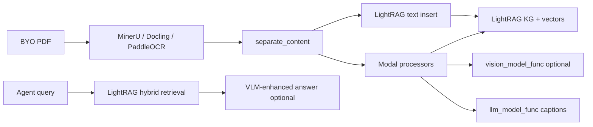

# RAG-Anything evaluation for EE textbook RAG

## Purpose

Evaluate [HKUDS/RAG-Anything](https://github.com/HKUDS/RAG-Anything) as the multimodal RAG spine for Electrical-Engineer: fit for EE PDFs (text, equations, tables, figures, multi-column layout), how its features are implemented, and whether it beats composing MinerU/Docling + a custom MCP retrieval layer.

## Findings

Claim | Evidence (URL or ledger ID) | Confidence
--- | --- | ---
RAG-Anything targets exactly the document class we care about: interleaved text, images, tables, equations, charts | S43 README architecture section | high
It is a Python library built on LightRAG, not a portable MCP server | S43 `raganything/raganything.py`, S3 `rag-agent-integration.md` | high
Default parser is MinerU (formula → LaTeX, tables → HTML, multi-column OCR path) — aligns with our prior parser lean | S43 `config.py`, S31 | high
Alternative parsers: Docling, PaddleOCR — matches our Docling vs MinerU spike plan | S43 `parser.py` | high
Fully local text RAG is supported via Ollama or LM Studio examples; vision/multimodal captioning needs a separate VLM endpoint | S43 `examples/ollama_integration_example.py`, `examples/lmstudio_integration_example.py` | high
Core stack is heavy: Python ≥3.10, `mineru[core]`, `lightrag-hku`, HuggingFace model downloads, optional LibreOffice for Office formats | S43 `pyproject.toml`, README | high
MIT licence on RAG-Anything; MinerU model/terms remain a separate compliance check | S43 repo licence, S31 | med
LightRAG adds a knowledge-graph layer (entity/relation extraction) beyond our earlier “hybrid BM25 + dense + rerank” sketch | S43 README §Multimodal Knowledge Graph; S44 paper | med
No EE-specific metadata schema, citation contract, or MCP tool surface — must be wrapped | S3, `rag-chunking-and-retrieval.md` | high
RAG-Anything is integrated upstream into LightRAG (2026) — reduces fork risk if we adopt LightRAG family | S43 README News | med

### Main features → implementation map

| Feature | What it does for EE | How it is implemented (code / deps) |
|---------|---------------------|--------------------------------------|
| **End-to-end multimodal pipeline** | One call from PDF → searchable index | `RAGAnything` dataclass composes `QueryMixin`, `ProcessorMixin`, `BatchMixin` (`raganything.py`); orchestrates parse → insert → query |
| **Document parsing** | Multi-column EE chapters, equations, tables | `get_parser()` registry: MinerU (default), Docling, PaddleOCR (`parser.py`); MinerU runs as subprocess with actionable error hints |
| **Parse cache** | Re-ingest only when file or parse config changes | `ProcessorMixin._generate_cache_key()` hashes file SHA-256, mtime, parser, parse_method (`processor.py`) |
| **Concurrent text + modal pipelines** | Prose and figures processed in parallel | `separate_content()` splits MinerU content list; text → LightRAG insert; modals → dedicated processors (`processor.py`, `utils.py`) |
| **Image analysis** | Circuit diagrams, Bode plots, phasor diagrams | `ImageModalProcessor` calls injectable `vision_model_func` (VLM); stores caption + entity in LightRAG graph (`modalprocessors.py`) |
| **Table analysis** | Machine data sheets, per-unit tables | `TableModalProcessor` formats `table_body` (HTML/Markdown), LLM summary, graph entity (`modalprocessors.py`, `format_table_body`) |
| **Equation analysis** | LaTeX identities, transfer functions | `EquationModalProcessor` uses `get_equation_text_and_format()`; stores LaTeX + caption as searchable chunks (`modalprocessors.py`) |
| **Context-aware modal processing** | Keep “Solution” with problem, caption with figure | `ContextExtractor` pulls page/chunk window around current item (`modalprocessors.py`, `config.py` CONTEXT_* env vars) |
| **Multimodal knowledge graph** | Cross-links “synchronous reactance” text to related table/figure | LightRAG `extract_entities` / `merge_nodes_and_edges` during modal insert; `belongs_to` hierarchy preserved (README + `modalprocessors.py`) |
| **Hybrid retrieval** | Concept questions + symbol/acronym lookup | Delegates to LightRAG `aquery()` modes: `local`, `global`, `hybrid`, `naive`, `mix` (`query.py` → LightRAG `QueryParam`) |
| **VLM-enhanced query** | Answer “what does Figure 3 show?” with actual pixels | `QueryMixin.aquery()` optionally replaces image paths in retrieved context with base64 and calls `vision_model_func` (`query.py`) |
| **Multimodal query API** | User attaches equation/table at query time | `aquery_with_multimodal()` with typed content list + cache key over file fingerprints (`query.py`) |
| **Direct content-list insert** | Skip re-parse when MinerU output already exists | `insert_content_list()` on `ProcessorMixin` — BYO pre-parsed JSON |
| **Batch ingest** | Whole textbook corpus folder | `BatchMixin.process_folder_complete()` with `max_concurrent_files` (`batch.py`) |
| **Local LLM / embeddings** | Offline / privacy | Injectable `llm_model_func` + `EmbeddingFunc`; Ollama example uses `/v1` chat + native `/api/embed`; LM Studio uses OpenAI-compatible endpoints |
| **Extensibility** | Custom modalities (e.g. SPICE netlist blocks later) | `register_parser()`, subclass `GenericModalProcessor` (README examples) |

### Pipeline (conceptual)

### Fit for Electrical-Engineer

**Strong alignment**

- Document modality mix matches EE textbooks (equations, multi-column, figures, tables).
- Reuses MinerU — already our leading formula-aware parser candidate (`rag-parsing-formulae-figures.md`).
- Pluggable local backends (Ollama, LM Studio, vLLM examples) support a no-cloud default.
- Context extraction helps worked examples that span pages.

**Gaps vs our research spine**

| Our requirement | RAG-Anything out of the box |
|-----------------|----------------------------|
| MCP tools (`search_ee_corpus`, `cite`) | Library only — needs wrapper server |
| EE metadata schema (`domain_tag`, `chunk_type`, prerequisites) | Generic LightRAG entities — custom mapping required |
| BM25 + dense fusion with explicit lexical path for `Ybus`, part numbers | LightRAG hybrid modes; BM25 not exposed as first-class config in RAG-Anything |
| Citation page accuracy evals | Page indices from MinerU content list — must enforce in MCP response contract |
| Portable across agents without Python env on host | Requires packaged release or remote RAG service |
| Lightest maintenance | Heavy deps (MinerU models, optional LibreOffice, GPU RAM) |

### Alternatives (short comparison)

| Option | Best when | Weakness for us |
|--------|-----------|-----------------|
| **RAG-Anything (full)** | Want one maintained multimodal pipeline + graph RAG | Opinionated; MCP + EE schema still custom; heavy |
| **MinerU/Docling + custom MCP** | Maximum control, smallest conceptual surface | Re-implement modal routing, context, batch, cache |
| **Docling + LlamaIndex/LangChain** | Team already on those frameworks | More assembly; graph/multimodal less integrated |
| **VLM-only RAG (chunk screenshots)** | Fast prototype | Poor equation fidelity; costly; hallucination-prone |
| **GraphRAG (Microsoft)** | Org-wide entity graphs over prose reports | Weaker formula/table native path; different ops model |
| **Commercial (Unstructured, Reducto, etc.)** | Budget for managed parsing | Cost, data residency, less hackable |

### Local + GitHub Releases deployment sketch

RAG-Anything does not ship a release artifact for us; **Electrical-Engineer** should publish:

1. **`ee-rag-mcp` release asset** — Python wheel or `uv`-frozen app embedding `raganything` + thin MCP shim (stdio).
2. **`manifest.json` in release** — pinned versions (`raganything`, `mineru`, `lightrag-hku`), MinerU model IDs, optional Ollama model tags (`nomic-embed-text`, `llama3.2`, vision model if images enabled).
3. **`install.sh` / `install.ps1`** — create venv, pull Ollama models, download MinerU weights to user cache (`~/.cache` / `%LOCALAPPDATA%`), register MCP in host config.
4. **User-local data dirs** (never in git release):
   - `~/.electrical-engineer/corpus/` — BYO PDFs
   - `~/.electrical-engineer/rag_storage/` — LightRAG working dir
   - `~/.electrical-engineer/output/` — parse artifacts
5. **Env template** — `OLLAMA_HOST`, `WORKING_DIR`, `PARSER=mineru`, toggles for image/table/equation processing.
6. **Offline guard** — set `TIKTOKEN_CACHE_DIR` and HF cache paths in install script (RAG-Anything loads `.env` before LightRAG for offline tiktoken).

Text-only local path: Ollama example sets `enable_image_processing=False` — acceptable for v1 if figures are caption-only. Full diagram understanding requires local VLM (e.g. LLaVA via Ollama) and more GPU.

### Recommendation stance (this note)

**Leaning: adopt RAG-Anything as the ingestion + indexing engine, not as the whole agent.**

- Wrap it in the **EE RAG MCP server** already envisioned in ADR-0002 / `rag-agent-integration.md`.
- Do **not** replace the O1 harness recommendation — RAG-Anything solves WS-B parsing/indexing, not Pi/Cursor/MATLAB wiring.
- **Spike before acceptance:** one owned EE chapter through RAG-Anything → measure equation boundary survival, page citation accuracy, figure+table recall@k vs a MinerU+thin-MCP baseline.
- **Fallback:** if graph overhead or dep weight fails the spike, peel off MinerU parsing only and keep custom hybrid retrieval.

## Open questions

- Head-to-head on one EE chapter: RAG-Anything vs MinerU+Docling+thin MCP (latency, formula F1, citation page error rate).
- Does LightRAG graph extraction help or hurt EE formula lookup vs flat hybrid retrieval?
- MinerU licence/redistribution terms for bundling model weights in GitHub Releases.
- Minimum GPU/RAM profile for acceptable MinerU parse on a 400-page machines textbook.
- Best local VLM for circuit schematics without inventing topology.

## Sources

- [RAG-Anything README](https://github.com/HKUDS/RAG-Anything) — retrieved 2026-09-08 — reliability: primary (S43)
- [RAG-Anything pyproject.toml](https://github.com/HKUDS/RAG-Anything/blob/main/pyproject.toml) — retrieved 2026-09-08 — reliability: primary (S43)
- [RAG-Anything technical report arXiv:2510.12323](http://arxiv.org/abs/2510.12323) — retrieved 2026-09-08 — reliability: paper (S44)
- [LightRAG](https://github.com/HKUDS/LightRAG) — retrieved 2026-09-08 — reliability: primary (S45)
- [MinerU paper](https://arxiv.org/abs/2409.18839) — retrieved 2026-09-07 — reliability: paper (S31)
- [rag-parsing-formulae-figures.md](rag-parsing-formulae-figures.md) — retrieved 2026-09-08 — reliability: primary
- [rag-chunking-and-retrieval.md](rag-chunking-and-retrieval.md) — retrieved 2026-09-08 — reliability: primary
- [rag-agent-integration.md](rag-agent-integration.md) — retrieved 2026-09-08 — reliability: primary (S3)

## Confidence

Overall confidence for this note: med

Direction (use as ingestion engine behind MCP, spike before lock-in) is high; comparative ranking against a thin custom stack needs measured EE-chapter evidence.
